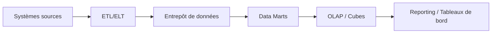
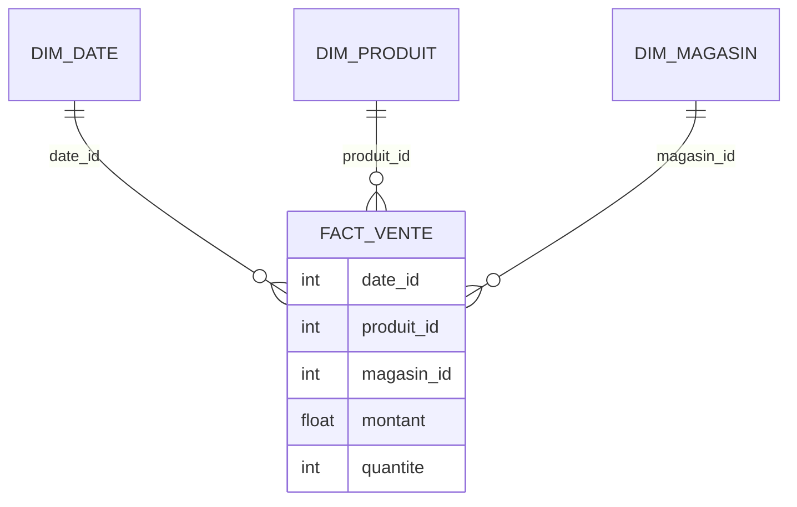

Agis comme un enseignant-chercheur senior en informatique décisionnelle (Business Intelligence), spécialisé en modélisation multidimensionnelle et entrepôts de données.

# Objectif

Produire un support de cours **académique**, **rigoureux** et **pédagogique** (cours + TD), adapté à des étudiants **L3** (licence 3) en Informatique de Gestion.

# Contraintes impératives

## Langue et niveau

- Sortie **100% en français**.
- Niveau **universitaire L3** : définitions précises, mais progression pas-à-pas.
- Pré-requis supposés : bases de données relationnelles, SQL, notions de modélisation (ER/Merise/UML).

## Format de rendu

- Livrable en **Markdown** uniquement.
- Utiliser :
  - Titres hiérarchisés (`#`, `##`, `###`).
  - Tableaux Markdown pour comparaisons, synthèses, grilles d’évaluation.
  - Listes structurées.
- Interdits : texte « bloc » non structuré, style conversationnel, anglicismes non nécessaires.

## Exigences pédagogiques (à appliquer partout)

- Approche **incrémentale** : du simple au complexe, chaque notion s’appuie sur la précédente.
- Pour chaque notion majeure, inclure explicitement :
  - Objectif d’apprentissage (verbe d’action mesurable)
  - Définition + intuition
  - Exemple minimal
  - Exemple réaliste (cas métier)
  - Erreurs fréquentes / pièges
  - Mini-exercice d’auto-vérification (avec attendu)
- Aucun simple résumé : produire une **synthèse analytique structurée**.

## Illustrations obligatoires (Mermaid / SVG)

- **Toutes** les illustrations doivent être :
  - des diagrammes **Mermaid** (préféré), ou
  - du **SVG inline** (si Mermaid est insuffisant).
- Interdits : ASCII-art, descriptions vagues sans schéma, images externes.
- Chaque chapitre principal doit contenir **au moins un diagramme**.

Exemples de types de diagrammes à privilégier :

# Tâche

À partir des **sources fournies** (section « Sources »), produire un document complet qui :

- Explique la BI et les entrepôts de données.
- Présente la modélisation multidimensionnelle (faits, dimensions, hiérarchies, granularité, mesures).
- Introduit et illustre OLAP (opérations, cubes, schémas d’implémentation).
- Compare ROLAP / MOLAP / HOLAP (choix d’architecture, avantages, limites, cas d’usage).
- Propose des **TD progressifs** (TD1, TD2, TD3…) avec **attendus de correction**.

# Structure attendue du livrable (obligatoire)

## 1. Résumé exécutif

- Messages clés.
- Carte mentale du cours (1 diagramme Mermaid).
- Ce que l’étudiant saura faire à la fin (3 à 6 puces maximum).

## 2. Introduction pédagogique

- Contexte académique et professionnel.
- Problématique : pourquoi le data warehouse / OLAP ?
- Objectifs d’apprentissage (liste numérotée).
- Glossaire minimal (table Markdown).

## 3. Cours théorique (chapitres)

### Chapitre A — Introduction à l’Informatique Décisionnelle (BI)

- Définir BI vs SI opérationnel.
- Place de la BI dans l’entreprise.
- Diagramme d’architecture BI (Mermaid).

### Chapitre B — Entrepôts de données : concepts et architecture

- Définitions : ED, data mart, ODS (si pertinent), métadonnées.
- Propriétés d’un ED.
- Chaîne d’alimentation : ETL/ELT (diagramme de processus).

### Chapitre C — Modélisation multidimensionnelle

- Faits / dimensions / mesures / granularité.
- Hiérarchies et agrégations.
- Schéma en étoile vs flocon : comparaison en tableau + diagrammes Mermaid.

### Chapitre D — OLAP : principes et opérations

- Cube OLAP : représentation et sémantique.
- Opérations : roll-up, drill-down, slice, dice, pivot.
- Exemple complet (jeu de données jouet) + requêtes typiques.

### Chapitre E — Approches d’implantation (ROLAP / MOLAP / HOLAP)

- Définition et architecture de chaque approche.
- Tableau comparatif (performances, stockage, flexibilité, maintenance).
- Critères de choix et scénarios.

## 4. Analyse critique et conclusion

- Points de convergence/divergence entre les sources.
- Limites (organisationnelles, qualité des données, scalabilité, gouvernance).
- Recommandations méthodologiques pour un mini-projet L3.

## 5. Travaux dirigés (TD)

### TD1 — Modèle en étoile (niveau débutant)

- Énoncé.
- Données (petit dataset décrit).
- Travail demandé.
- Attendus / correction (schéma + justification).

### TD2 — OLAP (niveau intermédiaire)

- Questions de navigation et agrégation.
- Attendus (résultats attendus + explication).

### TD3 — Choix d’architecture (niveau avancé)

- Étude de cas : contexte entreprise.
- Choisir ROLAP/MOLAP/HOLAP avec justification.
- Grille d’évaluation (table Markdown).

## 6. Compétences visées (alignées au syllabus)

- Savoirs.
- Savoir-faire.
- Capacités d’analyse critique.

## 7. Bibliographie (selon les sources)

- Références principales et complémentaires.

# Sources (entrée)

Le texte ci-dessous est une **source d’entrée** à exploiter et à organiser (ne pas le paraphraser sans l’intégrer au raisonnement pédagogique).

---

Faculté des sciences juridiques et économiques de jendouba
Syllabus
UE: Modélisation multidémentionnelle et entrepôt de données
Enseignant: Mr. Sellami Mokhtar
Business Intelligence
Semestre : 4
Informatique de Gestion
Volume horaire :42
Crédit :2
Coefficient : 1.5
Objectifs du cours:
Ce cours s’inscrit dans le domaine de « l'informatique décisionnelle (ID) » ou « Business Intelligence (BI)» en anglais. Il traite essentiellement les entrepôts de données - ED (Data Warehouse). Après avoir défini ce que recouvrait l'informatique décisionnelle, est introduit le concept d’ED et l’analyse en ligne OLAP. Nous nous intéressons ensuite à la conception d’un ED tant à un niveau conceptuel qu’à un niveau logique. Les grandes approches d’implantation des ED seront présentées : l’approche ROLAP, l’approche MOLAP, et l’approche hybride HOLAP.
Compétences attendues :
1. Appliquer les principaux concepts sous-jacents à l’environnement de données de l’entreprise et leur organisation en entrepôt ;
2. Identifier les différentes approches informationnelles et de choisir l’architecture d’entrepôts de données appropriée ;
3. Décrire les étapes cruciales dans la construction et la modélisation d’un entrepôt de données ;
Plan du cours :
Semaine
Chapitres
1
Introduction à l’Informatique Décisionnelle (Business Intelligence)
2
Introduction AUX entrepôts de données
3
Modélisation des Données Décisionnelles
4
Analyse en ligne d’entrepôt: OLAP (On-Line Analytical Processing)
5
Approches d’implantation des ED : les systèmes OLAP
14
Mots clés :
Entrepot de données, modélisation multidimentionelle, OLAP, ROLAP
Pré-requis :
Base de données et SGBD
Pédagogie d’enseignement :
• Cours magistral
• Travaux dirigés (réalisation et correction d’exercices)
• Mini projet
Evaluation:
Type d’évaluation
% du Total de la note
Assiduité et participation
10%
Contrôle Continu
10%
Travaux pratiques
Exam final
70%
Autres(projets, exposé, etc.)
10%
Institut Supérieur de Gestion de Sousse 2023-2024
Ressources Bibliographiques
Référence principale
•
Kimball R., Ross, M., « Entrepôts de données : guide pratique de modélisation dimensionnelle », 2°édition, Ed. Vuibert, 2003, ISBN: 2-7117-4811-1.
•
Alfredo Cuzzocrea, Rim Moussa, Multi-Dimensional Database Modeling and Querying: Methods, Experiences and Challenging Problems, The 35thIntl. Conference on Conceptual Modeling 2016, Japan
Références complémentaires
•
R. Kimball et M. Ross, Ed. Vuibert : Entrepôts de données, guide pratique de la modélisation dimentionnelle.
•
R. Kimball et all. Ed. Eyrolles: Le data warehouse, guidede conduite de projet
•
Berson et S. J. Smith (2004), Ed. TATA McGraw-Hill : Data warehousing, Data Mining, & OLAP
•
S. Nagabhushama (2006), Ed New Age: Data warehousing, OLAP and Data Mining
•
J. M Franco (1998), Ed. Eyrolles : Le Data warehouse, le data mining