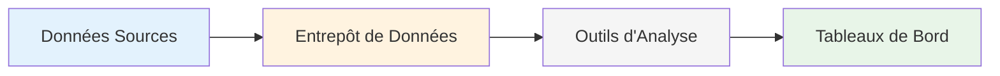

# Chapitre A — Introduction à l'Informatique Décisionnelle (BI)

> **Semaine 1** | **Volume horaire : 8h** | **Crédits : 0.4**  
> **Références : Kimball & Ross (2003), Syllabus MMD S4**

## Objectifs pédagogiques

À la fin de ce chapitre, l'étudiant sera capable de :

1. **Comprendre** la différence entre systèmes opérationnels et décisionnels
2. **Identifier** les composants essentiels d'un système de BI
3. **Expliquer** pourquoi les entreprises ont besoin d'analyse de données
4. **Reconnaître** les bénéfices concrets de la BI pour la prise de décision

## Contenu théorique

### 1. Qu'est-ce que la Business Intelligence ?

**Définition simple** : La BI transforme les données brutes en informations utiles pour aider les managers à prendre de meilleures décisions.

**Exemple concret** : 
- **Sans BI** : Le gérant de magasin regarde les ventes du jour sur un papier
- **Avec BI** : Le gérant voit un tableau de bord avec les ventes par produit, par heure, et peut comparer avec la semaine dernière

### 2. Pourquoi la BI est-elle importante ?

**Avantages pratiques** :
- **Décisions plus rapides** : Informations disponibles en temps réel
- **Meilleure visibilité** : Vue d'ensemble de l'activité
- **Détection des tendances** : Repérer ce qui fonctionne et ce qui ne fonctionne pas
- **Avantage concurrentiel** : Réagir plus vite que les concurrents

### 3. Les composants d'un système de BI

**Explication simple** :
1. **Sources de données** : Ventes, clients, produits (Excel, ERP, etc.)
2. **Entrepôt de données** : Base de données centralisée et organisée
3. **Outils d'analyse** : Logiciels pour explorer les données
4. **Tableaux de bord** : Visualisations graphiques pour les managers

### 4. Différence clé : OLTP vs OLAP

| Caractéristique | OLTP (Opérationnel) | OLAP (Décisionnel) |
|----------------|---------------------|-------------------|
| **Objectif** | Gérer les opérations quotidiennes | Analyser les tendances |
| **Exemples** | Vente d'un produit, mise à jour stock | Analyse des ventes mensuelles |
| **Utilisateurs** | Caissiers, vendeurs | Managers, analystes |
| **Questions** | "Combien ce client a-t-il acheté ?" | "Quels produits se vendent le mieux ?" |

### 5. Cas pratique : Magasin de vêtements

**Contexte** : Un magasin vend 1000 articles par jour avec 3 vendeurs

**Problème sans BI** :
- Le gérant passe 2 heures chaque dimanche à analyser les ventes sur Excel
- Il ne voit pas les tendances (saisonnalités, produits populaires)
- Il ne peut pas comparer rapidement avec l'année dernière

**Solution avec BI** :
- **Tableau de bord quotidien** : Ventes par heure, par vendeur, par catégorie
- **Alertes automatiques** : "Stock faible pour les jeans bleus"
- **Comparaisons** : "Ventes +15% par rapport à la semaine dernière"
- **Temps économisé** : 5 minutes pour l'analyse complète

### 6. Exercice d'application

**Scénario** : Vous êtes gérant d'une petite librairie avec 3 employés

**Questions** :
1. Quelles données collecteriez-vous chaque jour ?
2. Quelles questions aimeriez-vous pouvoir répondre rapidement ?
3. Comment la BI pourrait-elle vous aider à augmenter vos ventes ?

**Travail demandé** :
- Lister 5 types de données utiles
- Proposer 3 questions que la BI pourrait répondre
- Expliquer en 2-3 phrases les bénéfices attendus

### 7. Vocabulaire essentiel

| Terme | Définition simple | Exemple |
|-------|------------------|---------|
| **Données brutes** | Informations non traitées | Liste de toutes les ventes |
| **Indicateur (KPI)** | Mesure de performance | Chiffre d'affaires journalier |
| **Tableau de bord** | Interface visuelle | Graphique des ventes par jour |
| **Entrepôt** | Base de données centralisée | Base de données des ventes |

### 8. Mini-projet de découverte

**Objectif** : Créer votre premier tableau de bord simple

**Données** : Ventes fictives d'un café universitaire (1 semaine)
- 100 transactions
- 5 types de boissons
- 3 périodes (matin, midi, soir)

**Livrables** :
1. Schéma simple des données
2. 3 questions d'analyse pertinentes
3. Proposition de tableau de bord (dessin sur papier)

**Évaluation** : Pertinence des questions, clarté du schéma, faisabilité technique

---

## Références complémentaires

### Pour aller plus loin
- **Vidéo** : "La BI expliquée simplement" (10 min)
- **Article** : "5 exemples concrets de BI dans les PME"
- **Quiz** : Testez vos connaissances sur les concepts de base

### Exercices pratiques
- **Exercice 1** : Identifier les données dans votre environnement
- **Exercice 2** : Proposer une solution BI pour votre association étudiante
- **Exercice 3** : Analyser un tableau de bord existant
### Cas d'entreprises
- Amazon Web Services Analytics Case Studies
- Microsoft Customer Success Stories BI

---

**Contact enseignant** : M. Sellami Mokhtar  
**Volume horaire total** : 8h (4h cours magistral + 4h travaux dirigés)  
**Évaluation** : Contrôle continu (10%) + Participation (10%) + TD (20%) + Exam final (60%)
