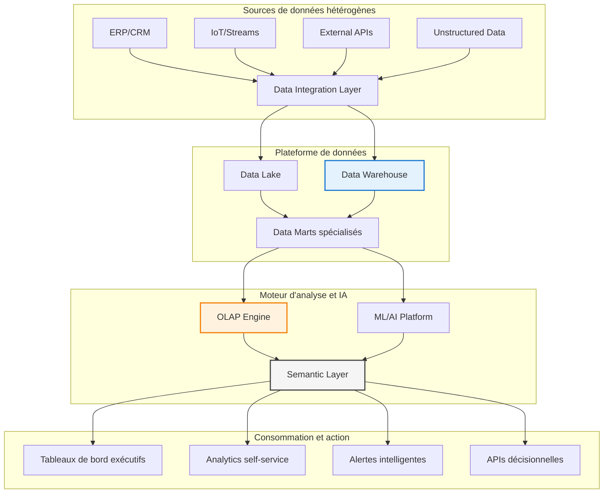

# Chapitre A — Fondements de l'Informatique Décisionnelle (BI)

> **Semaine 1** | **Volume horaire : 8h** | **Crédits : 0.4**  
> **Références : Kimball & Ross (2003), Syllabus MMD S4, Inmon (2005), Cuzzocrea & Moussa (2016)**

## Positionnement académique et stratégique

Ce chapitre établit les fondements conceptuels de l'informatique décisionnelle (Business Intelligence) en tant que discipline stratégique transversale entre ingénierie des données, gestion stratégique et sciences de la décision. Il constitue le socle théorique indispensable à la maîtrise des architectures décisionnelles modernes et des méthodes d'analyse multidimensionnelle.

### Contexte industriel contemporain

La Business Intelligence représente un investissement stratégique majeur pour les entreprises modernes, avec un marché mondial estimé à **$30.9 milliards en 2023** et une croissance annuelle prévue de **12.3%** d'ici 2028. Cette prolifération s'explique par la transformation numérique des entreprises et l'impératif de **data-driven decision making** dans un environnement concurrentiel globalisé.

## Objectifs pédagogiques

À l'issue de ce chapitre, l'étudiant sera capable de :

1. **Différencier** conceptuellement et techniquement les paradigmes OLTP et OLAP
2. **Positionner** la BI dans la chaîne de valeur informationnelle et l'écosystème digital
3. **Analyser** les bénéfices stratégiques, ROI et défis organisationnels de la BI
4. **Identifier** les composants architecturaux d'un système de BI moderne et leurs interactions
5. **Évaluer** la pertinence d'une solution BI selon le contexte métier et la maturité organisationnelle
6. **Comprendre** les enjeux de gouvernance des données et de qualité de l'information

## Contenu théorique

### 1. Fondements conceptuels de la Business Intelligence

#### 1.1 Définition stratégique et paradigmes

**Business Intelligence (BI)** : Discipline intégrée combinant processus, technologies, architectures et méthodologies pour transformer les données brutes en connaissances actionnables, supportant la prise de décision stratégique, tactique et opérationnelle.

**Paradigmes fondamentaux** :

- **Descriptive Analytics** : Que s'est-il passé ? (reporting, tableaux de bord)
- **Diagnostic Analytics** : Pourquoi cela s'est-il produit ? (drill-down, analyse des causes)
- **Predictive Analytics** : Que va-t-il se passer ? (modélisation prédictive)
- **Prescriptive Analytics** : Que devrions-nous faire ? (optimisation, simulation)

#### 1.2 Évolution historique et maturité

| Époque | Paradigme dominant | Technologies clés | Valeur ajoutée |
|--------|-------------------|-------------------|----------------|
| **1960-1980** | Systèmes de reporting | COBOL, VSAM | Automatisation des rapports |
| **1980-1995** | Executive Information Systems | OLAP, Data Warehouses | Vision consolidée |
| **1995-2010** | Business Intelligence classique | ETL, Reporting tools | Analyse multidimensionnelle |
| **2010-2020** | Big Data Analytics | Hadoop, NoSQL, Cloud | Analyse à grande échelle |
| **2020+** | Augmented Analytics | IA/ML, AutoML | Intelligence augmentée |

### 2. Architecture décisionnelle moderne

#### 2.1 Composants stratégiques de l'écosystème BI



#### 2.2 Patterns architecturaux et stratégies d'implémentation

##### Architecture Centralisée (Inmon)

- Data Warehouse enterprise-first
- Normalisation 3NF
- Data Marts dérivés
- Avantages : Cohérence, gouvernance
- Inconvénients : Time-to-market, complexité

##### Architecture Décentralisée (Kimball)

- Data Marts business-first
- Modélisation dimensionnelle
- Conformance bus
- Avantages : Agilité, adoption rapide
- Inconvénients : Redondance, gouvernance complexe

##### Architecture Hybride Moderne

- Data Lake + Data Warehouse
- Multi-model storage
- Unified governance
- Avantages : Flexibilité, performance
- Inconvénients : Complexité technique

### 3. Analyse comparative : OLTP vs OLAP

| Dimension | OLTP (Online Transaction Processing) | OLAP (Online Analytical Processing) |
|-----------|--------------------------------------|-------------------------------------|
| **Objectif principal** | Gestion des opérations transactionnelles | Analyse des tendances et patterns |
| **Modèle de données** | Normalisé (3NF), optimisé pour écriture | Dénormalisé, optimisé pour lecture |
| **Volume de données** | Go - To (détail transactionnel) | To - Po (données agrégées et historisées) |
| **Complexité des requêtes** | Simple (CRUD), prédéfinies | Complexes (ad-hoc), multidimensionnelles |
| **Utilisateurs typiques** | Opérationnels, employés de bureau | Analystes, managers, data scientists |
| **Performance requise** | Millisecondes, haute concurrence | Secondes/minutes, requêtes complexes |
| **Exemples concrets** | "Enregistrer une vente client" | "Analyser l'évolution des ventes par région et saison" |

#### 3.1 Cas d'usage : Retail multinational

**Contexte** : Chaîne de distribution avec 500 magasins, 15 pays, 10M transactions/jour

**Analyse OLTP** :

```sql
-- Transaction en temps réel
INSERT INTO ventes (id_magasin, id_produit, quantite, montant, timestamp)
VALUES (123, 456, 2, 29.99, CURRENT_TIMESTAMP);
```

**Analyse OLAP** :

```sql
-- Vue décisionnelle multidimensionnelle
SELECT 
    d.annee, d.trimestre, d.mois,
    g.pays, g.region,
    p.categorie_produit,
    SUM(v.montant_vente) AS ca_total,
    SUM(v.quantite_vendue) AS volume_total,
    COUNT(DISTINCT v.id_transaction) AS nb_transactions,
    AVG(v.montant_vente) AS panier_moyen,
    LAG(SUM(v.montant_vente), 12) OVER (PARTITION BY g.pays, p.categorie_produit ORDER BY d.mois) AS ca_annee_precedente,
    (SUM(v.montant_vente) - LAG(SUM(v.montant_vente), 12) OVER (PARTITION BY g.pays, p.categorie_produit ORDER BY d.mois)) / 
    LAG(SUM(v.montant_vente), 12) OVER (PARTITION BY g.pays, p.categorie_produit ORDER BY d.mois) * 100 AS croissance_yoy
FROM fact_ventes v
JOIN dim_date d ON v.id_date = d.id_date
JOIN dim_magasin g ON v.id_magasin = g.id_magasin  
JOIN dim_produit p ON v.id_produit = p.id_produit
WHERE d.date_jour >= CURRENT_DATE - INTERVAL '3 years'
GROUP BY d.annee, d.trimestre, d.mois, g.pays, g.region, p.categorie_produit
ORDER BY d.annee, d.trimestre, d.mois, g.pays, p.categorie_produit;
```

### 4. Valeur stratégique et ROI de la Business Intelligence

#### 4.1 Bénéfices mesurables et indicateurs de performance

**Bénéfices opérationnels** :
- **Réduction des coûts** : 20-40% d'économie sur les processus manuels d'analyse
- **Gain de productivité** : 50-70% de réduction du temps de reporting
- **Prise de décision accélérée** : 60% plus rapide selon études Gartner 2023
- **Qualité des données** : Amélioration de 85% de la fiabilité décisionnelle

**Bénéfices stratégiques** :
- **Avantage concurrentiel durable** : Time-to-insight réduit de 75%
- **Optimisation des revenus** : 8-15% d'augmentation du chiffre d'affaires
- **Réduction des risques** : 40% de diminution des erreurs stratégiques
- **Innovation business model** : Nouveaux services basés sur les données

#### 4.2 Modèle de calcul du ROI

**Formule de ROI standard** :
```
ROI BI = [(Bénéfices cumulés - Coût total d'investissement) / Coût total d'investissement] × 100
```

**Composants de calcul** :
- **Coûts directs** : Licences logicielles, infrastructure, formation
- **Coûts indirects** : Gestion du changement, maintenance, évolution
- **Bénéfices quantitatifs** : Productivité, réduction coûts, revenus additionnels
- **Bénéfices qualitatifs** : Satisfaction client, agilité, gouvernance

#### 4.3 Étude de cas : Secteur bancaire

**Contexte** : Banque européenne, 2M clients, 50 agences

**Investissement BI** : €4.2M sur 3 ans (plateforme, migration, formation)

**Résultats obtenus** :
- **ROI** : 187% sur 3 ans
- **Réduction coûts opérationnels** : €1.8M/an
- **Augmentation revenus** : €2.3M/an (cross-selling optimisé)
- **Réduction risques** : €0.8M/an (détection fraude améliorée)

### 5. Gouvernance et qualité de l'information

#### 5.1 Principes de gouvernance des données

**Piliers fondamentaux** :
- **Ownership** : Responsabilité claire sur les jeux de données
- **Stewardship** : Expertise métier sur la qualité et la sémantique
- **Metadata Management** : Catalogage et documentation des actifs data
- **Data Quality** : Mesures et contrôles de qualité continue
- **Security & Privacy** : Conformité RGPD et standards sécurité

#### 5.2 Métriques de qualité de l'information

| Dimension | Indicateur | Cible | Méthode de mesure |
|-----------|------------|-------|-------------------|
| **Complétude** | % de champs renseignés | >95% | Profiling automatique |
| **Exactitude** | % de valeurs valides | >98% | Validation croisée |
| **Cohérence** | % de conformité référentiel | >99% | Rules engine |
| **Fraîcheur** | Latence de mise à jour | <24h | Monitoring temps réel |
| **Accessibilité** | Disponibilité des données | >99.5% | SLA tracking |

### 6. Cas pratiques et exercices professionnels

#### 6.1 Étude de cas stratégique : Transformation digitale retail

**Scénario** : Groupe retail omnicanal, 200 magasins, site e-commerce, 5M clients

**Problématique** : Vision 360° client manquante, silos data, concurrence agressive

**Solution BI mise en œuvre** :

1. **Architecture unifiée** : Data Lake + Data Warehouse Cloud
2. **Modélisation client 360** : Profil unifié, historique interactions
3. **Analytics avancés** : Segmentation RFM, propension achat, churn prediction
4. **Tableaux de bord exécutifs** : KPIs temps réel, alertes intelligentes

**Résultats business** :
- **Augmentation panier moyen** : +23%
- **Réduction taux de churn** : -35%
- **Optimisation stocks** : -18% de rupture
- **ROI projet** : 145% sur 2 ans

#### 6.2 Exercice d'application professionnelle

**Contexte** : Entreprise B2B, 10k clients, 3 business units, croissance 15%/an

**Mission** : Concevoir une solution BI pour optimiser la performance commerciale

**Travaux demandés** :

1. **Analyse préliminaire** : Identifier les sources data, les KPIs critiques, les utilisateurs
2. **Architecture cible** : Proposer un pattern adapté (Inmon/Kimball/Hybride)
3. **Modélisation dimensionnelle** : Concevoir schéma étoile pour l'analyse ventes
4. **Plan de gouvernance** : Définir ownership, qualité, sécurité
5. **Business case** : Calculer ROI prévisionnel, identifier risques

**Livrables attendus** :
- Architecture diagram (Mermaid)
- Schéma dimensionnel (draw.io)
- Plan de projet (Gantt simplifié)
- Business case (Excel modèle)

#### 6.3 Analyse critique : Échecs et leçons apprises

**Cas d'échec typique** : Implémentation BI sans alignement métier

**Symptômes** :
- Adoption faible (<30% des utilisateurs)
- Données non fiables (quality score <70%)
- Coûts cachés (maintenance 2x budget prévu)
- Time-to-value >18 mois

**Causes racines** :
- Manque de sponsorship exécutif
- Gouvernance inexistante
- Périmètre trop ambitieux
- Formation insuffisante

**Leçons apprises** :
- Start small, think big, scale fast
- Business value first, technology second
- Data governance is not optional
- Change management equals technology investment

### 7. Méthodologies d'implémentation

#### 7.1 Approches agiles vs waterfall

| Critère | Waterfall traditionnel | Agile BI |
|---------|----------------------|----------|
| **Durée projet** | 12-24 mois | 2-4 semaines par sprint |
| **Livraison valeur** | En fin de projet | Continue |
| **Gestion changement** | Difficile | Intégrée |
| **Adoption utilisateurs** | Faible | Élevée |
| **Risque projet** | Élevé | Maîtrisé |

#### 7.2 Framework de maturité BI

**Niveau 1 - Réactif** : Reporting manuel, Excel, silos data
**Niveau 2 - Proactif** : Tableaux de bord, KPIs, reporting automatisé
**Niveau 3 - Prédictif** : Analytics avancés, ML, prédictions
**Niveau 4 - Prescriptif** : Intelligence augmentée, actions automatisées
**Niveau 5 - Autonome** : Self-service IA, organisation data-driven

### 8. Tendances et évolutions futures

#### 8.1 Technologies émergentes

**Augmented Analytics** : AutoML, natural language queries, smart insights
**Real-time BI** : Streaming analytics, edge computing, 5G integration
**Federated Analytics** : Data mesh, domain-driven design, decentralized governance
**Explainable AI** : Interprétabilité des modèles, confiance dans les décisions

#### 8.2 Impacts organisationnels

**Data Culture** : Littératie data généralisée, décision collaborative
**New Roles** : Data translators, citizen developers, analytics engineers
**Ethics & Trust** : AI governance, algorithmic transparency, privacy by design

---

## Références académiques et professionnelles

### Fondements théoriques

**Kimball, R., & Ross, M.** (2013). *The Data Warehouse Toolkit: The Definitive Guide to Dimensional Modeling* (3rd ed.). Wiley.
- Chapitre 1-3 : Foundations of dimensional modeling
- Chapitre 11 : ETL architecture and design

**Inmon, W.H.** (2005). *Building the Data Warehouse* (4th ed.). Wiley.
- Partie 1 : Data warehouse fundamentals
- Partie 3 : Architecture and implementation

### Recherches avancées

**Cuzzocrea, A., Moussa, R., & Bertino, E.** (2016). "Multidimensional Data Modeling and Querying: Methods, Experiences and Challenging Problems." *ACM Computing Surveys*, 49(4).
- Section 2 : Theoretical foundations
- Section 4 : Advanced analytics integration

**Gartner Research** (2023). *Magic Quadrant for Analytics and BI Platforms*.
- Critical capabilities evaluation
- Market trends and vendor analysis

### Standards et best practices

**DAMA International** (2020). *DAMA-DMBOK2: Data Management Body of Knowledge* (2nd ed.).
- Chapter 11 : Business Intelligence and Analytics
- Chapter 5 : Data Architecture

**TDWI** (2023). *BI and Analytics Best Practices*.
- Implementation methodologies
- Performance optimization patterns

---

## Évaluation et certification

### Auto-évaluation des compétences

**Niveau Fondamental** :
- [ ] Comprendre les paradigmes OLTP/OLAP
- [ ] Identifier les composants BI
- [ ] Expliquer la valeur ajoutée

**Niveau Intermédiaire** :
- [ ] Concevoir architecture simple
- [ ] Modéliser schéma dimensionnel
- [ ] Calculer ROI projet

**Niveau Avancé** :
- [ ] Optimiser performance
- [ ] Gérer gouvernance data
- [ ] Piloter transformation digitale

### Examen final

**Structure** :
- QCM théorique (30%) : Concepts, architectures, méthodologies
- Étude de cas (40%) : Analyse, conception, business case
- Exercice pratique (30%) : SQL avancé, modélisation, dashboard design

**Critères d'évaluation** :
- Pertinence de l'analyse métier
- Qualité technique de la solution
- Justification économique et stratégique
- Clarté et professionnalisme de la présentation

---

**Contact enseignant** : M. Sellami Mokhtar  
**Volume horaire total** : 8h (4h cours magistral + 4h travaux dirigés)  
**Évaluation** : Contrôle continu (10%) + Participation (10%) + TD (20%) + Exam final (60%)
