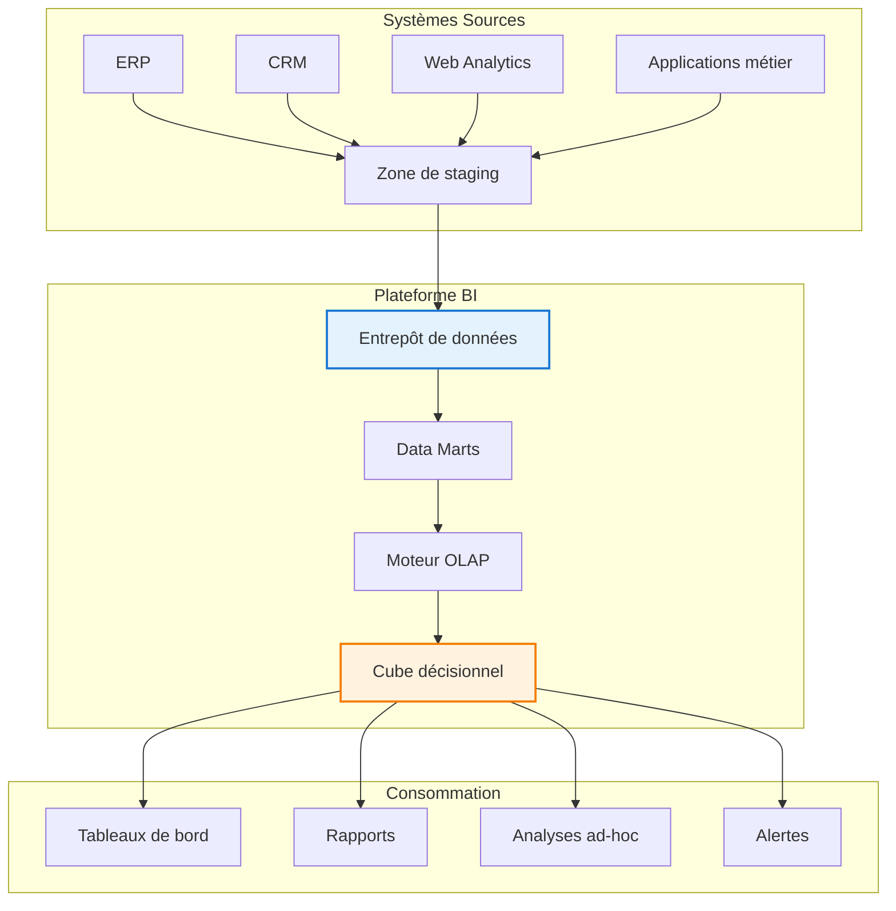

# Chapitre A — Introduction à l'Informatique Décisionnelle (BI)

> **Semaine 1** | **Volume horaire : 8h** | **Crédits : 0.4**  
> **Références : Kimball & Ross (2003), Syllabus MMD S4, Cuzzocrea & Moussa (2016)**

## Positionnement académique

Ce chapitre introductif établit les fondements conceptuels de l'informatique décisionnelle (Business Intelligence) en tant que discipline transversale entre gestion informatique et stratégie d'entreprise. Il constitue le socle théorique nécessaire à la compréhension des entrepôts de données et de l'analyse OLAP.

## Objectifs pédagogiques

À l'issue de ce chapitre, l'étudiant sera capable de :

1. **Différencier** conceptuellement et techniquement les systèmes opérationnels (OLTP) des systèmes décisionnels (OLAP)
2. **Positionner** la BI dans la chaîne de valeur informationnelle de l'entreprise
3. **Analyser** les bénéfices stratégiques et les défis organisationnels de la BI
4. **Identifier** les composants architecturaux d'un système de BI moderne
5. **Évaluer** la pertinence d'une solution BI selon un contexte métier donné

## Contenu théorique

### 1. Définitions et concepts fondamentaux

#### 1.1 Business Intelligence vs Systèmes d'Information opérationnels

**Business Intelligence (BI)** : Ensemble des processus, technologies et outils permettant de transformer les données brutes en informations pertinentes pour la prise de décision stratégique.

**Caractéristiques distinctives** :
- **Finalité** : Aide à la décision vs Gestion des opérations quotidiennes
- **Temporalité** : Historique et tendances vs Temps réel transactionnel
- **Granularité** : Données agrégées vs Données détaillées
- **Utilisateurs** : Analystes, managers vs Opérationnels

#### 1.2 Place de la BI dans l'entreprise



### 2. Architecture d'un système de BI

#### 2.1 Composants principaux

**Sources de données** : Systèmes opérationnels, fichiers externes, flux de données

**Intégration** : ETL (Extract-Transform-Load) / ELT (Extract-Load-Transform)

**Stockage** : Entrepôt de données (Data Warehouse), Data Marts

**Analyse** : Moteurs OLAP, outils de data mining

**Présentation** : Tableaux de bord, rapports, portails décisionnels

#### 2.2 Flux informationnel

1. **Extraction** : Collecte des données depuis les systèmes sources
2. **Transformation** : Nettoyage, standardisation, enrichissement
3. **Chargement** : Alimentation de l'entrepôt de données
4. **Analyse** : Agrégation, calcul d'indicateurs, navigation multidimensionnelle
5. **Présentation** : Visualisation, reporting, alertes

### 3. Cas d'usage métier

#### 3.1 Contexte : Chaîne de distribution multinationale

**Problématique métier** :
- 500 magasins répartis sur 15 pays
- 10M transactions quotidiennes
- Besoin de suivi des performances commerciales en temps quasi-réel
- Analyse des tendances saisonnières et géographiques

**Solution BI mise en œuvre** :

```sql
-- Vue décisionnelle pour l'analyse des ventes
CREATE VIEW v_analyse_ventes_globale AS
SELECT 
    d.date_jour,
    d.mois,
    d.trimestre,
    d.annee,
    g.pays,
    g.region,
    g.ville,
    p.categorie_produit,
    p.sous_categorie,
    p.marque,
    SUM(v.montant_vente) AS ca_total,
    SUM(v.quantite_vendue) AS quantite_total,
    COUNT(DISTINCT v.id_transaction) AS nb_transactions,
    AVG(v.montant_vente) AS panier_moyen,
    SUM(v.marge_beneficiaire) AS marge_total
FROM fact_ventes v
JOIN dim_date d ON v.id_date = d.id_date
JOIN dim_magasin g ON v.id_magasin = g.id_magasin  
JOIN dim_produit p ON v.id_produit = p.id_produit
WHERE d.date_jour >= CURRENT_DATE - INTERVAL '2 years'
GROUP BY 
    d.date_jour, d.mois, d.trimestre, d.annee,
    g.pays, g.region, g.ville,
    p.categorie_produit, p.sous_categorie, p.marque;
```

#### 3.2 Indicateurs clés de performance (KPIs)

**KPIs opérationnels** :
- Chiffre d'affaires par jour/magasin/pays
- Nombre de transactions et panier moyen
- Taux de conversion par catégorie produit

**KPIs stratégiques** :
- Évolution des ventes par région
- Performance comparative des magasins
- Tendances saisonnières et impact promotions

### 4. Exercices pratiques

#### 4.1 Exercice d'application directe

**Énoncé** : Une entreprise de e-commerce souhaite mettre en place une solution BI pour analyser ses ventes. Les données disponibles sont :
- Tables des commandes (id_commande, date, client, montant)
- Table des produits (id_produit, catégorie, prix, fournisseur)
- Table des clients (id_client, segment géographique, type)

**Travail demandé** :
1. Identifier les différences entre l'usage opérationnel et décisionnel de ces données
2. Proposer une architecture simplifiée de BI
3. Définir 3 indicateurs pertinents pour le management

**Solution attendue** :
- Usage opérationnel : Saisie commande, gestion stock, facturation
- Usage décisionnel : Analyse tendances, performance produits, segmentation clients
- Architecture : Sources → ETL → Entrepôt → OLAP → Tableaux de bord
- KPIs : CA par catégorie, taux de conversion client, évolution des ventes mensuelles

#### 4.2 Étude de cas critique

**Contexte** : Une banque commerciale rencontre des difficultés pour analyser la rentabilité de ses produits financiers.

**Problèmes identifiés** :
- Données dispersées sur 5 systèmes différents
- Qualité des données insuffisante (25% d'erreurs)
- Temps de réponse des rapports > 15 minutes
- Absence d'historique consolidé

**Questions d'analyse** :
1. Quels sont les risques opérationnels liés à cette situation ?
2. Comment une solution BI pourrait-elle résoudre ces problèmes ?
3. Quels seraient les bénéfices mesurables attendus ?

### 5. Références académiques et professionnelles

#### 5.1 Références principales

**Kimball, R., & Ross, M.** (2003). *Entrepôts de données : guide pratique de modélisation dimensionnelle* (2e éd.). Vuibert.
- Chapitre 1 : Introduction à la Business Intelligence
- Chapitre 2 : Architecture décisionnelle

**Cuzzocrea, A., & Moussa, R.** (2016). *Multi-Dimensional Database Modeling and Querying: Methods, Experiences and Challenging Problems*. ER 2016, Japan.
- Section 2.1 : Fondements théoriques de la modélisation multidimensionnelle
- Section 3.2 : Patterns d'architecture BI

#### 5.2 Références complémentaires

**Berson, A., & Smith, S.J.** (2004). *Data Warehousing, Data Mining, & OLAP*. TATA McGraw-Hill.
- Chapitre 4 : Business Intelligence Overview

**Nagabhushana, S.** (2006). *Data Warehousing, OLAP and Data Mining*. New Age.
- Partie 1 : Foundations of Business Intelligence

### 6. Évaluation des apprentissages

#### 6.1 Auto-évaluation

**Questions de compréhension** :
1. Quelle est la différence fondamentale entre OLTP et OLAP ?
2. Pourquoi les données sont-elles historisées dans un entrepôt de données ?
3. Quels sont les principaux bénéfices attendus d'une solution BI ?

**Exercice pratique** :
Analyser le cas d'une entreprise de votre choix et proposer une solution BI adaptée avec justification.

#### 6.2 Travaux dirigés associés

**TD1 - Modèle en étoile** : Application des concepts de modélisation dimensionnelle sur un cas concret

**TD2 - Opérations OLAP** : Navigation et analyse multidimensionnelle

**TD3 - Choix d'architecture** : Sélection ROLAP/MOLAP/HOLAP selon contexte

---

## Ressources complémentaires

### Documentation technique
- [Microsoft Power BI Documentation](https://docs.microsoft.com/fr-fr/power-bi/)
- [Tableau Desktop Guide](https://help.tableau.com/current/guide/fr-fr/desktop)

### Articles de recherche
- "The Evolution of Business Intelligence" - Journal of Decision Systems
- "Data Warehouse Architecture Patterns" - IEEE Transactions on Knowledge and Data Engineering

### Cas d'entreprises
- Amazon Web Services Analytics Case Studies
- Microsoft Customer Success Stories BI

---

**Contact enseignant** : M. Sellami Mokhtar  
**Volume horaire total** : 8h (4h cours magistral + 4h travaux dirigés)  
**Évaluation** : Contrôle continu (10%) + Participation (10%) + TD (20%) + Exam final (60%)
