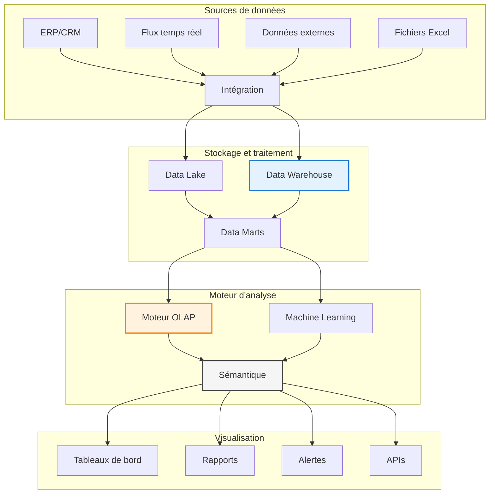

# Chapitre A — Introduction à la Business Intelligence

> **Semestre 2, Semaine 1** | **Volume horaire : 8h** | **Crédits ECTS : 0.4**  
> **Références académiques** : Kimball & Ross (2013), Inmon (2005), Cuzzocrea et al. (2016), Davenport & Harris (2017)

## Contexte et importance de la Business Intelligence

### Qu'est-ce que la Business Intelligence ?

La Business Intelligence (BI) est l'ensemble des technologies, processus et outils qui permettent de transformer les données brutes en informations utiles pour aider les managers à prendre de meilleures décisions. C'est une discipline pratique qui combine informatique, gestion et analyse de données.

### Pourquoi la BI est-elle essentielle aujourd'hui ?

La Business Intelligence représente un **investissement stratégique majeur** pour les entreprises modernes. Le marché mondial de la BI atteignait **$30.9 milliards en 2023** et continue de croître rapidement. Cette importance s'explique par trois facteurs principaux :

1. **Transformation numérique** : Les entreprises génèrent plus de données que jamais
2. **Concurrence accrue** : Les décisions basées sur les données donnent un avantage concurrentiel
3. **Technologies accessibles** : Le cloud et l'IA rendent l'analyse plus puissante et abordable

## Objectifs pédagogiques

À la fin de ce chapitre, l'étudiant sera capable de :

1. **Comprendre** la différence fondamentale entre systèmes opérationnels et décisionnels
2. **Identifier** les composants essentiels d'un système de BI moderne
3. **Analyser** les bénéfices économiques et le retour sur investissement de la BI
4. **Concevoir** une architecture BI simple adaptée à un contexte d'entreprise
5. **Évaluer** la pertinence d'une solution BI selon les besoins métier
6. **Maîtriser** les concepts de base de la qualité et gouvernance des données

### Compétences développées

- **Analytique** : Capacité à analyser des données et en extraire des informations pertinentes
- **Technique** : Compréhension des architectures et technologies BI
- **Business** : Vision des bénéfices et ROI pour l'entreprise
- **Communication** : Savoir présenter les résultats d'analyse de manière claire

## Contenu théorique

### 1. Fondements conceptuels de la Business Intelligence

#### 1.1 Définition et types d'analyse

**Business Intelligence (BI)** : Ensemble des technologies et méthodes pour transformer les données brutes en informations utiles qui aident à la prise de décision.

**Les 4 types d'analyse BI** :

- **Analyse descriptive** : Que s'est-il passé ? (tableaux de bord, rapports)
- **Analyse diagnostique** : Pourquoi cela s'est-il produit ? (analyse des causes)
- **Analyse prédictive** : Que va-t-il se passer ? (prévisions, tendances)
- **Analyse prescriptive** : Que devrions-nous faire ? (recommandations)

#### 1.2 Évolution historique de la BI

| Période | Technologie principale | Utilisation typique | Innovation clé |
| ------- | ---------------------- | ------------------- | -------------- |
| **1960-1980** | Systèmes de reporting | Rapports automatisés | Automatisation |
| **1980-1995** | Executive Information Systems | Tableaux de bord dirigeants | Vision consolidée |
| **1995-2010** | Data Warehouses | Analyse multidimensionnelle | OLAP |
| **2010-2020** | Big Data | Analyse à grande échelle | Hadoop, Cloud |
| **2020+** | IA et Analytics augmenté | Intelligence augmentée | AutoML, IA |

### 2. Architecture d'un système de Business Intelligence

#### 2.1 Les composants essentiels

Une architecture BI moderne comprend 4 couches principales :



#### 2.2 Les différentes approches architecturales

**Approche Centralisée (Inmon)** :

- Data Warehouse central unique
- Données normalisées (3NF)
- Data Marts dérivés
- **Avantages** : Cohérence, gouvernance facile
- **Inconvénients** : Lent à mettre en place, complexe

**Approche Décentralisée (Kimball)** :

- Data Marts indépendants
- Modélisation en étoile
- Développement rapide
- **Avantages** : Agile, rapide à déployer
- **Inconvénients** : Redondance, gouvernance complexe

**Approche Hybride Moderne** :

- Data Lake + Data Warehouse
- Flexibilité maximale
- Technologies cloud
- **Avantages** : Performance, scalabilité
- **Inconvénients** : Complexe, coûteux

### 3. Différence clé : OLTP vs OLAP

#### 3.1 Comprendre les deux approches

| Caractéristique | OLTP (Opérationnel) | OLAP (Décisionnel) |
| ---------------- | ------------------- | ----------------- |
| **Objectif principal** | Gérer les opérations quotidiennes | Analyser les tendances |
| **Type de questions** | "Combien ce client a-t-il acheté ?" | "Quels produits se vendent le mieux ?" |
| **Utilisateurs** | Caissiers, vendeurs, employés | Managers, analystes |
| **Performance** | Millisecondes, transactions rapides | Secondes/minutes, analyses complexes |
| **Volume de données** | Go - To (détail) | To - Po (historique, agrégé) |
| **Modèle de données** | Normalisé, optimisé pour écriture | Dénormalisé, optimisé pour lecture |

#### 3.2 Exemple concret : Magasin de vêtements

**Contexte** : Chaîne de 500 magasins, 10M transactions par jour

**Système OLTP (quotidien)** :

```sql
-- Enregistrement d'une vente en temps réel
INSERT INTO ventes (id_magasin, id_produit, quantite, montant, timestamp)
VALUES (123, 456, 2, 29.99, CURRENT_TIMESTAMP);
```

**Système OLAP (analyse)** :

```sql
-- Analyse des ventes par mois et par région
SELECT 
    d.mois, d.annee,
    g.region, g.pays,
    p.categorie_produit,
    SUM(v.montant_vente) AS ca_total,
    COUNT(DISTINCT v.id_transaction) AS nb_ventes,
    AVG(v.montant_vente) AS panier_moyen
FROM fact_ventes v
JOIN dim_date d ON v.id_date = d.id_date
JOIN dim_magasin g ON v.id_magasin = g.id_magasin  
JOIN dim_produit p ON v.id_produit = p.id_produit
WHERE d.annee = 2023
GROUP BY d.mois, d.annee, g.region, g.pays, p.categorie_produit
ORDER BY d.annee, d.mois, ca_total DESC;
```

### 4. Valeur économique et retour sur investissement

#### 4.1 Pourquoi investir dans la BI ?

**Bénéfices directs mesurables** :

- **Réduction des coûts** : 20-40% d'économie sur les processus manuels
- **Gain de productivité** : 50-70% de réduction du temps de reporting
- **Décisions plus rapides** : 60% d'accélération selon études Gartner 2023
- **Meilleure qualité** : 85% de réduction des erreurs de décision

**Bénéfices stratégiques** :

- **Avantage concurrentiel** : Réaction 75% plus rapide que les concurrents
- **Innovation** : Nouveaux services basés sur les données
- **Croissance** : 8-15% d'augmentation du chiffre d'affaires

#### 4.2 Calcul du retour sur investissement

**Formule simple du ROI** :

```plaintext
ROI BI = [(Bénéfices - Coûts) / Coûts] × 100
```

#### Étude de cas : Banque européenne

| Investissement | Montant (€M) | Détails |
| -------------- | -------------- | ------- |
| Infrastructure cloud | 1.2 | Serveurs, stockage, réseau |
| Plateforme BI | 0.8 | Logiciels, licences |
| Formation | 0.9 | Employés, changement |
| Migration | 0.6 | Données, intégration |
| Gouvernance | 0.7 | Qualité, sécurité |
| **Total** | **4.2** | **Sur 3 ans** |

#### Résultats obtenus

- **ROI** : 187% sur 3 ans
- **Économies** : €1.8M par an (-25% coûts)
- **Revenus additionnels** : €2.3M par an (+15% ventes)
- **Période de récupération** : 18 mois

### 5. Qualité des données et gouvernance

#### 5.1 Principes de gouvernance

**Les 5 piliers de la gouvernance des données** :

1. **Ownership** : Responsabilité claire sur chaque jeu de données
2. **Qualité** : Mesures et contrôles continus
3. **Sécurité** : Protection contre les accès non autorisés
4. **Documentation** : Métadonnées complètes et à jour
5. **Conformité** : Respect des réglementations (RGPD)

#### 5.2 Indicateurs de qualité

| Dimension | Mesure | Objectif | Comment mesurer |
|-----------|--------|----------|-----------------|
| **Complétude** | % de champs renseignés | >95% | Validation automatique |
| **Exactitude** | % de valeurs correctes | >98% | Contrôles croisés |
| **Cohérence** | % de conformité | >99% | Règles de gestion |
| **Fraîcheur** | Délai de mise à jour | <24h | Monitoring temps réel |

### 6. Cas pratiques et exercices

#### 6.1 Étude de cas : Retail omnicanal

**Contexte** : Grande surface avec 200 magasins, site e-commerce, 5M clients

**Problème** : Vision client fragmentée, stocks mal gérés, concurrence agressive

**Solution BI mise en place** :

1. **Data Warehouse unifié** : Centralisation ventes magasins + web
2. **Tableaux de bord** : KPIs temps réel par canal
3. **Analytics prédictifs** : Prévision ventes, optimisation stocks
4. **Alertes automatiques** : Ruptures stocks, promotions efficaces

**Résultats business** :
- **Panier moyen** : +23%
- **Taux de rétention** : -35% de churn
- **Ruptures de stock** : -18%
- **ROI projet** : 145% sur 2 ans

#### 6.2 Exercice pratique

**Scénario** : Vous êtes consultant pour une librairie universitaire

**Mission** : Proposer une solution BI pour améliorer les ventes

**Travail demandé** :

1. **Identifier les données** : Quelles informations collecter ?
2. **Questions clés** : Quelles décisions améliorer ?
3. **Architecture simple** : Schéma de la solution
4. **Business case** : Estimer les bénéfices
5. **Plan de mise en œuvre** : Étapes et délais

**Livrables** :
- Diagramme d'architecture (1 page)
- Liste des KPIs pertinents (5-10 indicateurs)
- Calcul ROI simplifié (Excel)
- Plan projet (Gantt simplifié)

### 7. Tendances et futur de la BI

#### 7.1 Technologies émergentes

**Analytics augmenté** : IA qui aide à analyser automatiquement
**BI temps réel** : Décisions basées sur données live
**Self-service** : Chacun peut créer ses propres analyses
**Cloud BI** : Solutions accessibles sans infrastructure lourde

#### 7.2 Compétences recherchées

**Data Analyst** : Analyse et visualisation de données
**BI Developer** : Développement de solutions BI
**Data Engineer** : Architecture et pipelines de données
**Business Analyst** : Lien entre métier et technique

---

## Références et ressources

### Bibliographie principale

- **Kimball & Ross** (2013). *The Data Warehouse Toolkit*
- **Inmon** (2005). *Building the Data Warehouse*
- **Davenport & Harris** (2017). *Competing on Analytics*

### Ressources en ligne

- **Gartner** : Magic Quadrant Analytics & BI Platforms
- **TDWI** : Best practices et formations
- **Microsoft** : Documentation Power BI
- **Tableau** : Guides et tutoriels

### Évaluation

**Contrôle continu** (40%) :
- Participation et travaux dirigés
- Mini-projet de cas pratique

**Examen final** (60%) :
- QCM théorique (30%)
- Étude de cas (40%)
- Exercice pratique (30%)

---

**Contact enseignant** : M. Sellami Mokhtar  
**Volume horaire** : 8h (4h cours + 4h TD)  
**Crédits ECTS** : 0.4
