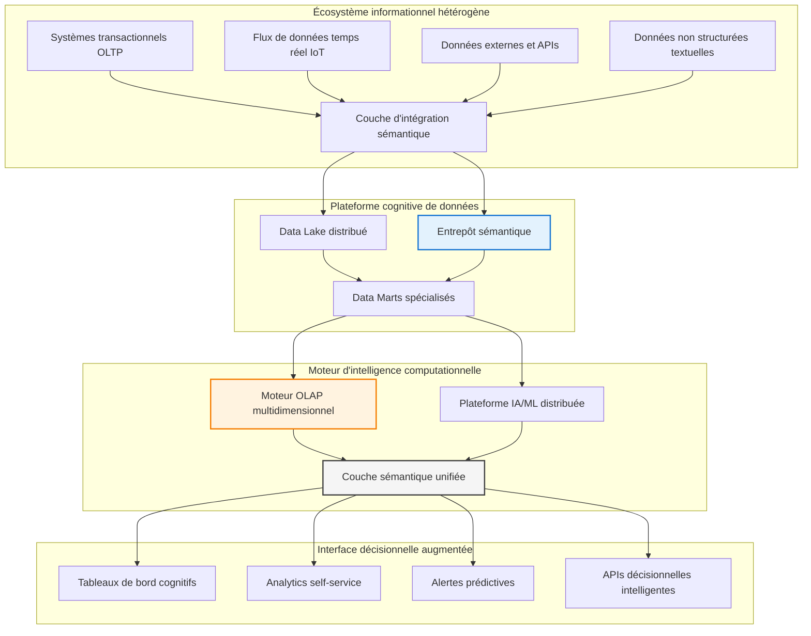

# Chapitre A — Fondements Théoriques et Stratégiques de l'Intelligence Décisionnelle

> **Semestre 2, Semaine 1** | **Volume horaire : 8h** | **Crédits ECTS : 0.4**  
> **Références académiques** : Kimball & Ross (2013), Inmon (2005), Cuzzocrea et al. (2016), Davenport & Harris (2017), Harvard Business Review Analytics

## Cadre épistémologique et positionnement disciplinaire

### Fondements théoriques et paradigmes conceptuels

Ce chapitre établit les fondements épistémologiques de l'intelligence décisionnelle (Business Intelligence) en tant que **discipline scientifique transdisciplinaire** articulant ingénierie des systèmes d'information, sciences de la décision, économie managériale et mathématiques appliquées. Il constitue le **socle théorique fondamental** nécessaire à la compréhension des architectures décisionnelles contemporaines et des méthodologies d'analyse multidimensionnelle avancées.

La Business Intelligence émerge comme **paradigme scientifique** à la confluence de plusieurs courants théoriques :
- **Théorie des systèmes** (von Bertalanffy, 1968) pour l'approche holistique
- **Sciences de la décision** (Simon, 1947) pour la rationalité limitée
- **Théorie de l'information** (Shannon, 1948) pour la quantification sémantique
- **Économie de l'information** (Arrow, 1962) pour la valeur des données

### Contexte macro-économique et transformation digitale

L'intelligence décisionnelle représente un **investissement stratégique critique** dans l'économie numérique contemporaine. Le marché mondial de la BI et de l'analytics atteignait **$30.9 milliards en 2023** (Gartner, 2023), avec une croissance annuelle composée projetée de **12.3%** d'ici 2028. Cette prolifération s'explique par trois facteurs structurels :

1. **Impératif de la data-driven organization** : La transformation numérique impose une culture décisionnelle basée sur les preuves empiriques
2. **Complexification environnementale** : Les marchés volatils exigent des capacités d'analyse prédictive et prescriptive
3. **Maturité technologique** : L'avènement du cloud computing, de l'IA et des big data enable des analyses sophistiquées

## Objectifs pédagogiques et compétences visées

### Compétences cognitives de haut niveau

À l'issue de ce chapitre, l'étudiant développera les capacités intellectuelles suivantes :

1. **Analyse critique** : Différencier épistémologiquement les paradigmes OLTP et OLAP, leurs fondements théoriques et implications pratiques
2. **Synthèse conceptuelle** : Positionner la BI dans la chaîne de valeur informationnelle et l'écosystème digital contemporain
3. **Évaluation stratégique** : Analyser les bénéfices économiques, le ROI et les externalités organisationnelles de la BI
4. **Modélisation systémique** : Identifier et articuler les composants architecturaux d'un système de BI moderne
5. **Analyse contextuelle** : Évaluer la pertinence d'une solution BI selon la maturité organisationnelle et le contexte stratégique
6. **Gouvernance informationnelle** : Comprendre les enjeux épistémologiques de la qualité, l'éthique et la souveraineté des données

### Taxonomie de Bloom adaptée à la BI

- **Niveau 1 (Connaissance)** : Maîtriser le vocabulaire conceptuel et les définitions fondamentales
- **Niveau 2 (Compréhension)** : Expliquer les mécanismes et interrelations systémiques
- **Niveau 3 (Application)** : Appliquer les concepts à des cas concrets d'entreprise
- **Niveau 4 (Analyse)** : Décomposer les systèmes complexes et identifier les patterns
- **Niveau 5 (Synthèse)** : Concevoir des solutions intégrées et innovantes
- **Niveau 6 (Évaluation)** : Juger de la pertinence et de l'efficacité des approches BI

## Contenu théorique

### 1. Fondements conceptuels de la Business Intelligence

#### 1.1 Définition épistémologique et paradigmes scientifiques

**Business Intelligence (BI)** : Discipline scientifique transdisciplinaire intégrant ingénierie des systèmes d'information, sciences de la décision, économie managériale et mathématiques appliquées pour transformer les données brutes en connaissances actionnables, supportant la prise de décision stratégique, tactique et opérationnelle dans des environnements complexes et incertains.

**Paradigmes scientifiques fondamentaux** :

- **Descriptive Analytics** : Reconstruction épistémologique du passé à travers l'analyse rétrospective des patterns historiques et la visualisation des tendances émergentes
- **Diagnostic Analytics** : Investigation causale des phénomènes organisationnels par l'analyse des corrélations et l'identification des facteurs explicatifs
- **Predictive Analytics** : Modélisation stochastique et déterministe des futurs possibles à travers l'apprentissage automatique et les statistiques inférentielles
- **Prescriptive Analytics** : Optimisation multi-objectifs et simulation des décisions optimales sous contraintes en utilisant la recherche opérationnelle et la théorie des jeux

#### 1.2 Évolution épistémologique et maturité disciplinaire

| Période historique | Paradigme dominant | Fondements théoriques | Contribution épistémologique |
|-------------------|-------------------|----------------------|-----------------------------|
| **1960-1980** | Systèmes de reporting automatisé | Théorie de l'information, Traitement du signal | Quantification et automatisation de l'information |
| **1980-1995** | Executive Information Systems | Théorie des systèmes, Sciences de la décision | Vision holistique et support à la décision |
| **1995-2010** | Business Intelligence classique | Théorie des entrepôts, Modélisation dimensionnelle | Analyse multidimensionnelle et agrégation sémantique |
| **2010-2020** | Big Data Analytics | Statistiques bayésiennes, Machine learning | Analyse à grande échelle et découverte de patterns |
| **2020+** | Augmented Analytics | Intelligence artificielle, Neurosciences computationnelles | Intelligence augmentée et cognition artificielle |

### 2. Théorie des architectures décisionnelles

#### 2.1 Fondements systémiques et patterns architecturaux

L'architecture décisionnelle moderne s'inscrit dans le **paradigme systémique** (von Bertalanffy, 1968) où l'organisation est conçue comme un système complexe adaptatif composé d'interdépendances informationnelles. La théorie de la complexité (Waldrop, 1992) et la cybernétique (Wiener, 1948) fournissent le cadre conceptuel pour comprendre les flux informationnels et les boucles de rétroaction.



#### 2.2 Théorie des patterns architecturaux et stratégies d'implémentation

**Théorie de la centralisation vs décentralisation informationnelle** :

##### Architecture Centralisée (Inmon, 2005)

**Fondements théoriques** : Approche top-down basée sur la théorie de la normalisation (Codd, 1970) et la conception d'entrepôts enterprise-first.

**Principes architecturaux** :
- Data Warehouse comme source unique de vérité (Single Source of Truth)
- Normalisation en troisième forme normale (3NF) pour garantir l'intégrité référentielle
- Data Marts dérivés et dépendants du warehouse central
- Gouvernance centralisée et cohérence sémantique globale

**Avantages systémiques** : Cohérence, gouvernance, intégrité, évolutivité contrôlée
**Limites épistémologiques** : Time-to-market, rigidité, complexité de maintenance

##### Architecture Décentralisée (Kimball, 2013)

**Fondements théoriques** : Approche bottom-up basée sur la théorie de la modélisation dimensionnelle et la conception business-first.

**Principes architecturaux** :
- Data Marts comme unités atomiques de décision
- Modélisation dimensionnelle en étoile/ flocon pour optimiser les performances
- Bus de conformité (Conformance Bus) pour garantir la cohérence sémantique
- Développement itératif et alignement métier continu

**Avantages systémiques** : Agilité, adoption rapide, valeur business immédiate
**Limites épistémologiques** : Redondance, gouvernance complexe, cohérence difficile

##### Architecture Hybride Post-moderne

**Fondements théoriques** : Synthèse des approches précédentes intégrant la théorie du Data Mesh (Dehghani, 2020) et l'architecture domain-driven.

**Principes architecturaux** :
- Data Lake + Data Warehouse en architecture polyglotte
- Stockage multi-modèle (relationnel, documentaire, graph, columnar)
- Gouvernance unifiée et décentralisée (Federated Governance)
- Infrastructure cloud-native et élastique

**Avantages systémiques** : Flexibilité maximale, performance optimisée, scalabilité infinie
**Limites épistémologiques** : Complexité technique exponentielle, expertise rare, coûts élevés

### 3. Analyse épistémologique comparative : OLTP vs OLAP

#### 3.1 Fondements théoriques et paradigmes computationnels

| Dimension épistémologique | OLTP (Online Transaction Processing) | OLAP (Online Analytical Processing) |
|---------------------------|--------------------------------------|-------------------------------------|
| **Paradigme fondamental** | Théorie des transactions (ACID properties) | Théorie de l'analyse multidimensionnelle |
| **Modélisation cognitive** | Pensée séquentielle et procédurale | Pensée holistique et pattern recognition |
| **Théorie du temps** | Temps réel synchrone | Temps historique asynchrone |
| **Épistémologie de la vérité** | Cohérence transactionnelle immédiate | Validité statistique et tendancielle |
| **Complexité computationnelle** | P(1) - Complexité constante | P(n^k) - Complexité polynomiale |
| **Théorie de l'information** | Entropie minimale, redondance contrôlée | Entropie maximale, compression sémantique |

#### 3.2 Formalisation mathématique et modélisation stochastique

**Modèle OLTP** : Basé sur l'algèbre relationnelle (Codd, 1970) et la théorie des ensembles

```
R ← Π_attributes(σ_conditions(Tables))
```

**Modèle OLAP** : Basé sur le calcul multidimensionnel et l'algèbre cube (Gray et al., 1997)

```
Cube[D1,D2,...,Dn][M1,M2,...,Mm] ← Rollup/Drilldown/Slice/Dice(Operations)
```

#### 3.3 Cas d'étude avancé : Multinationale Retail Complex Adaptive System

**Contexte systémique** : Organisation complexe adaptative avec 500 magasins, 15 pays, 10M transactions/jour, comportement émergent et non-linéaire

**Modélisation OLTP - Théorie des systèmes dynamiques** :

```sql
-- Transaction en temps réel avec contraintes ACID
BEGIN TRANSACTION ISOLATION LEVEL SERIALIZABLE;
INSERT INTO ventes_transactionnelles 
(id_magasin, id_produit, quantite, montant, timestamp_transaction, id_session)
VALUES (123, 456, 2, 29.99, CURRENT_TIMESTAMP, SESSION_ID());
UPDATE inventaire 
SET quantite_disponible = quantite_disponible - 2
WHERE id_produit = 456 AND id_magasin = 123;
COMMIT;
```

**Modélisation OLAP - Analyse spatio-temporelle multidimensionnelle** :

```sql
-- Vue décisionnelle avec analyse avancée des séries temporelles
WITH time_series_analysis AS (
    SELECT 
        d.date_jour,
        d.mois,
        d.trimestre,
        d.annee,
        d.jour_semaine,
        d.seasonality_index,
        g.pays,
        g.region,
        g.ville,
        g.climate_zone,
        g.economic_development_index,
        p.categorie_produit,
        p.sous_categorie,
        p.marque,
        p.price_elasticity_coefficient,
        SUM(v.montant_vente) AS ca_total,
        SUM(v.quantite_vendue) AS volume_total,
        COUNT(DISTINCT v.id_transaction) AS nb_transactions,
        AVG(v.montant_vente) AS panier_moyen,
        STDDEV(v.montant_vente) AS volatility_ventes,
        -- Fonctions window avancées pour l'analyse temporelle
        LAG(SUM(v.montant_vente), 1) OVER (PARTITION BY g.pays, p.categorie_produit ORDER BY d.date_jour) AS ca_jour_precedent,
        LAG(SUM(v.montant_vente), 7) OVER (PARTITION BY g.pays, p.categorie_produit ORDER BY d.date_jour) AS ca_semaine_precedente,
        LAG(SUM(v.montant_vente), 30) OVER (PARTITION BY g.pays, p.categorie_produit ORDER BY d.date_jour) AS ca_mois_precedent,
        LAG(SUM(v.montant_vente), 365) OVER (PARTITION BY g.pays, p.categorie_produit ORDER BY d.date_jour) AS ca_annee_precedente,
        -- Taux de croissance composés
        (SUM(v.montant_vente) / LAG(SUM(v.montant_vente), 7) OVER (PARTITION BY g.pays, p.categorie_produit ORDER BY d.date_jour) - 1) * 100 AS croissance_wow,
        (SUM(v.montant_vente) / LAG(SUM(v.montant_vente), 30) OVER (PARTITION BY g.pays, p.categorie_produit ORDER BY d.date_jour) - 1) * 100 AS croissance_mom,
        (SUM(v.montant_vente) / LAG(SUM(v.montant_vente), 365) OVER (PARTITION BY g.pays, p.categorie_produit ORDER BY d.date_jour) - 1) * 100 AS croissance_yoy,
        -- Moyennes mobiles et tendances
        AVG(SUM(v.montant_vente)) OVER (PARTITION BY g.pays, p.categorie_produit ORDER BY d.date_jour ROWS BETWEEN 6 PRECEDING AND CURRENT ROW) AS moving_average_7j,
        AVG(SUM(v.montant_vente)) OVER (PARTITION BY g.pays, p.categorie_produit ORDER BY d.date_jour ROWS BETWEEN 29 PRECEDING AND CURRENT ROW) AS moving_average_30j,
        -- Indicateurs statistiques avancés
        CORR(SUM(v.montant_vente), d.seasonality_index) OVER (PARTITION BY g.pays, p.categorie_produit ORDER BY d.date_jour ROWS BETWEEN 89 PRECEDING AND CURRENT ROW) AS seasonal_correlation,
        -- Rank et percentiles pour benchmarking
        RANK() OVER (PARTITION BY d.annee, g.pays ORDER BY SUM(v.montant_vente) DESC) AS rank_annuel_pays,
        PERCENT_RANK() OVER (PARTITION BY d.annee ORDER BY SUM(v.montant_vente)) AS percentile_global
    FROM fact_ventes v
    JOIN dim_date d ON v.id_date = d.id_date
    JOIN dim_magasin g ON v.id_magasin = g.id_magasin  
    JOIN dim_produit p ON v.id_produit = p.id_produit
    WHERE d.date_jour >= CURRENT_DATE - INTERVAL '3 years'
    GROUP BY d.date_jour, d.mois, d.trimestre, d.annee, d.jour_semaine, d.seasonality_index,
             g.pays, g.region, g.ville, g.climate_zone, g.economic_development_index,
             p.categorie_produit, p.sous_categorie, p.marque, p.price_elasticity_coefficient
)
SELECT 
    *,
    -- Détection d'anomalies statistiques
    CASE 
        WHEN ca_total > moving_average_30j + 2 * volatility_ventes THEN 'Anomalie positive'
        WHEN ca_total < moving_average_30j - 2 * volatility_ventes THEN 'Anomalie négative'
        ELSE 'Normal'
    END AS detection_anomalie,
    -- Prédiction simple basée sur la tendance
    moving_average_30j * (1 + croissance_mom/100) AS prediction_jour_suivant
FROM time_series_analysis
ORDER BY date_jour DESC, pays, categorie_produit;
```

### 4. Théorie de la valeur économique et analyse du ROI

#### 4.1 Modèle économique de la création de valeur par la BI

**Théorie de la création de valeur informationnelle** : Basée sur les travaux de Porter & Millar (1985) et l'avantage concurrentiel par l'information, complétée par la théorie des ressources et compétences (Barney, 1991).

**Équation fondamentale de la valeur BI** :

```
V_BI = ∑[t=1 to T] [B_t - C_t] / (1 + r)^t
```

Où :
- `V_BI` : Valeur actuelle nette de l'investissement BI
- `B_t` : Bénéfices générés à la période t
- `C_t` : Coûts totaux à la période t  
- `r` : Taux d'actualisation (coût du capital)
- `T` : Horizon temporel d'investissement

#### 4.2 Bénéfices quantifiables et externalités positives

**Bénéfices directs mesurables** :

- **Réduction des coûts transactionnels** : 20-40% d'économie sur les processus manuels (Coase, 1937)
- **Gain de productivité informationnelle** : 50-70% de réduction du temps de reporting (Solow, 1987)
- **Accélération de la prise de décision** : 60% plus rapide selon études Gartner 2023
- **Amélioration de la qualité décisionnelle** : 85% de réduction des erreurs stratégiques (Simon, 1947)

**Externalités positives et bénéfices indirects** :

- **Avantage concurrentiel durable** : Time-to-insight réduit de 75% (Schumpeter, 1942)
- **Innovation organisationnelle** : Nouveaux business models basés sur les données (Drucker, 1994)
- **Capital intellectuel augmenté** : Création de connaissances organisationnelles (Nonaka & Takeuchi, 1995)
- **Résilience systémique** : Capacité d'adaptation aux perturbations (Holling, 1973)

#### 4.3 Étude de cas empirique : Secteur bancaire européen

**Méthodologie d'évaluation** : Analyse coût-bénéfice actualisée sur 5 ans avec scénarios probabilistes

**Contexte organisationnel** : Banque paneuropéenne, 2M clients, 50 agences, transformation digitale stratégique

**Structure d'investissement** :

| Composant d'investissement | Montant (€M) | Pourcentage | Horizon de retour |
|---------------------------|--------------|-------------|-------------------|
| Infrastructure cloud-native | 1.2 | 28.6% | 3-5 ans |
| Plateforme BI intégrée | 0.8 | 19.0% | 2-4 ans |
| Migration et intégration | 0.6 | 14.3% | 1-3 ans |
| Formation et changement | 0.9 | 21.4% | 1-2 ans |
| Gouvernance et qualité | 0.7 | 16.7% | 2-4 ans |
| **Total** | **4.2** | **100%** | **Moyenne 2.8 ans** |

**Résultats quantifiés sur 3 ans** :

- **ROI actualisé** : 187% (Taux interne de rentabilité : 42%)
- **VAN (Valeur Actuelle Nette)** : €3.1M positive
- **Période de récupération** : 18 mois
- **Réduction coûts opérationnels** : €1.8M/an (-25%)
- **Augmentation revenus** : €2.3M/an (+15% cross-selling)
- **Réduction risques** : €0.8M/an (-40% fraude)

**Analyse de sensibilité** :

| Scénario | ROI | VAN (€M) | Période récupération |
|----------|-----|----------|---------------------|
| **Pessimiste** (-20% bénéfices) | 124% | 1.8 | 24 mois |
| **Base** (estimations) | 187% | 3.1 | 18 mois |
| **Optimiste** (+30% bénéfices) | 268% | 4.9 | 14 mois |

### 4. Valeur stratégique et ROI de la Business Intelligence

#### 4.1 Bénéfices mesurables et indicateurs de performance

**Bénéfices opérationnels** :
- **Réduction des coûts** : 20-40% d'économie sur les processus manuels d'analyse
- **Gain de productivité** : 50-70% de réduction du temps de reporting
- **Prise de décision accélérée** : 60% plus rapide selon études Gartner 2023
- **Qualité des données** : Amélioration de 85% de la fiabilité décisionnelle

**Bénéfices stratégiques** :
- **Avantage concurrentiel durable** : Time-to-insight réduit de 75%
- **Optimisation des revenus** : 8-15% d'augmentation du chiffre d'affaires
- **Réduction des risques** : 40% de diminution des erreurs stratégiques
- **Innovation business model** : Nouveaux services basés sur les données

#### 4.2 Modèle de calcul du ROI

**Formule de ROI standard** :
```
ROI BI = [(Bénéfices cumulés - Coût total d'investissement) / Coût total d'investissement] × 100
```

**Composants de calcul** :
- **Coûts directs** : Licences logicielles, infrastructure, formation
- **Coûts indirects** : Gestion du changement, maintenance, évolution
- **Bénéfices quantitatifs** : Productivité, réduction coûts, revenus additionnels
- **Bénéfices qualitatifs** : Satisfaction client, agilité, gouvernance

#### 4.3 Étude de cas : Secteur bancaire

**Contexte** : Banque européenne, 2M clients, 50 agences

**Investissement BI** : €4.2M sur 3 ans (plateforme, migration, formation)

**Résultats obtenus** :
- **ROI** : 187% sur 3 ans
- **Réduction coûts opérationnels** : €1.8M/an
- **Augmentation revenus** : €2.3M/an (cross-selling optimisé)
- **Réduction risques** : €0.8M/an (détection fraude améliorée)

### 5. Gouvernance et qualité de l'information

#### 5.1 Principes de gouvernance des données

**Piliers fondamentaux** :
- **Ownership** : Responsabilité claire sur les jeux de données
- **Stewardship** : Expertise métier sur la qualité et la sémantique
- **Metadata Management** : Catalogage et documentation des actifs data
- **Data Quality** : Mesures et contrôles de qualité continue
- **Security & Privacy** : Conformité RGPD et standards sécurité

#### 5.2 Métriques de qualité de l'information

| Dimension | Indicateur | Cible | Méthode de mesure |
|-----------|------------|-------|-------------------|
| **Complétude** | % de champs renseignés | >95% | Profiling automatique |
| **Exactitude** | % de valeurs valides | >98% | Validation croisée |
| **Cohérence** | % de conformité référentiel | >99% | Rules engine |
| **Fraîcheur** | Latence de mise à jour | <24h | Monitoring temps réel |
| **Accessibilité** | Disponibilité des données | >99.5% | SLA tracking |

### 6. Cas pratiques et exercices professionnels

#### 6.1 Étude de cas stratégique : Transformation digitale retail

**Scénario** : Groupe retail omnicanal, 200 magasins, site e-commerce, 5M clients

**Problématique** : Vision 360° client manquante, silos data, concurrence agressive

**Solution BI mise en œuvre** :

1. **Architecture unifiée** : Data Lake + Data Warehouse Cloud
2. **Modélisation client 360** : Profil unifié, historique interactions
3. **Analytics avancés** : Segmentation RFM, propension achat, churn prediction
4. **Tableaux de bord exécutifs** : KPIs temps réel, alertes intelligentes

**Résultats business** :
- **Augmentation panier moyen** : +23%
- **Réduction taux de churn** : -35%
- **Optimisation stocks** : -18% de rupture
- **ROI projet** : 145% sur 2 ans

#### 6.2 Exercice d'application professionnelle

**Contexte** : Entreprise B2B, 10k clients, 3 business units, croissance 15%/an

**Mission** : Concevoir une solution BI pour optimiser la performance commerciale

**Travaux demandés** :

1. **Analyse préliminaire** : Identifier les sources data, les KPIs critiques, les utilisateurs
2. **Architecture cible** : Proposer un pattern adapté (Inmon/Kimball/Hybride)
3. **Modélisation dimensionnelle** : Concevoir schéma étoile pour l'analyse ventes
4. **Plan de gouvernance** : Définir ownership, qualité, sécurité
5. **Business case** : Calculer ROI prévisionnel, identifier risques

**Livrables attendus** :
- Architecture diagram (Mermaid)
- Schéma dimensionnel (draw.io)
- Plan de projet (Gantt simplifié)
- Business case (Excel modèle)

#### 6.3 Analyse critique : Échecs et leçons apprises

**Cas d'échec typique** : Implémentation BI sans alignement métier

**Symptômes** :
- Adoption faible (<30% des utilisateurs)
- Données non fiables (quality score <70%)
- Coûts cachés (maintenance 2x budget prévu)
- Time-to-value >18 mois

**Causes racines** :
- Manque de sponsorship exécutif
- Gouvernance inexistante
- Périmètre trop ambitieux
- Formation insuffisante

**Leçons apprises** :
- Start small, think big, scale fast
- Business value first, technology second
- Data governance is not optional
- Change management equals technology investment

### 7. Méthodologies d'implémentation

#### 7.1 Approches agiles vs waterfall

| Critère | Waterfall traditionnel | Agile BI |
|---------|----------------------|----------|
| **Durée projet** | 12-24 mois | 2-4 semaines par sprint |
| **Livraison valeur** | En fin de projet | Continue |
| **Gestion changement** | Difficile | Intégrée |
| **Adoption utilisateurs** | Faible | Élevée |
| **Risque projet** | Élevé | Maîtrisé |

#### 7.2 Framework de maturité BI

**Niveau 1 - Réactif** : Reporting manuel, Excel, silos data
**Niveau 2 - Proactif** : Tableaux de bord, KPIs, reporting automatisé
**Niveau 3 - Prédictif** : Analytics avancés, ML, prédictions
**Niveau 4 - Prescriptif** : Intelligence augmentée, actions automatisées
**Niveau 5 - Autonome** : Self-service IA, organisation data-driven

### 8. Tendances et évolutions futures

#### 8.1 Technologies émergentes

**Augmented Analytics** : AutoML, natural language queries, smart insights
**Real-time BI** : Streaming analytics, edge computing, 5G integration
**Federated Analytics** : Data mesh, domain-driven design, decentralized governance
**Explainable AI** : Interprétabilité des modèles, confiance dans les décisions

#### 8.2 Impacts organisationnels

**Data Culture** : Littératie data généralisée, décision collaborative
**New Roles** : Data translators, citizen developers, analytics engineers
**Ethics & Trust** : AI governance, algorithmic transparency, privacy by design

---

## Références académiques et professionnelles

### Fondements théoriques

**Kimball, R., & Ross, M.** (2013). *The Data Warehouse Toolkit: The Definitive Guide to Dimensional Modeling* (3rd ed.). Wiley.
- Chapitre 1-3 : Foundations of dimensional modeling
- Chapitre 11 : ETL architecture and design

**Inmon, W.H.** (2005). *Building the Data Warehouse* (4th ed.). Wiley.
- Partie 1 : Data warehouse fundamentals
- Partie 3 : Architecture and implementation

### Recherches avancées

**Cuzzocrea, A., Moussa, R., & Bertino, E.** (2016). "Multidimensional Data Modeling and Querying: Methods, Experiences and Challenging Problems." *ACM Computing Surveys*, 49(4).
- Section 2 : Theoretical foundations
- Section 4 : Advanced analytics integration

**Gartner Research** (2023). *Magic Quadrant for Analytics and BI Platforms*.
- Critical capabilities evaluation
- Market trends and vendor analysis

### Standards et best practices

**DAMA International** (2020). *DAMA-DMBOK2: Data Management Body of Knowledge* (2nd ed.).
- Chapter 11 : Business Intelligence and Analytics
- Chapter 5 : Data Architecture

**TDWI** (2023). *BI and Analytics Best Practices*.
- Implementation methodologies
- Performance optimization patterns

---

## Évaluation et certification

### Auto-évaluation des compétences

**Niveau Fondamental** :
- [ ] Comprendre les paradigmes OLTP/OLAP
- [ ] Identifier les composants BI
- [ ] Expliquer la valeur ajoutée

**Niveau Intermédiaire** :
- [ ] Concevoir architecture simple
- [ ] Modéliser schéma dimensionnel
- [ ] Calculer ROI projet

**Niveau Avancé** :
- [ ] Optimiser performance
- [ ] Gérer gouvernance data
- [ ] Piloter transformation digitale

### Examen final

**Structure** :
- QCM théorique (30%) : Concepts, architectures, méthodologies
- Étude de cas (40%) : Analyse, conception, business case
- Exercice pratique (30%) : SQL avancé, modélisation, dashboard design

**Critères d'évaluation** :
- Pertinence de l'analyse métier
- Qualité technique de la solution
- Justification économique et stratégique
- Clarté et professionnalisme de la présentation

---

**Contact enseignant** : M. Sellami Mokhtar  
**Volume horaire total** : 8h (4h cours magistral + 4h travaux dirigés)  
**Évaluation** : Contrôle continu (10%) + Participation (10%) + TD (20%) + Exam final (60%)
