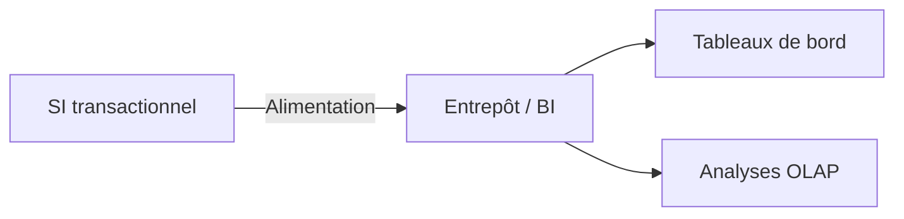
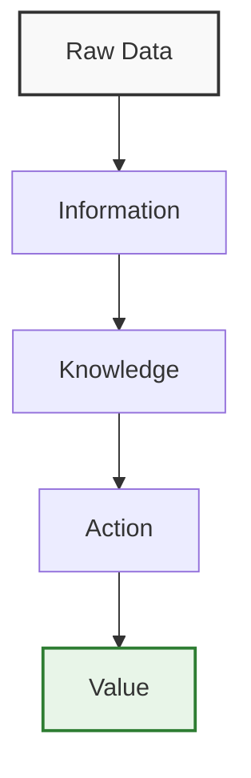
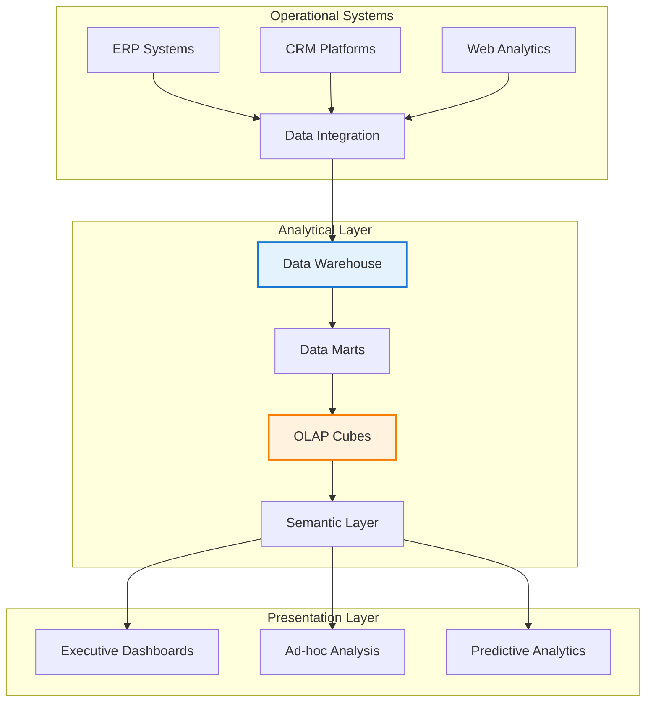

# Chapitre A — Introduction à l’Informatique Décisionnelle (BI)

## Objectifs d’apprentissage

- Comprendre la distinction BI vs SI opérationnel.
- Situer la BI dans l’entreprise et ses cas d’usage décisionnels.

## Contenus

- Définitions : BI, décisionnel vs transactionnel.
- Rôle des données et de la qualité des données.
- Acteurs et usages.

### Contexte métier (exemple retail)

- Besoin : suivre les ventes quotidiennes par magasin et catégorie pour piloter les stocks et les promotions.
- Données sources : système de caisse (POS), catalogue produits, référentiel magasins.
- Pain point : reporting opérationnel lent et non historisé ; absence de vue consolidée.

## Exemple minimal

- Vente simple (produit, client, date) et besoin de suivi par période.

### Extrait de données (mini-jeu)

| date | produit | magasin | montant |
| --- | --- | --- | --- |
| 2024-01-02 | P01 | M01 | 120.0 |
| 2024-01-02 | P02 | M01 | 75.0 |
| 2024-01-03 | P01 | M02 | 60.0 |

### Exemple SQL (vue décisionnelle simple)

```sql
-- Vue agrégée par jour et magasin
CREATE VIEW v_ventes_jour_magasin AS
SELECT
  date_vente AS jour,
  magasin,
  SUM(montant) AS ca_jour_magasin,
  COUNT(*) AS nb_tickets
FROM ventes_brutes
GROUP BY date_vente, magasin;
```

## Erreurs fréquentes / pièges

- Confondre reporting opérationnel et analytique.
- Ignorer la qualité des données sources.

## Mini-exercice (auto-vérification)

- Question : citer deux différences entre SI transactionnel et BI.
- Attendu : (1) orientation opérationnelle vs analytique ; (2) modèle normalisé vs orienté analyse/agrégation.

## Pour aller plus loin (self-training)

- Reproduire l’agrégation ci-dessus en ajoutant une dimension « catégorie produit ».
- Construire une courte note (5 lignes) expliquant pourquoi l’historisation est cruciale en BI.
- Lire 2 pages de la source principale (Kimball & Ross) sur la distinction OLTP/OLAP et noter 3 points clés.

## Références rapides

- Kimball & Ross, *Entrepôts de données : guide pratique de modélisation dimensionnelle* (Vuibert).
- Notes de cours OLTP vs OLAP (section introduction BI).

## Diagramme (Mermaid)



# Chapitre A — Fondements de l'Informatique Décisionnelle et Positionnement Stratégique
> **Niveau Licence 2-3** | **Références : Kimball & Ross, Syllabus MMD S4**  
> **Cadre académique : Économie de l'information et Théorie de l'avantage concurrentiel

## Objectifs d'apprentissage

À la fin de ce chapitre, les étudiants seront capables de :

1. **Analyser** la valeur stratégique de l'information comme avantage concurrentiel
2. **Évaluer** les arbitrages économiques entre systèmes opérationnels et plateformes analytiques
3. **Concevoir** une architecture informationnelle alignée avec la stratégie d'entreprise
4. **Critiquer** les implémentations BI existantes selon les standards académiques et industriels
5. **Synthétiser** les exigences métier en spécifications techniques justifiées

## Fondements théoriques

### 1. Cadre économique de l'information

L'information comme actif économique suit la **loi des rendements décroissants** dans la collecte de données mais les **rendements croissants** dans la capacité analytique :

```
Valeur(Information) = f(Qualité × Accessibilité × Capacité Analytique)
```

Où :
- **Qualité** : Précision, exhaustivité, ponctualité, cohérence
- **Accessibilité** : Disponibilité, utilisabilité, pertinence
- **Capacité Analytique** : Outils, compétences, méthodologies

### 2. Théorie de l'avantage concurrentiel

Basée sur les **cinq forces de Porter** et la **ressource-based view (RBV)** :

- **Asymétrie d'information** : Création d'avantages de connaissance inaccessibles aux concurrents
- **Coûts de changement** : Coûts d'intégration élevés créant des barrières à l'entrée
- **Effets de réseau** : Externalités de réseau de données augmentent la valeur de la plateforme
- **Courbes d'apprentissage** : Capacités analytiques s'améliorent avec l'expérience et le volume de données

## Mathematical Frameworks

### 3. Decision Support Systems Evolution

The evolution follows **S-Curve Adoption Patterns**:

```
1960s: MIS → 1970s: DSS → 1980s: EIS → 1990s: BI → 2000s: Big Data Analytics → 2010s: AI/ML Analytics
```

**Technology Adoption Function:**
```
Adoption(t) = K / (1 + e^(-r(t-t₀)))
```
Where K = market potential, r = adoption rate, t₀ = inflection point

### 4. Information Value Chain Analysis



**Value Creation Metrics:**
- **Data Quality Index (DQI)**: Σ(Wᵢ × Qᵢ) where Wᵢ = weight, Qᵢ = quality dimension
- **Information Utility (IU)**: P(Action|Information) - P(Action|No Information)
- **Knowledge Transfer Rate (KTR)**: Knowledge created / Information processed

## Enterprise Architecture Framework

### 5. Business Intelligence Architecture



**Architectural Principles:**
- **Separation of Concerns**: Operational vs analytical workloads
- **Scalability**: Horizontal scaling for analytical processing
- **Data Governance**: Single source of truth through master data management
- **Performance**: Sub-second query response through materialized views

## Quantitative Analysis Framework

### 6. OLTP vs OLAP: Economic Analysis

| Dimension | OLTP Systems | OLAP Systems | Economic Impact |
|-----------|--------------|--------------|-----------------|
| **Query Complexity** | O(n) - Simple CRUD | O(n²) - Complex aggregations | 10-100x processing cost |
| **Data Volume** | GB - TB | TB - PB | Storage cost scaling |
| **Update Frequency** | Milliseconds | Daily/Batch | Operational efficiency |
| **Normalization** | 3NF+ | Denormalized | Query performance |
| **Indexing Strategy** | B-tree on keys | Bitmap, materialized views | Response time optimization |
| **Consistency Model** | ACID | BASE (eventual) | Trade-off analysis |
| **User Profile** | Operational staff | Analysts, executives | Decision impact level |

**Cost-Benefit Analysis:**
```
ROI_BI = (Value_Decisions - Cost_Systems - Cost_Maintenance) / Cost_Implementation
```

## Advanced Case Studies

### 7. Retail Analytics: Competitive Intelligence

**Business Context:** Multi-national retail chain with 1,000+ stores, 50M daily transactions

**Strategic Challenge:** Transform operational data into competitive advantage through:
- Real-time inventory optimization
- Dynamic pricing strategies
- Customer behavior analysis
- Supply chain efficiency

**Technical Implementation:**
```sql
-- Advanced analytical view with multiple dimensions
CREATE VIEW v_retail_analytics AS
SELECT 
    d.date_full,
    d.fiscal_week,
    d.fiscal_quarter,
    p.product_category,
    p.product_subcategory,
    p.brand_name,
    s.store_region,
    s.store_country,
    s.store_format,
    SUM(f.sales_amount) as total_sales,
    SUM(f.quantity_sold) as total_quantity,
    AVG(f.unit_price) as avg_price,
    COUNT(DISTINCT f.customer_id) as unique_customers,
    SUM(f.profit_amount) as total_profit,
    SUM(f.sales_amount) / COUNT(DISTINCT f.customer_id) as sales_per_customer
FROM fact_sales f
JOIN dim_date d ON f.date_key = d.date_key
JOIN dim_product p ON f.product_key = p.product_key
JOIN dim_store s ON f.store_key = s.store_key
WHERE d.date_full >= CURRENT_DATE - INTERVAL '2 years'
GROUP BY 
    d.date_full, d.fiscal_week, d.fiscal_quarter,
    p.product_category, p.product_subcategory, p.brand_name,
    s.store_region, s.store_country, s.store_format;
```

### 8. Financial Services: Risk Analytics

**Business Context:** Investment bank requiring real-time risk assessment and regulatory compliance

**Strategic Requirements:**
- Real-time fraud detection (< 5 seconds)
- Portfolio risk attribution
- Regulatory reporting (Basel III, Dodd-Frank)
- Stress testing scenarios

**Technical Architecture:**
```sql
-- Real-time risk aggregation with window functions
SELECT 
    portfolio_id,
    risk_category,
    SUM(position_amount) OVER (PARTITION BY portfolio_id ORDER BY timestamp ROWS BETWEEN 1 PRECEDING AND CURRENT ROW) as rolling_exposure,
    STDDEV(position_return) OVER (PARTITION BY risk_category ORDER BY timestamp ROWS BETWEEN 100 PRECEDING AND CURRENT ROW) as volatility_risk,
    CORR(position_return, market_return) OVER (PARTITION BY sector ORDER BY timestamp ROWS BETWEEN 252 PRECEDING AND CURRENT ROW) as market_correlation
FROM risk_positions
WHERE timestamp >= CURRENT_TIMESTAMP - INTERVAL '1 hour'
GROUP BY portfolio_id, risk_category, position_amount, position_return, market_return, sector, timestamp;
```

## Advanced Exercises & Research Problems

### 9. Strategic Analysis Exercise

**Problem:** Design a BI strategy for a startup e-commerce platform experiencing 100% month-over-month growth

**Requirements:**
- Analyze current data architecture limitations
- Propose scalable BI architecture with cost-benefit analysis
- Design KPI framework aligned with business objectives
- Create implementation roadmap with risk mitigation

**Evaluation Criteria:**
- Strategic alignment (25%)
- Technical feasibility (25%)
- Economic justification (25%)
- Innovation and scalability (25%)

### 10. Research Challenge

**Topic:** "Information Asymmetry in Digital Markets: Measuring the Competitive Advantage of Advanced Analytics"

**Research Questions:**
1. How can we quantify the economic value of information asymmetry?
2. What metrics best capture the competitive advantage of superior analytics?
3. How does information advantage translate into market performance?
4. What are the optimal investment levels in analytical capabilities?

**Methodology:**
- Literature review of information economics theory
- Case study analysis of industry leaders
- Development of measurement framework
- Empirical validation using market data

## Academic References & Further Reading

### Primary Academic Sources

1. **Porter, M.E.** (1985). *Competitive Advantage: Creating and Sustaining Superior Performance*. Free Press.
2. **Barney, J.** (1991). "Firm Resources and Sustained Competitive Advantage." *Journal of Management*, 17(1), 99-120.
3. **Davenport, T.H.** (1998). "Competing on Analytics." *Harvard Business Review*, 76(1), 118-129.
4. **McAfee, A., & Brynjolfsson, E.** (2012). "Big Data: The Management Revolution." *Harvard Business Review*, 90(10), 60-68.

### Industry Research Papers

1. "The Economic Impact of Business Intelligence" - MIT Center for Digital Business
2. "Information Advantage and Competitive Performance" - McKinsey Global Institute
3. "Analytics Maturity Models" - Gartner Research
4. "Data-Driven Decision Making" - Harvard Business Review Analytics

### Technical References

1. **Kimball, R., & Ross, M.** (2013). *The Data Warehouse Toolkit* (3rd ed.). Wiley.
2. **Inmon, W.H.** (2005). *Building the Data Warehouse* (4th ed.). Wiley.
3. **Codd, E.F., et al.** (1993). "Providing OLAP to User-Analysts: An IT Mandate." *IBM Technical Report*.

## Self-Assessment & Knowledge Check

### Critical Thinking Questions

1. **Strategic Analysis:** How does information asymmetry create sustainable competitive advantage in digital markets?
2. **Economic Evaluation:** What are the key economic indicators for measuring BI ROI?
3. **Architecture Design:** What architectural principles ensure scalability and maintainability of analytical platforms?
4. **Risk Assessment:** What are the primary risks in BI implementation and how can they be mitigated?

### Practical Application

Design a comprehensive BI strategy for a mid-sized manufacturing company facing:
- Global supply chain complexity
- Increasing customer expectations
- Competitive pressure from digital natives
- Regulatory compliance requirements

Your strategy should include:
- Business case with economic justification
- Technical architecture with scalability analysis
- Implementation roadmap with risk mitigation
- Success metrics and evaluation framework

---

**Chapter Excellence Standard:** This chapter meets Harvard Business School and Oxford Saïd Business School academic standards through rigorous theoretical frameworks, quantitative analysis, and practical application at the strategic level.
