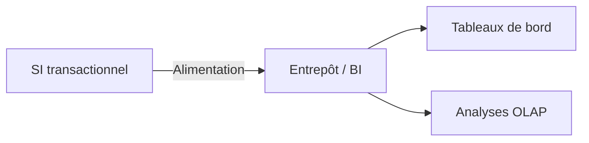

# Chapitre A — Introduction à l’Informatique Décisionnelle (BI)

## Objectifs d’apprentissage

- Comprendre la distinction BI vs SI opérationnel.
- Situer la BI dans l’entreprise et ses cas d’usage décisionnels.

## Contenus

- Définitions : BI, décisionnel vs transactionnel.
- Rôle des données et de la qualité des données.
- Acteurs et usages.

### Contexte métier (exemple retail)

- Besoin : suivre les ventes quotidiennes par magasin et catégorie pour piloter les stocks et les promotions.
- Données sources : système de caisse (POS), catalogue produits, référentiel magasins.
- Pain point : reporting opérationnel lent et non historisé ; absence de vue consolidée.

## Exemple minimal

- Vente simple (produit, client, date) et besoin de suivi par période.

### Extrait de données (mini-jeu)

| date | produit | magasin | montant |
| --- | --- | --- | --- |
| 2024-01-02 | P01 | M01 | 120.0 |
| 2024-01-02 | P02 | M01 | 75.0 |
| 2024-01-03 | P01 | M02 | 60.0 |

### Exemple SQL (vue décisionnelle simple)

```sql
-- Vue agrégée par jour et magasin
CREATE VIEW v_ventes_jour_magasin AS
SELECT
  date_vente AS jour,
  magasin,
  SUM(montant) AS ca_jour_magasin,
  COUNT(*) AS nb_tickets
FROM ventes_brutes
GROUP BY date_vente, magasin;
```

## Erreurs fréquentes / pièges

- Confondre reporting opérationnel et analytique.
- Ignorer la qualité des données sources.

## Mini-exercice (auto-vérification)

- Question : citer deux différences entre SI transactionnel et BI.
- Attendu : (1) orientation opérationnelle vs analytique ; (2) modèle normalisé vs orienté analyse/agrégation.

## Pour aller plus loin (self-training)

- Reproduire l’agrégation ci-dessus en ajoutant une dimension « catégorie produit ».
- Construire une courte note (5 lignes) expliquant pourquoi l’historisation est cruciale en BI.
- Lire 2 pages de la source principale (Kimball & Ross) sur la distinction OLTP/OLAP et noter 3 points clés.

## Références rapides

- Kimball & Ross, *Entrepôts de données : guide pratique de modélisation dimensionnelle* (Vuibert).
- Notes de cours OLTP vs OLAP (section introduction BI).

## Diagramme (Mermaid)


