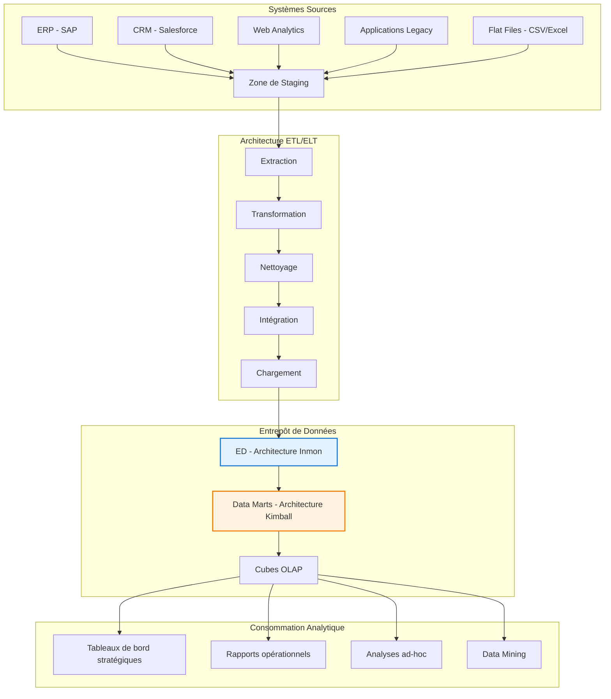
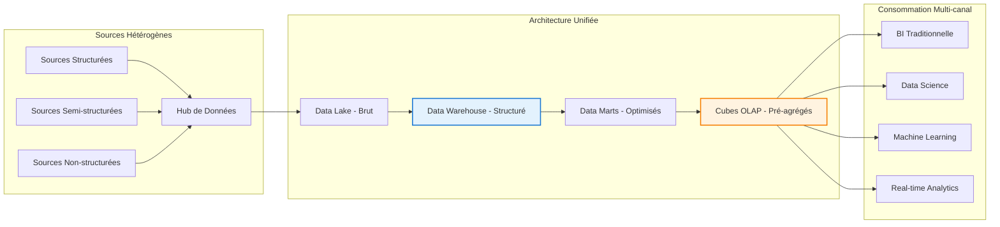
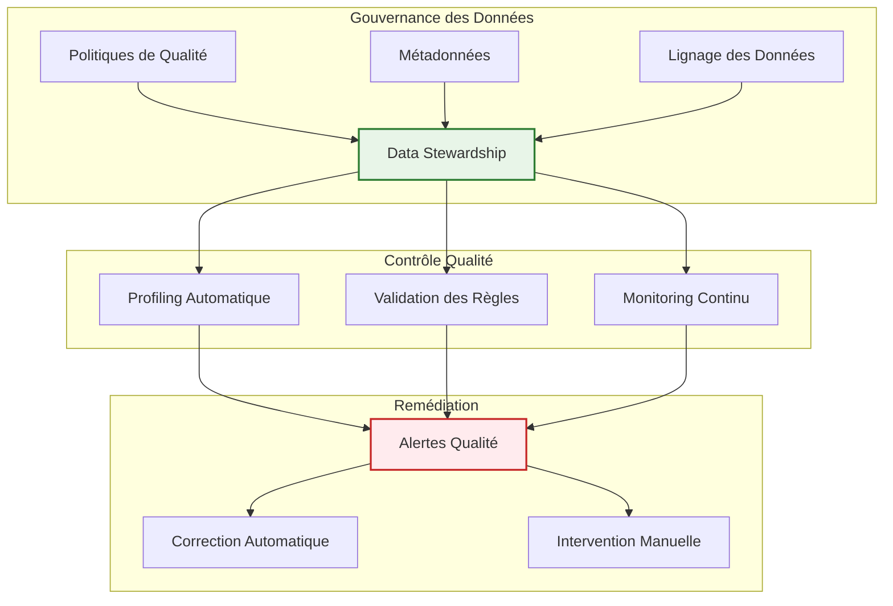

# Chapitre B — Entrepôts de Données : Concepts et Architecture

> **Semaine 2** | **Volume horaire : 8h** | **Crédits : 0.4**  
> **Références : Kimball & Ross (2003) Chap. 2-5, Inmon (2005), Syllabus MMD S4**

## Positionnement académique

Ce chapitre constitue le cœur technique de la modélisation décisionnelle. Il établit les fondements architecturaux des entrepôts de données (Data Warehouse) en tant que système d'information dédié à l'analyse décisionnelle, distinct par conception et finalité des systèmes opérationnels traditionnels.

## Objectifs pédagogiques

À l'issue de ce chapitre, l'étudiant sera capable de :

1. **Définir** formellement un entrepôt de données selon les critères académiques établis
2. **Analyser** les propriétés fondamentales d'un ED (subject-oriented, integrated, time-variant, non-volatile)
3. **Concevoir** une architecture d'ED adaptée aux besoins analytiques de l'entreprise
4. **Distinguer** les approches Inmon (top-down) et Kimball (bottom-up) avec justification
5. **Évaluer** les composants techniques d'une chaîne d'alimentation ETL/ELT

## Contenu théorique

### 1. Fondements conceptuels des entrepôts de données

#### 1.1 Définition académique et caractéristiques

**Définition (Inmon, 2005)** : "Un entrepôt de données est une collection de données orientées sujet, intégrées, non volatiles et variant dans le temps qui supporte le processus de prise de décision de management."

**Les quatre propriétés fondamentales** :

| Propriété | Définition formelle | Implications techniques |
|-----------|-------------------|------------------------|
| **Subject-Oriented** | Organisation autour de sujets métier (clients, produits, ventes) | Modélisation dimensionnelle vs normalisation 3NF |
| **Integrated** | Unification sémantique et structurelle de sources hétérogènes | Transformation et standardisation des données |
| **Time-Variant** | Conservation de l'historique complet avec gestion du temps | Gestion des SCD, temporalité des données |
| **Non-Volatile** | Données en lecture seule, accumulation sans suppression | Architecture d'ajout, pas de mises à jour destructives |

#### 1.2 Positionnement dans l'écosystème informationnel



### 2. Architectures d'entrepôts de données

#### 2.1 Approche Inmon (Top-Down)

**Principes fondamentaux** :
- Vision centralisée avec entrepôt d'entreprise unique
- Normalisation 3NF pour garantir l'intégrité des données
- Data marts dérivés de l'entrepôt central
- Focus sur l'intégration et la cohérence sémantique

**Avantages académiques** :
- Single source of truth garanti
- Intégrité référentielle maintenue
- Réduction de la redondance
- Gouvernance centralisée

**Limites pratiques** :
- Délai de mise en œuvre : 18-24 mois
- Complexité technique élevée
- Moins agile face aux besoins métier

#### 2.2 Approche Kimball (Bottom-Up)

**Principes fondamentaux** :
- Vision décentralisée avec data marts métier
- Modélisation dimensionnelle (schéma en étoile/flocon)
- Conception orientée utilisateur final
- Focus sur la rapidité de déploiement et la valeur ajoutée

**Avantages pratiques** :
- Délai de mise en œuvre : 3-6 mois par data mart
- Alignement direct avec les besoins métier
- Facilité de compréhension pour les utilisateurs
- Flexibilité et agilité

**Limites académiques** :
- Risque de redondance entre data marts
- Gouvernance plus complexe
- Potentiel d'incohérences sémantiques

#### 2.3 Architecture hybride moderne



### 3. Chaîne d'alimentation ETL/ELT

#### 3.1 Processus ETL (Extract-Transform-Load)

**Phase d'Extraction** :
```sql
-- Extraction incrémentale avec CDC (Change Data Capture)
SELECT * FROM source_transactions 
WHERE last_modified > :last_extract_timestamp
AND operation_type IN ('INSERT', 'UPDATE', 'DELETE');
```

**Phase de Transformation** :
```sql
-- Transformation et standardisation
CREATE VIEW v_stg_customers_clean AS
SELECT 
    COALESCE(customer_id, 'UNKNOWN') as customer_key,
    UPPER(TRIM(customer_name)) as customer_name,
    CASE 
        WHEN REGEXP_LIKE(email, '^[A-Za-z0-9._%+-]+@[A-Za-z0-9.-]+\.[A-Za-z]{2,}$') 
        THEN email 
        ELSE 'INVALID_EMAIL' 
    END as email,
    CASE 
        WHEN customer_type IN ('INDIVIDUAL', 'BUSINESS') THEN customer_type
        ELSE 'UNKNOWN' 
    END as customer_segment,
    CURRENT_TIMESTAMP as processing_date
FROM stg_customers_raw;
```

**Phase de Chargement** :
```sql
-- Chargement avec gestion des doublons et historisation
INSERT INTO dim_customer (
    customer_key, customer_name, email, customer_segment,
    effective_start_date, effective_end_date, is_current
)
SELECT 
    customer_key, customer_name, email, customer_segment,
    effective_start_date, 
    CASE 
        WHEN EXISTS (
            SELECT 1 FROM dim_customer dc 
            WHERE dc.customer_key = s.customer_key AND dc.is_current = 1
        ) THEN CURRENT_TIMESTAMP - INTERVAL '1 day'
        ELSE '9999-12-31'
    END as effective_end_date,
    TRUE as is_current
FROM v_stg_customers_clean s
WHERE NOT EXISTS (
    SELECT 1 FROM dim_customer dc 
    WHERE dc.customer_key = s.customer_key 
    AND dc.is_current = 1
    AND dc.customer_name = s.customer_name
    AND dc.email = s.email
);
```

#### 3.2 Processus ELT (Extract-Load-Transform)

**Avantages de l'approche ELT** :
- Exploitation de la puissance de calcul de l'entrepôt cible
- Flexibilité pour les transformations complexes
- Réduction des temps de traitement pour gros volumes
- Maintien de la traçabilité des données brutes

**Exemple d'architecture ELT** :
```sql
-- Chargement brut dans le data lake
CREATE TABLE raw_transactions AS
SELECT * FROM external_source_transactions;

-- Transformation SQL dans l'entrepôt
CREATE MATERIALIZED VIEW mv_sales_analytics AS
SELECT 
    DATE_TRUNC('month', transaction_date) as month,
    product_category,
    customer_segment,
    SUM(transaction_amount) as total_sales,
    COUNT(*) as transaction_count,
    AVG(transaction_amount) as avg_transaction_value
FROM raw_transactions rt
JOIN dim_product dp ON rt.product_id = dp.product_id
JOIN dim_customer dc ON rt.customer_id = dc.customer_id
WHERE transaction_date >= DATE_TRUNC('year', CURRENT_DATE) - INTERVAL '2 years'
GROUP BY DATE_TRUNC('month', transaction_date), product_category, customer_segment;
```

### 4. Qualité des données et gouvernance

#### 4.1 Dimensions de la qualité des données

| Dimension | Définition | Métriques de mesure | Techniques d'amélioration |
|-----------|------------|---------------------|---------------------------|
| **Exhaustivité** | Présence de toutes les données requises | % de valeurs non nulles | Validation de schéma, profiling |
| **Exactitude** | Conformité à la réalité | % de valeurs correctes | Validation croisée, règles métier |
| **Cohérence** | Absence de contradictions | % de violations d'intégrité | Contraintes référentielles, normalisation |
| **Ponctualité** | Disponibilité au moment requis | Latence de mise à jour | Orchestration temps réel, monitoring |
| **Unicité** | Absence de doublons | % d'enregistrements uniques | Déduplication, matching flou |

#### 4.2 Architecture de gouvernance



### 5. Cas d'usage avancé

#### 5.1 Contexte : Banque multinationale

**Problématique métier** :
- 15 pays, 50M clients, 1B transactions/mois
- Régulation Basel III exige une vue consolidée des risques
- Besoin d'analyse temps réel pour la détection de fraude
- Migration depuis 20 systèmes legacy vers une plateforme unifiée

**Architecture mise en œuvre** :

```sql
-- Vue consolidée multi-pays pour l'analyse des risques
CREATE VIEW v_risk_exposure_consolidated AS
WITH customer_risk_profile AS (
    SELECT 
        customer_id,
        country_code,
        risk_score,
        customer_tier,
        total_exposure,
        -- Calcul du ratio d'endettement
        ROUND(total_debt / annual_income * 100, 2) as debt_to_income_ratio,
        -- Historique des défauts de paiement
        COUNT(CASE WHEN payment_status = 'DEFAULT' THEN 1 END) OVER (
            PARTITION BY customer_id ORDER BY month_date 
            ROWS BETWEEN 12 PRECEDING AND CURRENT ROW
        ) as defaults_last_12_months
    FROM risk_calculations
    WHERE calculation_date >= CURRENT_DATE - INTERVAL '30 days'
),
portfolio_aggregation AS (
    SELECT 
        country_code,
        customer_tier,
        risk_category,
        COUNT(*) as customer_count,
        SUM(total_exposure) as total_exposure,
        AVG(debt_to_income_ratio) as avg_debt_ratio,
        SUM(CASE WHEN defaults_last_12_months > 0 THEN 1 END) as customers_with_defaults
    FROM customer_risk_profile
    GROUP BY country_code, customer_tier, risk_category
)
SELECT 
    country_code,
    customer_tier,
    risk_category,
    customer_count,
    total_exposure,
    avg_debt_ratio,
    ROUND(customers_with_defaults * 100.0 / customer_count, 2) as default_rate,
    -- Indicateur de concentration du risque
    ROUND(total_exposure * 100.0 / SUM(total_exposure) OVER (), 2) as exposure_concentration_pct
FROM portfolio_aggregation
ORDER BY total_exposure DESC;
```

#### 5.2 Indicateurs de performance clés

**KPIs opérationnels** :
- Latence de chargement : < 2 heures pour données journalières
- Taux de succès ETL : > 99.5%
- Volume traité : 1B transactions/mois
- Disponibilité : 99.9% uptime

**KPIs qualité** :
- Exhaustivité des données : 99.8%
- Exactitude des calculs : 99.95%
- Cohérence inter-systèmes : 99.7%

### 6. Exercices pratiques

#### 6.1 Exercice d'architecture

**Énoncé** : Une compagnie d'assurance souhaite construire un entrepôt de données pour analyser ses sinistres. Les sources disponibles sont :
- Système de gestion des polices (Oracle)
- Système de traitement des sinistres (SQL Server)
- Données externes (météo, économie) - fichiers CSV
- Applications mobileles d'expertise (NoSQL MongoDB)

**Travail demandé** :
1. Proposer une architecture ETL/ELT adaptée
2. Justifier le choix entre approche Inmon vs Kimball
3. Définir les indicateurs de qualité à surveiller
4. Concevoir le schéma de la table de faits sinistres

**Solution attendue** :
- Architecture hybride avec data lake pour sources non-structurées
- Approche Kimball pour rapidité de déploiement
- Indicateurs : exhaustivité, exactitude, ponctualité
- Table de faits avec grain = sinistre, dimensions = temps, police, client, risque

#### 6.2 Étude de cas critique

**Contexte** : Un groupe de distribution rencontre des problèmes de qualité après migration vers un nouvel ED.

**Problèmes identifiés** :
- Incohérences entre data marts (différences de 15% sur CA)
- Latence de chargement > 8 heures pour données quotidiennes
- Perte d'historique lors des rechargements
- Absence de traçabilité des transformations

**Questions d'analyse** :
1. Quelles sont les causes racines de ces problèmes ?
2. Comment redéfinir l'architecture pour garantir la qualité ?
3. Quels processus de gouvernance mettre en place ?

### 7. Références académiques et professionnelles

#### 7.1 Références principales

**Inmon, W.H.** (2005). *Building the Data Warehouse* (4th ed.). Wiley.
- Chapitre 3 : Data Warehouse Architecture
- Chapitre 5 : ETL and Data Quality
- Chapitre 7 : Metadata Management

**Kimball, R., & Ross, M.** (2003). *Entrepôts de données : guide pratique de modélisation dimensionnelle*.
- Chapitre 2 : The 10 Essential Requirements of a Data Warehouse
- Chapitre 4 : 101 Common Mistakes to Avoid
- Chapitre 14 : ETL Subsystems and Techniques

#### 7.2 Références complémentaires

**Kimball, R., et al.** *The Data Warehouse Lifecycle Toolkit*. Eyrolles.
- Partie 2 : Project Planning and Management
- Partie 3 : Architecture Design

**Berson, A., & Smith, S.J.** (2004). *Data Warehousing, Data Mining, & OLAP*. TATA McGraw-Hill.
- Chapter 6 : Data Warehouse Architecture
- Chapter 7 : Data Extraction and Transformation

### 8. Évaluation des apprentissages

#### 8.1 Auto-évaluation

**Questions de compréhension** :
1. Quelles sont les quatre propriétés fondamentales d'un entrepôt de données ?
2. Comment différencier les approches Inmon et Kimball ?
3. Pourquoi la qualité des données est-elle critique en BI ?

**Exercice pratique** :
Analyser l'architecture d'un ED existant et proposer des améliorations basées sur les concepts académiques.

#### 8.2 Travaux dirigés associés

**TD1 - Modèle en étoile** : Application des concepts de modélisation sur cas assurance

**TD2 - Opérations OLAP** : Navigation dans les cubes de sinistres

**TD3 - Choix d'architecture** : Sélection ETL/ELT selon contexte technique

---

## Ressources complémentaires

### Documentation technique
- [AWS Glue Documentation](https://docs.aws.amazon.com/glue/)
- [Azure Data Factory Guide](https://docs.microsoft.com/fr-fr/azure/data-factory/)
- [Google Cloud Dataflow](https://cloud.google.com/dataflow)

### Articles de recherche
- "Data Warehouse Architecture: A Comparative Study" - IEEE Transactions
- "ETL vs ELT: Performance Analysis" - ACM Computing Surveys
- "Data Quality Frameworks for Business Intelligence" - Information Systems Research

### Cas d'entreprises
- Netflix Data Architecture Case Study
- Uber Big Data Platform Evolution
- Airbnb Analytics Infrastructure

---

**Contact enseignant** : M. Sellami Mokhtar  
**Volume horaire total** : 8h (4h cours magistral + 4h travaux dirigés)  
**Évaluation** : Contrôle continu (10%) + Participation (10%) + TD (20%) + Exam final (60%)
