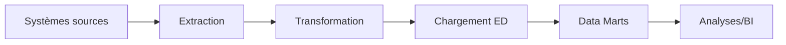

# Chapitre B — Entrepôts de données : concepts et architecture

## Objectifs d’apprentissage

- Définir ED, data mart, ODS, métadonnées.
- Expliquer la chaîne d’alimentation ETL/ELT.

## Contenus

- Propriétés d’un ED (intégration, historisation, disponibilité).
- Typologie : ED central, data marts dépendants/indépendants.
- Métadonnées techniques et métiers.

## Exemple minimal

- Consolidation ventes + CRM vers un entrepôt unique.

## Erreurs fréquentes / pièges

- Mélanger ODS et ED (temps réel vs historisation).
- Négliger la gouvernance des métadonnées.

## Mini-exercice

- Question : citer 3 propriétés attendues d’un ED.
- Attendu : intégration, historisation, disponibilité/qualité.

## Diagramme ETL (Mermaid)

