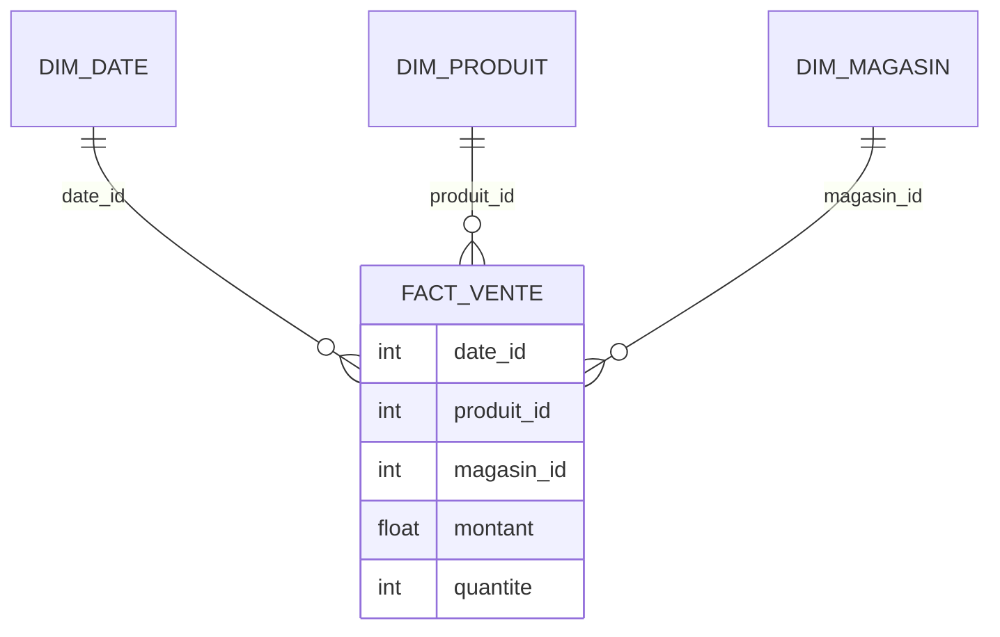

# Chapitre C — Modélisation multidimensionnelle

## Objectifs d’apprentissage

- Identifier faits, dimensions, mesures, granularité, hiérarchies.
- Comparer schéma en étoile vs schéma en flocon et choisir selon le besoin.

## Contenus

- Types de faits : additifs, semi-additifs, non additifs.
- Dimensions conformes, rôles de dimensions, hiérarchies (niveau, parent-enfant).
- Granularité : principe, impacts sur stockage et performance.

## Exemple SQL (mise en place minimale)

```sql
CREATE TABLE dim_produit (
  produit_id INT PRIMARY KEY,
  categorie VARCHAR(50),
  marque VARCHAR(50)
);

CREATE TABLE dim_date (
  date_id DATE PRIMARY KEY,
  annee INT,
  mois INT,
  jour INT
);

CREATE TABLE dim_magasin (
  magasin_id INT PRIMARY KEY,
  region VARCHAR(50),
  ville VARCHAR(50)
);

CREATE TABLE fact_ventes (
  date_id DATE,
  produit_id INT,
  magasin_id INT,
  quantite INT,
  montant NUMERIC(12,2),
  PRIMARY KEY (date_id, produit_id, magasin_id)
);
```

## Cas métier (retail)

- Fait : ligne de ticket (granularité fine) pour permettre drill-down jour/produit/magasin.
- Dimensions : date, produit, magasin, promotion (dimension rôle si réutilisée ailleurs).
- Hiérarchie produit : catégorie → sous-catégorie → produit ; hiérarchie temps : année → mois → jour.

## Tableau comparatif (étoile vs flocon)

| Aspect | Étoile | Flocon |
| --- | --- | --- |
| Normalisation des dimensions | Faible | Plus élevée |
| Performance requêtes | Haute (moins de joins) | Variable (plus de joins) |
| Maintenance | Simple | Plus complexe |
| Lisibilité métier | Très bonne | Plus technique |

## Erreurs fréquentes / pièges

- Granularité non alignée entre faits et dimensions.
- Dimensions dupliquées non conformes (pas de dimensions communes partagées).
- Mesures non cohérentes avec la granularité (ex. mesure mensuelle dans un fact journalier).

## Mini-exercice

- Question : choisir la granularité d’un fact de ventes au jour vs au mois — impact ?
- Attendu : détail jour permet agrégation ; granularité mensuelle limite les analyses fines (perte d’information), mais réduit volume.

## Pour aller plus loin (self-training)

- Ajouter une dimension « canal » (web / magasin) et adapter le schéma en étoile.
- Écrire une requête qui calcule le CA par catégorie et par mois à partir de `fact_ventes`.
- Dessiner un flocon pour la dimension produit (catégorie/sous-catégorie) et comparer au schéma étoile.

## Références rapides

- Kimball & Ross — *Entrepôts de données : guide pratique de modélisation dimensionnelle* (chap. modélisation).
- Articles/conference ER 2016 (Conceptual Modeling) sur les modèles multidimensionnels.

## Diagramme étoile (Mermaid)


