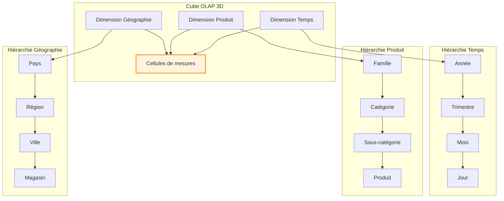

# Chapitre D — OLAP : Principes et Opérations

> **Semaine 4** | **Volume horaire : 8h** | **Crédits : 0.4**  
> **Références : Kimball & Ross (2003) Chap. 10-12, Codd et al. (1993), Syllabus MMD S4**

## Positionnement académique

Ce chapitre constitue le pont théorique et pratique entre la modélisation dimensionnelle et l'analyse décisionnelle interactive. Il établit les fondements de l'Online Analytical Processing (OLAP) comme paradigme dominant pour l'exploration multidimensionnelle des données, en opposition complémentaire au paradigme transactionnel traditionnel.

## Objectifs pédagogiques

À l'issue de ce chapitre, l'étudiant sera capable de :

1. **Maîtriser** la théorie OLAP et ses 12 règles fondamentales (Codd et al.)
2. **Exécuter** les opérations OLAP de base (roll-up, drill-down, slice, dice, pivot)
3. **Concevoir** des cubes OLAP optimisés selon les besoins analytiques
4. **Analyser** les performances des requêtes multidimensionnelles
5. **Traduire** les besoins métier en opérations OLAP appropriées

## Contenu théorique

### 1. Fondements théoriques de l'OLAP

#### 1.1 Historique et définition

**Origine** : Le terme OLAP a été défini par E.F. Codd et al. en 1993 en réponse aux limitations des systèmes transactionnels pour l'analyse décisionnelle.

**Définition formelle** : "OLAP est une technologie permettant aux utilisateurs d'analyser des données multidimensionnelles interactives à partir de multiples perspectives."

**Les 12 règles de Codd pour OLAP** :

| Règle | Description | Implémentation |
|-------|-------------|-----------------|
| **Règle 1** | Vue multidimensionnelle | Cubes avec hiérarchies |
| **Règle 2** | Transparence | Accès transparent aux données |
| **Règle 3** | Accessibilité | Navigation intuitive |
| **Règle 4** | Performance cohérente | Temps de réponse prévisible |
| **Règle 5** | Client-serveur | Architecture distribuée |
| **Règle 6** | Dimension générique | Dimensions réutilisables |
| **Règle 7** | Dynamique | Mise à jour en temps réel |
| **Règle 8** | Multi-utilisateur | Gestion des accès concurrents |
| **Règle 9** | Croisement d'opérations | Opérations multidimensionnelles |
| **Règle 10** | Intuitivité | Interface utilisateur simple |
| **Règle 11** | Flexibilité | Adaptation aux besoins |
| **Règle 12** | Uniformité | Cohérence des opérations |

#### 1.2 Paradigme OLAP vs OLTP

| Caractéristique | OLTP (Online Transaction Processing) | OLAP (Online Analytical Processing) |
|-----------------|--------------------------------------|-----------------------------------|
| **Objectif** | Opérations quotidiennes | Analyse décisionnelle |
| **Données** | Actuelles, détaillées | Historiques, agrégées |
| **Utilisateurs** | Opérationnels, employés | Analystes, managers |
| **Opérations** | INSERT, UPDATE, DELETE | Slice, Dice, Roll-up, Drill-down |
| **Modèle** | Normalisé (3NF) | Dénormalisé (dimensionnel) |
| **Volume** | GB | TB-PB |
| **Performance** | Millisecondes | Secondes |
| **Consistance** | ACID | BASE |

### 2. Modèle de données multidimensionnel

#### 2.1 Structure du cube OLAP

**Définition mathématique** : Un cube C est défini comme :
```
C = D₁ × D₂ × ... × Dₙ → M
```
Où Dᵢ sont les dimensions et M les mesures.

**Composants du cube** :
- **Cellules** : Intersections des membres de dimensions
- **Membres** : Valeurs individuelles dans une dimension
- **Niveaux** : Hiérarchies au sein des dimensions
- **Mesures** : Valeurs numériques analysables

#### 2.2 Représentation visuelle



### 3. Opérations OLAP fondamentales

#### 3.1 Roll-up (Agrégation ascendante)

**Définition** : Agrégation des données d'un niveau de détail à un niveau supérieur dans la hiérarchie.

**Formalisation** : Roll-up(Dᵢ, niveau_supérieur) où Dᵢ est la dimension cible

```sql
-- Exemple : Roll-up du niveau jour vers mois
SELECT 
    d.annee,
    d.mois,
    p.categorie_produit,
    g.region,
    SUM(f.montant_vente) as ventes_mensuelles,
    SUM(f.quantite_vendue) as quantite_mensuelle,
    COUNT(DISTINCT f.client_key) as_clients_uniques,
    AVG(f.montant_vente) as panier_moyen_mensuel
FROM fact_ventes f
JOIN dim_date d ON f.date_key = d.date_key
JOIN dim_produit p ON f.produit_key = p.produit_key
JOIN dim_magasin g ON f.magasin_key = g.magasin_key
WHERE d.annee = 2024
GROUP BY d.annee, d.mois, p.categorie_produit, g.region
ORDER BY d.annee, d.mois, p.categorie_produit;
```

#### 3.2 Drill-down (Désagrégation descendante)

**Définition** : Navigation d'un niveau agrégé vers un niveau de détail plus fin.

**Formalisation** : Drill-down(Dᵢ, niveau_inférieur) où Dᵢ est la dimension cible

```sql
-- Exemple : Drill-down du niveau mois vers jour pour une catégorie spécifique
SELECT 
    d.date_complete,
    d.jour_semaine,
    p.produit_nom,
    g.ville,
    f.montant_vente,
    f.quantite_vendue,
    f.client_key
FROM fact_ventes f
JOIN dim_date d ON f.date_key = d.date_key
JOIN dim_produit p ON f.produit_key = p.produit_key
JOIN dim_magasin g ON f.magasin_key = g.magasin_key
WHERE d.mois = 1 
    AND d.annee = 2024
    AND p.categorie_produit = 'Électronique'
    AND g.region = 'Île-de-France'
ORDER BY d.date_complete, g.ville;
```

#### 3.3 Slice (Sélection par dimension)

**Définition** : Réduction du cube en sélectionnant une valeur unique pour une dimension.

**Formalisation** : Slice(C, Dᵢ = valeur) où C est le cube et Dᵢ la dimension

```sql
-- Exemple : Slice sur la dimension Temps = '2024-01-15'
SELECT 
    p.categorie_produit,
    g.region,
    SUM(f.montant_vente) as ventes_jour,
    COUNT(DISTINCT f.client_key) as clients_jour,
    AVG(f.montant_vente) as panier_moyen_jour
FROM fact_ventes f
JOIN dim_date d ON f.date_key = d.date_key
JOIN dim_produit p ON f.produit_key = p.produit_key
JOIN dim_magasin g ON f.magasin_key = g.magasin_key
WHERE d.date_complete = '2024-01-15'
GROUP BY p.categorie_produit, g.region
ORDER BY ventes_jour DESC;
```

#### 3.4 Dice (Sélection multi-dimensionnelle)

**Définition** : Sélection de sous-cube en spécifiant des valeurs pour plusieurs dimensions.

**Formalisation** : Dice(C, D₁ ∈ V₁ ∧ D₂ ∈ V₂ ∧ ... ∧ Dₙ ∈ Vₙ)

```sql
-- Exemple : Dice sur plusieurs dimensions
SELECT 
    d.mois,
    p.categorie_produit,
    g.region,
    SUM(f.montant_vente) as ventes_dice,
    SUM(f.quantite_vendue) as quantite_dice,
    COUNT(*) as nb_transactions
FROM fact_ventes f
JOIN dim_date d ON f.date_key = d.date_key
JOIN dim_produit p ON f.produit_key = p.produit_key
JOIN dim_magasin g ON f.magasin_key = g.magasin_key
WHERE d.annee = 2024
    AND d.mois IN (1, 2, 3)  -- Q1 2024
    AND p.categorie_produit IN ('Électronique', 'Habillement', 'Maison')
    AND g.region IN ('Île-de-France', 'Auvergne-Rhône-Alpes')
GROUP BY d.mois, p.categorie_produit, g.region
ORDER BY d.mois, ventes_dice DESC;
```

#### 3.5 Pivot (Rotation de perspective)

**Définition** : Réorganisation des dimensions pour changer la perspective d'analyse.

**Formalisation** : Permutation des axes dimensionnels

```sql
-- Exemple : Pivot pour analyser par produit vs région
-- Perspective initiale : Temps × Produit × Région
-- Perspective pivotée : Produit × Région × Temps

-- Vue pivotée avec produits en lignes et régions en colonnes
SELECT 
    p.categorie_produit,
    SUM(CASE WHEN g.region = 'Île-de-France' THEN f.montant_vente ELSE 0 END) as ventes_idf,
    SUM(CASE WHEN g.region = 'Auvergne-Rhône-Alpes' THEN f.montant_vente ELSE 0 END) as ventes_ara,
    SUM(CASE WHEN g.region = 'Occitanie' THEN f.montant_vente ELSE 0 END) as ventes_occ,
    SUM(CASE WHEN g.region = 'Hauts-de-France' THEN f.montant_vente ELSE 0 END) as ventes_hdf,
    SUM(f.montant_vente) as total_ventes
FROM fact_ventes f
JOIN dim_produit p ON f.produit_key = p.produit_key
JOIN dim_magasin g ON f.magasin_key = g.magasin_key
JOIN dim_date d ON f.date_key = d.date_key
WHERE d.annee = 2024
GROUP BY p.categorie_produit
ORDER BY total_ventes DESC;
```

### 4. Implémentation des cubes OLAP

#### 4.1 Architecture MOLAP (Multidimensional OLAP)

**Caractéristiques** :
- Stockage optimisé en tableaux multidimensionnels
- Pré-agrégation des données pour performance
- Requêtes MDX (Multidimensional Expressions)

**Exemple de structure MOLAP** :
```sql
-- Création d'un cube avec pré-agrégations
CREATE CUBE sales_cube AS
SELECT 
    d.annee,
    d.trimestre,
    d.mois,
    p.categorie_produit,
    p.marque,
    g.pays,
    g.region,
    g.ville,
    SUM(f.montant_vente) as total_ventes,
    SUM(f.quantite_vendue) as total_quantite,
    COUNT(DISTINCT f.client_key) as nb_clients,
    AVG(f.montant_vente) as panier_moyen
FROM fact_ventes f
JOIN dim_date d ON f.date_key = d.date_key
JOIN dim_produit p ON f.produit_key = p.produit_key
JOIN dim_magasin g ON f.magasin_key = g.magasin_key
GROUP BY 
    d.annee, d.trimestre, d.mois,
    p.categorie_produit, p.marque,
    g.pays, g.region, g.ville;

-- Définition des hiérarchies
DEFINE HIERARCHY time_hierarchy AS 
    (annee, trimestre, mois);

DEFINE HIERARCHY product_hierarchy AS 
    (categorie_produit, marque);

DEFINE HIERARCHY geography_hierarchy AS 
    (pays, region, ville);
```

#### 4.2 Architecture ROLAP (Relational OLAP)

**Caractéristiques** :
- Stockage en base de données relationnelle
- Requêtes SQL dynamiques
- Flexibilité maximale pour les données de grande taille

**Exemple d'implémentation ROLAP** :
```sql
-- Vue matérialisée pour optimisation ROLAP
CREATE MATERIALIZED VIEW mv_olap_sales AS
WITH monthly_aggregates AS (
    SELECT 
        d.annee,
        d.mois,
        p.categorie_produit,
        g.region,
        SUM(f.montant_vente) as ventes_mois,
        SUM(f.quantite_vendue) as quantite_mois,
        COUNT(DISTINCT f.client_key) as clients_mois,
        AVG(f.montant_vente) as panier_moyen_mois
    FROM fact_ventes f
    JOIN dim_date d ON f.date_key = d.date_key
    JOIN dim_produit p ON f.produit_key = p.produit_key
    JOIN dim_magasin g ON f.magasin_key = g.magasin_key
    GROUP BY d.annee, d.mois, p.categorie_produit, g.region
),
quarterly_aggregates AS (
    SELECT 
        d.annee,
        d.trimestre,
        p.categorie_produit,
        g.region,
        SUM(f.montant_vente) as ventes_trimestre,
        SUM(f.quantite_vendue) as quantite_trimestre,
        COUNT(DISTINCT f.client_key) as clients_trimestre,
        AVG(f.montant_vente) as panier_moyen_trimestre
    FROM fact_ventes f
    JOIN dim_date d ON f.date_key = d.date_key
    JOIN dim_produit p ON f.produit_key = p.produit_key
    JOIN dim_magasin g ON f.magasin_key = g.magasin_key
    GROUP BY d.annee, d.trimestre, p.categorie_produit, g.region
)
SELECT * FROM monthly_aggregates
UNION ALL
SELECT * FROM quarterly_aggregates;

-- Index pour optimisation
CREATE INDEX idx_mv_olap_sales_composite ON mv_olap_sales(annee, mois, categorie_produit, region);
```

### 5. Cas d'usage avancé

#### 5.1 Contexte : Compagnie aérienne internationale

**Problématique métier** :
- 500 vols/jour, 200 destinations, 10M passagers/an
- Analyse des revenus par route, classe, saisonnalité
- Optimisation du pricing et de l'occupation
- Prévision de la demande et gestion des capacités

**Cube OLAP conçu** :

```sql
-- Table de faits vols avec grain vol-passager
CREATE TABLE fact_vol_passager (
    vol_passager_id BIGINT PRIMARY KEY,
    vol_id VARCHAR(10) NOT NULL,
    date_vol DATE NOT NULL,
    passager_id BIGINT NOT NULL,
    route_origine VARCHAR(3) NOT NULL,
    route_destination VARCHAR(3) NOT NULL,
    classe_reservation VARCHAR(10) NOT NULL,
    tarif_versement DECIMAL(10,2) NOT NULL,
    tarif_base DECIMAL(10,2) NOT NULL,
    taxes_vol DECIMAL(8,2) NOT NULL,
    frais_service DECIMAL(8,2) DEFAULT 0,
    devise_paiement VARCHAR(3) DEFAULT 'EUR',
    canal_reservation VARCHAR(20),
    statut_reservation VARCHAR(10),
    -- Clés étrangères vers dimensions
    date_key INTEGER NOT NULL,
    route_key INTEGER NOT NULL,
    passager_key INTEGER NOT NULL,
    classe_key INTEGER NOT NULL,
    devise_key INTEGER NOT NULL,
    canal_key INTEGER NOT NULL,
    -- Index pour performance OLAP
    INDEX idx_vol_date_route (date_key, route_key),
    INDEX idx_vol_classe_date (classe_key, date_key),
    INDEX idx_vol_route_classe (route_key, classe_key)
);

-- Dimension route avec hiérarchie géographique
CREATE TABLE dim_route (
    route_key INTEGER PRIMARY KEY,
    code_origine VARCHAR(3) NOT NULL,
    ville_origine VARCHAR(50) NOT NULL,
    pays_origine VARCHAR(50) NOT NULL,
    region_origine VARCHAR(50),
    continent_origine VARCHAR(50),
    code_destination VARCHAR(3) NOT NULL,
    ville_destination VARCHAR(50) NOT NULL,
    pays_destination VARCHAR(50) NOT NULL,
    region_destination VARCHAR(50),
    continent_destination VARCHAR(50),
    distance_km INTEGER,
    duree_vol_minutes INTEGER,
    fuseau_horaire_origine VARCHAR(5),
    fuseau_horaire_destination VARCHAR(5),
    est_route_international BOOLEAN,
    est_route_transatlantique BOOLEAN,
    -- Hiérarchies
    continent_origine_key INTEGER,
    continent_destination_key INTEGER
);

-- Vue analytique multidimensionnelle pour le dashboard revenue management
CREATE MATERIALIZED VIEW mv_analyse_revenus_aeriens AS
WITH performance_temporelle AS (
    SELECT 
        d.annee,
        d.trimestre,
        d.mois,
        d.jour_semaine,
        d.est_jour_ferie,
        d.est_saison_haute,
        r.continent_origine,
        r.continent_destination,
        r.est_route_international,
        cl.classe_reservation,
        SUM(f.tarif_versement) as revenu_total,
        SUM(f.tarif_base) as revenu_base,
        SUM(f.taxes_vol) as taxes_totales,
        SUM(f.frais_service) as frais_service_totaux,
        COUNT(*) as nb_passagers,
        COUNT(DISTINCT f.vol_id) as nb_vols,
        AVG(f.tarif_versement) as tarif_moyen,
        -- Taux d'occupation calculé
        ROUND(COUNT(*) * 100.0 / 
             (SELECT AVG(capacite) FROM dim_vol dv WHERE dv.vol_id = f.vol_id), 2) as taux_occupation_pct
    FROM fact_vol_passager f
    JOIN dim_date d ON f.date_key = d.date_key
    JOIN dim_route r ON f.route_key = r.route_key
    JOIN dim_classe cl ON f.classe_key = cl.classe_key
    WHERE d.date_complete >= CURRENT_DATE - INTERVAL '2 years'
    GROUP BY 
        d.annee, d.trimestre, d.mois, d.jour_semaine, 
        d.est_jour_ferie, d.est_saison_haute,
        r.continent_origine, r.continent_destination, r.est_route_international,
        cl.classe_reservation
),
analyse_rentabilite AS (
    SELECT 
        pt.annee,
        pt.mois,
        pt.continent_origine,
        pt.continent_destination,
        pt.classe_reservation,
        pt.revenu_total,
        pt.revenu_base,
        pt.taxes_totales,
        pt.frais_service_totaux,
        pt.nb_passagers,
        pt.tarif_moyen,
        pt.taux_occupation_pct,
        -- Calcul de la marge
        pt.revenu_total - (pt.revenu_base * 0.3) as marge_estimee,
        -- Indicateurs de performance
        ROUND(pt.revenu_total / NULLIF(pt.nb_passagers, 0), 2) as revenu_par_passager,
        ROUND(pt.revenu_total / NULLIF(pt.nb_vols, 0), 2) as revenu_par_vol,
        -- Tendances
        LAG(pt.revenu_total, 1) OVER (
            PARTITION BY pt.continent_origine, pt.continent_destination, pt.classe_reservation 
            ORDER BY pt.annee, pt.mois
        ) as revenu_mois_precedent,
        ROUND((pt.revenu_total - LAG(pt.revenu_total, 1) OVER (
            PARTITION BY pt.continent_origine, pt.continent_destination, pt.classe_reservation 
            ORDER BY pt.annee, pt.mois
        )) * 100.0 / NULLIF(LAG(pt.revenu_total, 1) OVER (
            PARTITION BY pt.continent_origine, pt.continent_destination, pt.classe_reservation 
            ORDER BY pt.annee, pt.mois
        ), 0), 2) as croissance_mensuelle_pct
    FROM performance_temporelle pt
)
SELECT 
    ar.annee,
    ar.mois,
    ar.continent_origine,
    ar.continent_destination,
    ar.classe_reservation,
    ar.revenu_total,
    ar.marge_estimee,
    ar.nb_passagers,
    ar.tarif_moyen,
    ar.taux_occupation_pct,
    ar.revenu_par_passager,
    ar.revenu_par_vol,
    ar.croissance_mensuelle_pct,
    -- Classements
    ROW_NUMBER() OVER (ORDER BY ar.revenu_total DESC) as rang_revenu_global,
    ROW_NUMBER() OVER (PARTITION BY ar.continent_origine, ar.continent_destination 
                       ORDER BY ar.revenu_total DESC) as rang_revenu_route,
    -- Flags analytiques
    CASE 
        WHEN ar.croissance_mensuelle_pct > 10 THEN 'Forte croissance'
        WHEN ar.croissance_mensuelle_pct > 0 THEN 'Croissance modérée'
        WHEN ar.croissance_mensuelle_pct > -10 THEN 'Légère baisse'
        ELSE 'Baisse significative'
    END as tendance_revenus,
    CASE 
        WHEN ar.taux_occupation_pct > 85 THEN 'Optimal'
        WHEN ar.taux_occupation_pct > 70 THEN 'Bon'
        WHEN ar.taux_occupation_pct > 50 THEN 'Moyen'
        ELSE 'Faible'
    END as performance_occupation
FROM analyse_rentabilite ar
WHERE ar.annee = EXTRACT(YEAR FROM CURRENT_DATE)
   OR (ar.annee = EXTRACT(YEAR FROM CURRENT_DATE) - 1 AND ar.mois >= 10)
ORDER BY ar.annee DESC, ar.mois DESC, ar.revenu_total DESC;
```

#### 5.2 Opérations OLAP sur le cube aérien

**Roll-up : Analyse mensuelle → trimestrielle**
```sql
-- Roll-up sur la dimension temps
SELECT 
    annee,
    trimestre,
    continent_origine,
    continent_destination,
    classe_reservation,
    SUM(revenu_total) as revenu_trimestriel,
    SUM(nb_passagers) as passagers_trimestriels,
    AVG(taux_occupation_pct) as occupation_moyenne_trimestrielle
FROM mv_analyse_revenus_aeriens
WHERE annee = 2024
GROUP BY annee, trimestre, continent_origine, continent_destination, classe_reservation
ORDER BY annee, trimestre, revenu_trimestriel DESC;
```

**Drill-down : Analyse continent → pays**
```sql
-- Drill-down sur la dimension géographie
SELECT 
    mois,
    pays_origine,
    pays_destination,
    classe_reservation,
    revenu_total,
    nb_passagers,
    taux_occupation_pct
FROM performance_detaillee
WHERE mois = 1 AND annee = 2024
    AND continent_origine = 'Europe'
    AND continent_destination = 'Amérique du Nord'
ORDER BY revenu_total DESC;
```

**Slice : Analyse classe Affaires uniquement**
```sql
-- Slice sur la dimension classe
SELECT 
    annee,
    mois,
    continent_origine,
    continent_destination,
    SUM(revenu_total) as revenu_affaires,
    SUM(nb_passagers) as passagers_affaires,
    AVG(tarif_moyen) as tarif_moyen_affaires
FROM mv_analyse_revenus_aeriens
WHERE classe_reservation = 'Business'
    AND annee = 2024
GROUP BY annee, mois, continent_origine, continent_destination
ORDER BY annee, mois, revenu_affaires DESC;
```

### 6. Optimisation des performances OLAP

#### 6.1 Stratégies d'indexation

```sql
-- Index bitmap pour dimensions à faible cardinalité
CREATE BITMAP INDEX idx_bitmap_classe ON fact_vol_passager(classe_reservation);
CREATE BITMAP INDEX idx_bitmap_continent ON fact_vol_passager(route_key);

-- Index composite pour requêtes OLAP fréquentes
CREATE INDEX idx_olap_composite ON fact_vol_passager(date_key, route_key, classe_key);

-- Index de fonction pour calculs fréquents
CREATE INDEX idx_fonction_mois ON fact_vol_passager(EXTRACT(MONTH FROM date_vol));
```

#### 6.2 Partitionnement des tables de faits

```sql
-- Partitionnement par mois pour optimiser les requêtes temporelles
CREATE TABLE fact_vol_passager_partitioned (
    -- Mêmes colonnes que fact_vol_passager
) PARTITION BY RANGE (date_key);

-- Création des partitions mensuelles
CREATE TABLE fact_vol_passager_2024_01 PARTITION OF fact_vol_passager_partitioned
    FOR VALUES FROM (20240101) TO (20240201);

CREATE TABLE fact_vol_passager_2024_02 PARTITION OF fact_vol_passager_partitioned
    FOR VALUES FROM (20240201) TO (20240301);
-- ... etc pour chaque mois
```

### 7. Exercices pratiques

#### 7.1 Exercice d'analyse OLAP

**Énoncé** : Une chaîne de supermarchés souhaite analyser ses ventes. Le cube contient les dimensions Temps, Produit, Magasin, Client avec les mesures Ventes, Quantité, Marge.

**Travail demandé** :
1. Exécuter un roll-up du niveau jour vers mois pour l'année 2024
2. Effectuer un drill-down sur la catégorie "Produits Frais" au niveau produit
3. Réaliser un slice sur la région "Île-de-France" pour le trimestre 1
4. Pivoter les données pour comparer les performances par magasin vs catégorie

**Solution attendue** :
- Requêtes SQL avec opérations OLAP appropriées
- Analyse des résultats et interprétation métier
- Recommandations basées sur les analyses

#### 7.2 Étude de cas optimisation

**Contexte** : Une plateforme de streaming vidéo rencontre des temps de réponse > 30 secondes sur son cube OLAP.

**Problèmes identifiés** :
- Cube avec 1B de cellules
- Requêtes complexes sur 5 dimensions
- Absence d'index appropriés
- Pas de pré-agrégation

**Questions d'analyse** :
1. Quelles stratégies d'optimisation proposer ?
2. Comment structurer les pré-agrégations ?
3. Quel partitionnement mettre en place ?

### 8. Références académiques

#### 8.1 Références principales

**Codd, E.F., et al.** (1993). "Providing OLAP to User-Analysts: An IT Mandate". IBM Technical Report.
- Section 2 : The 12 Rules of OLAP
- Section 3 : Multidimensional Data Model

**Kimball, R., & Ross, M.** (2003). *Entrepôts de données : guide pratique de modélisation dimensionnelle*.
- Chapitre 10 : OLAP and Multidimensional Analysis
- Chapitre 11 : Introduction to MDX
- Chapitre 12 : Advanced OLAP Techniques

#### 8.2 Références complémentaires

**Cuzzocrea, A., & Moussa, R.** (2016). "Multi-Dimensional Database Modeling and Querying". ER 2016.
- Section 5.1 : OLAP Query Optimization
- Section 5.2 : Performance Analysis

**Nagabhushana, S.** (2006). *Data Warehousing, OLAP and Data Mining*. New Age.
- Chapter 4 : OLAP Systems and Applications

---

**Contact enseignant** : M. Sellami Mokhtar  
**Volume horaire total** : 8h (4h cours magistral + 4h travaux dirigés)  
**Évaluation** : Contrôle continu (10%) + Participation (10%) + TD (20%) + Exam final (60%)
