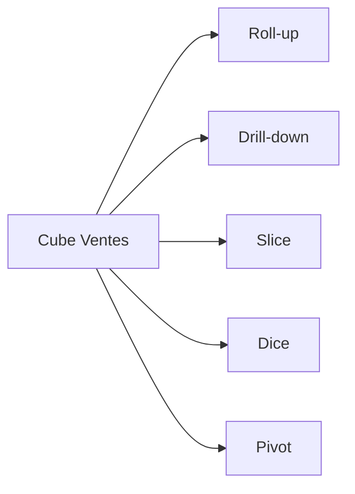

# Chapitre D — OLAP : principes et opérations

## Objectifs d’apprentissage

- Comprendre cube OLAP et opérations (roll-up, drill-down, slice, dice, pivot).
- Savoir lire/interpréter des requêtes OLAP basiques.

## Contenus

- Cube, axes, cellules, mesures.
- Opérations : définitions + exemples.
- Navigation multidimensionnelle.

## Exemple minimal

- Cube Ventes (Date, Produit, Magasin) avec mesures montant/quantité.

### Exemple SQL (ROLAP simplifié)

```sql
-- Drill-down sur mois -> jour
SELECT
  date_vente AS jour,
  produit,
  SUM(montant) AS ca_jour
FROM fact_ventes
GROUP BY date_vente, produit;

-- Roll-up jour -> mois
SELECT
  DATEFROMPARTS(YEAR(date_vente), MONTH(date_vente), 1) AS mois,
  produit,
  SUM(montant) AS ca_mensuel
FROM fact_ventes
GROUP BY DATEFROMPARTS(YEAR(date_vente), MONTH(date_vente), 1), produit;
```

### Cas métier (retail)

- Slice : filtrer sur un magasin spécifique pour analyser ses ventes.
- Dice : restreindre à deux catégories produits ET à une période donnée.
- Pivot : permuter lignes/colonnes pour comparer Produits x Magasins vs Magasins x Produits.

## Mini-exercice

- Question : décrire la différence entre slice et dice sur un cube à 3 dimensions.
- Attendu : slice = filtrer une dimension (plan 2D) ; dice = sous-cube multi-dims filtrées.

## Pour aller plus loin (self-training)

- Écrire une requête qui calcule le top 5 produits par mois et par magasin.
- Dessiner un mini-cube (3 dims) et indiquer quelles cellules sont touchées par un slice vs un dice.
- Lire un exemple MDX ou SQL Server Analysis Services (si dispo) pour voir la syntaxe pivot/rollup.

## Références rapides

- Kimball & Ross, chapitres OLAP et navigation.
- Documentation SQL (GROUP BY ROLLUP/CUBE si disponible sur le SGBD).

## Diagramme cube (Mermaid)


