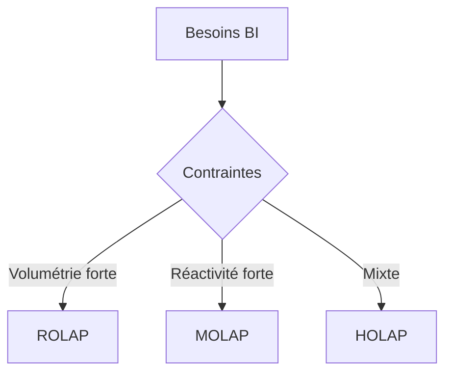

# Chapitre E — Approches d’implantation (ROLAP / MOLAP / HOLAP)

## Objectifs d’apprentissage
- Décrire architectures ROLAP, MOLAP, HOLAP.
- Évaluer les compromis performance/stockage/flexibilité.

## Contenus
- ROLAP : stockage relationnel + agrégations.
- MOLAP : stockage multidimensionnel, pré-agrégation.
- HOLAP : combinaison.

## Tableau comparatif (exemple)

| Critère | ROLAP | MOLAP | HOLAP |
| --- | --- | --- | --- |
| Performances req. ad hoc | Moyenne | Haute (si pré-agg.) | Haute/Moyenne |
| Volume très grand | Bon | Limité | Bon |
| Flexibilité schéma | Haute | Moyenne | Haute |

## Mini-exercice
- Question : recommander une approche pour un historique volumineux peu exploré vs un sous-ensemble très consulté.
- Attendu : ROLAP pour volumineux, MOLAP pour sous-ensemble, HOLAP si mix.

## Diagramme de choix (Mermaid)

