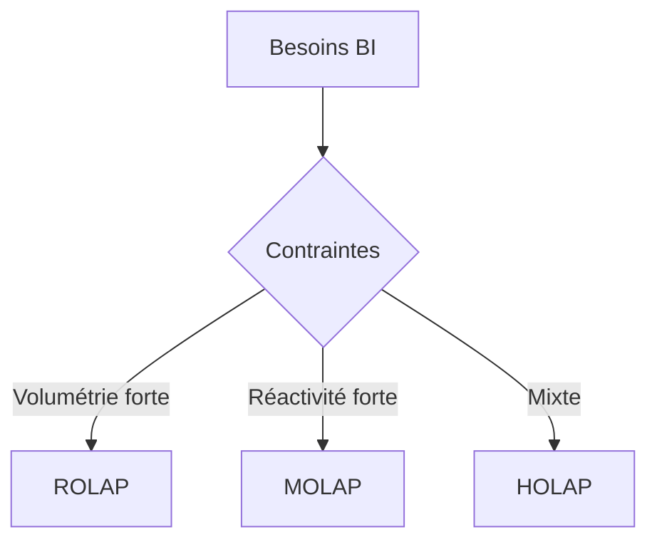

# Chapitre E — Approches d’implantation (ROLAP / MOLAP / HOLAP)

## Objectifs d’apprentissage

- Décrire architectures ROLAP, MOLAP, HOLAP.
- Évaluer les compromis performance/stockage/flexibilité.

## Contenus

- ROLAP : stockage relationnel + agrégations.
- MOLAP : stockage multidimensionnel, pré-agrégation.
- HOLAP : combinaison.

### Cas d’usage (retail / volumétrie)

- Historique massif peu consulté : privilégier ROLAP (stockage relationnel, requêtes ad hoc).
- Sous-ensemble très consulté (tableau de bord quotidien) : MOLAP pour vitesse (pré-agg).
- Mix volume + réactivité : HOLAP (détails en ROLAP, agrégés en MOLAP).

## Tableau comparatif (exemple)

| Critère | ROLAP | MOLAP | HOLAP |
| --- | --- | --- | --- |
| Performances req. ad hoc | Moyenne | Haute (si pré-agg.) | Haute/Moyenne |
| Volume très grand | Bon | Limité | Bon |
| Flexibilité schéma | Haute | Moyenne | Haute |

## Exemple (pseudo-SQL/OLAP)

- ROLAP : `GROUP BY ROLLUP (date, produit, magasin)` pour pré-agréger.
- MOLAP : cube pré-calculé (dimensions Date, Produit, Magasin) avec agrégations stockées.
- HOLAP : stockage des détails en table fact ROLAP, agrégations fréquentes en cube MOLAP.

## Erreurs fréquentes / pièges

- Choisir MOLAP sur un volume énorme sans limiter la portée : explosion stockage/processing.
- Choisir ROLAP pour des dashboards temps réel ultra-rapides : latence possible.
- Oublier la cohérence des agrégés (process d’actualisation cube).

## Mini-exercice

- Question : recommander une approche pour un historique volumineux peu exploré vs un sous-ensemble très consulté.
- Attendu : ROLAP pour volumineux, MOLAP pour sous-ensemble, HOLAP si mix.

## Pour aller plus loin (self-training)

- Rédiger un mini-critère de choix (5 lignes) : volumétrie, réactivité, coût, gouvernance.
- Proposer un plan d’actualisation (fréquence) pour un cube MOLAP hebdo vs ROLAP quotidien.
- Esquisser l’architecture HOLAP avec un diagramme (sources → ROLAP fact → cube MOLAP agg → BI).

## Références rapides

- Kimball & Ross — chapitres sur ROLAP/MOLAP/HOLAP et performances.
- Berson & Smith — sections OLAP et optimisation.

## Diagramme de choix (Mermaid)

