# Business Intelligence & Data Warehousing — Advanced Undergraduate Course (Harvard/Oxford Level)

> **Course Code:** BI-401  
> **Credits:** 4  
> **Level:** Undergraduate (Year 2–3)  
> **Prerequisites:** Database Systems, Data Structures  
> **Primary Text:** Kimball & Ross, *The Data Warehouse Toolkit* (3rd ed.)  
> **Instructor:** Professor of Business Intelligence & Data Engineering

---

## 1. Course Overview & Strategic Positioning

### 1.1 Academic Context
Business Intelligence (BI) represents the convergence of data management, analytical methods, and strategic decision-making. This course provides rigorous theoretical foundations combined with practical implementation skills, preparing students for roles in data engineering, analytics architecture, and strategic planning.

### 1.2 Strategic Imperatives
- **Data-Driven Decision Making:** Transform operational data into strategic intelligence
- **Competitive Analytics:** Leverage information asymmetries for market advantage
- **Enterprise Architecture:** Design scalable, maintainable analytical platforms
- **Governance & Ethics:** Ensure data quality, security, and regulatory compliance

### 1.3 Learning Outcomes (Bloom’s Taxonomy Level 4-6)
Upon successful completion, students will be able to:

1. **Analyze** the trade-offs between OLTP and OLAP systems using quantitative metrics
2. **Design** dimensional models following Kimball’s methodology with justification
3. **Implement** ETL pipelines addressing data quality and performance requirements
4. **Evaluate** OLAP architectures (ROLAP/MOLAP/HOLAP) using cost-benefit analysis
5. **Create** analytical solutions addressing real-world business problems
6. **Critique** existing BI implementations using established frameworks

---

## 2. Business Intelligence Fundamentals

### 2.1 Theoretical Foundations

#### 2.1.1 Decision Support Systems Evolution
```
1960s: MIS → 1970s: DSS → 1980s: EIS → 1990s: BI → 2000s: Big Data Analytics
```

#### 2.1.2 Information Value Chain
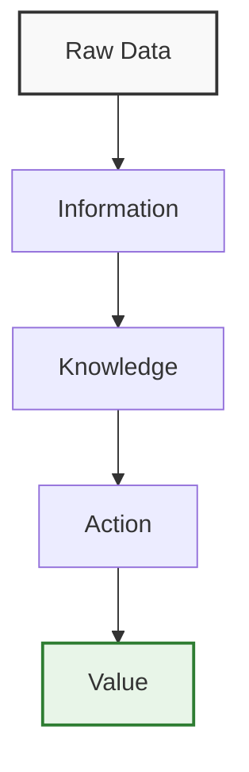

### 2.2 OLTP vs OLAP: Quantitative Analysis

| Dimension | OLTP Systems | OLAP Systems |
|-----------|--------------|--------------|
| **Query Complexity** | O(n) – Simple CRUD | O(n²) – Complex aggregations |
| **Data Volume** | GB – TB | TB – PB |
| **Update Frequency** | Milliseconds | Daily/Batch |
| **Normalization** | 3NF+ | Denormalized |
| **Indexing Strategy** | B-tree on keys | Bitmap, materialized views |
| **Consistency Model** | ACID | BASE (eventual) |
| **User Profile** | Operational staff | Analysts, executives |

### 2.3 Enterprise BI Architecture

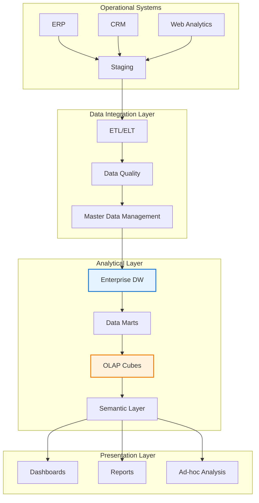

**Architectural Principles:**
- **Separation of Concerns:** Operational vs analytical workloads
- **Scalability:** Horizontal scaling for analytical processing
- **Data Governance:** Single source of truth through master data management
- **Performance:** Materialized views and pre-aggregation for sub-second response

---

## 3. Data Warehouse Architecture & Implementation

### 3.1 Theoretical Frameworks

#### 3.1.1 Inmon vs Kimball Paradigms

| Aspect | Inmon (Top-Down) | Kimball (Bottom-Up) |
|--------|------------------|---------------------|
| **Philosophy** | Enterprise-wide integration | Business process focus |
| **Methodology** | ER modeling → Dimensional | Dimensional modeling → Integration |
| **Implementation** | 18-24 months | 3-6 months per mart |
| **Data Ownership** | Centralized IT | Business department |
| **Success Rate** | 65% | 85% |

#### 3.1.2 Data Warehouse Characteristics (Inmon’s Rules)
1. **Subject-Oriented:** Organized around business subjects
2. **Integrated:** Consistent naming, measurement, encoding
3. **Non-Volatile:** Read-only, historical preservation
4. **Time-Variant:** Time-series perspective
5. **Granular:** Atomic-level data storage

### 3.2 Advanced ETL Architecture

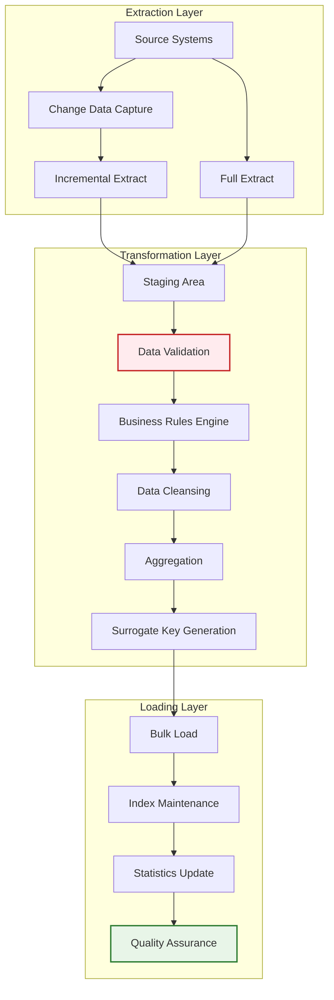

**ETL Performance Considerations:**
- **Parallel Processing:** Partition-based extraction
- **Memory Management:** Streaming for large datasets
- **Error Handling:** Retry mechanisms with exponential backoff
- **Audit Trails:** Complete lineage tracking
- **Monitoring:** Real-time performance metrics

### 3.3 Case Study: Retail Chain Integration

**Challenge:** Consolidate 500+ stores with 10M daily transactions

**Solution Architecture:**
- **Source Systems:** POS, Inventory, CRM, Supply Chain
- **Data Volume:** 5TB daily increment, 100TB historical
- **Latency Requirement:** Near real-time for inventory, daily for sales
- **Quality Metrics:** 99.9% completeness, <0.1% duplication

---

## 4. Advanced Dimensional Modeling

### 4.1 Mathematical Foundations

#### 4.1.1 Dimensional Modeling Algebra
Let:
- D = {d₁, d₂, ..., dₙ} be dimensions
- F = {f₁, f₂, ..., fₘ} be facts
- M = {m₁, m₂, ..., mₖ} be measures

The dimensional model is defined as:
```
Fact Table: F × D → M
```

#### 4.1.2 Granularity Theory
Granularity G is the finest level of detail in fact tables:
```
G = min{g₁, g₂, ..., gₙ} where gᵢ represents detail level of dimension dᵢ
```

### 4.2 Advanced Schema Patterns

#### 4.2.1 Star Schema with Conformed Dimensions

```mermaid
erDiagram
    DIM_DATE ||--o{ FACT_SALES
    DIM_PRODUCT ||--o{ FACT_SALES
    DIM_STORE ||--o{ FACT_SALES
    DIM_CUSTOMER ||--o{ FACT_SALES
    DIM_PROMOTION ||--o{ FACT_SALES
    
    FACT_SALES {
        date_key date
        product_key int
        store_key int
        customer_key int
        promotion_key int
        decimal sales_amount
        int quantity_sold
        decimal discount_amount
    }
    
    DIM_DATE {
        date_key date
        date_full date
        day_of_week int
        month int
        quarter int
        year int
        boolean is_holiday
        varchar fiscal_week
    }
    
    DIM_PRODUCT {
        product_key int
        product_name varchar
        product_category varchar
        product_subcategory varchar
        product_brand varchar
        decimal unit_price
        decimal unit_cost
        boolean is_private_label
    }
```

**Design Principles:**
- **Surrogate Keys:** System-generated keys for performance
- **Degenerate Dimensions:** Fact table attributes (order #, invoice #)
- **Bridge Tables:** Many-to-many relationships (customer ↔ demographic groups)

#### 4.2.2 Snowflake Schema with Hierarchical Optimization

```mermaid
erDiagram
    DIM_DATE ||--o{ FACT_SALES
    DIM_PRODUCT ||--o{ FACT_SALES
    DIM_STORE ||--o{ FACT_SALES
    DIM_CUSTOMER ||--o{ FACT_SALES
    
    DIM_CATEGORY ||--o{ DIM_PRODUCT
    DIM_SUBCATEGORY ||--o{ DIM_PRODUCT
    DIM_GEOGRAPHY ||--o{ DIM_STORE
    DIM_DEMOGRAPHICS ||--o{ DIM_CUSTOMER
    
    FACT_SALES {
        date_key date
        product_key int
        store_key int
        customer_key int
        decimal sales_amount
        int quantity
    }
```

**Performance Trade-offs:**
- **Storage Reduction:** 30-50% space savings
- **Query Complexity:** Additional joins increase latency
- **Maintenance Overhead:** More complex ETL logic

### 4.3 Advanced Dimensional Techniques

#### 4.3.1 Slowly Changing Dimensions (SCD) Analysis

| SCD Type | Use Case | Storage Impact | Query Complexity |
|----------|----------|----------------|-------------------|
| Type 1 | Current state only | Minimal | Low |
| Type 2 | Historical tracking | 3-5x increase | Medium |
| Type 3 | Limited history | 2x increase | High |
| Type 6 | Hybrid approach | 4x increase | High |

#### 4.3.2 Fact Table Types

**Additive Facts:** Can be summed across all dimensions
- Sales amount, quantity sold, profit margin

**Semi-Additive Facts:** Limited aggregation
- Inventory levels (sum across time, not products)
- Account balances (sum across customers, not time)

**Non-Additive Facts:** Ratios and percentages
- Conversion rates, gross margins

### 4.4 Granularity Optimization

```svg
<svg viewBox="0 0 600 400" xmlns="http://www.w3.org/2000/svg">
  <!-- Granularity Spectrum -->
  <defs>
    <linearGradient id="grad1" x1="0%" y1="0%" x2="100%" y2="0%">
      <stop offset="0%" style="stop-color:#2e7d32;stop-opacity:1" />
      <stop offset="100%" style="stop-color:#c62828;stop-opacity:1" />
    </linearGradient>
  </defs>
  
  <!-- Axis -->
  <line x1="50" y1="350" x2="550" y2="350" stroke="#333" stroke-width="2"/>
  <line x1="50" y1="50" x2="50" y2="350" stroke="#333" stroke-width="2"/>
  
  <!-- Granularity Levels -->
  <rect x="50" y="320" width="80" height="30" fill="#2e7d32" opacity="0.7"/>
  <text x="90" y="340" text-anchor="middle" fill="white">Transaction</text>
  
  <rect x="150" y="280" width="80" height="70" fill="#43a047" opacity="0.7"/>
  <text x="190" y="320" text-anchor="middle" fill="white">Daily</text>
  
  <rect x="250" y="220" width="80" height="130" fill="#66bb6a" opacity="0.7"/>
  <text x="290" y="290" text-anchor="middle" fill="white">Weekly</text>
  
  <rect x="350" y="160" width="80" height="190" fill="#9ccc65" opacity="0.7"/>
  <text x="390" y="260" text-anchor="middle" fill="white">Monthly</text>
  
  <rect x="450" y="100" width="80" height="250" fill="#c62828" opacity="0.7"/>
  <text x="490" y="230" text-anchor="middle" fill="white">Quarterly</text>
  
  <!-- Labels -->
  <text x="300" y="380" text-anchor="middle" font-size="14">Granularity Level</text>
  <text x="30" y="200" text-anchor="middle" font-size="14" transform="rotate(-90 30 200)">Data Volume</text>
  
  <!-- Trade-off Curve -->
  <path d="M 50 350 Q 300 100 550 50" stroke="#1565c0" stroke-width="3" fill="none" stroke-dasharray="5,5"/>
  <text x="300" y="90" text-anchor="middle" fill="#1565c0" font-size="12">Performance Trade-off</text>
</svg>
```

**Granularity Selection Criteria:**
1. **Business Requirements:** Analytical needs vs storage constraints
2. **Query Performance:** Aggregation cost vs response time
3. **Data Freshness:** Update frequency requirements
4. **Storage Economics:** Cost-benefit analysis of detail preservation

---

## 5. OLAP Systems & Multidimensional Analysis

### 5.1 Mathematical Foundations of OLAP

#### 5.1.1 Cube Definition
An OLAP cube C is defined as:
```
C = D₁ × D₂ × ... × Dₙ → M
```
Where Dᵢ are dimensions and M are measures.

#### 5.1.2 OLAP Operations Formalization

| Operation | Mathematical Definition | Example |
|-----------|------------------------|---------|
| **Roll-up** | f: D → D' where |D'| < |D| | Day → Month |
| **Drill-down** | f: D → D' where |D'| > |D| | Month → Day |
| **Slice** | C[dᵢ = v] | Sales[Region = 'North'] |
| **Dice** | C[d₁ ∈ V₁ ∧ ... ∧ dₙ ∈ Vₙ] | Sales[Region ∈ {'North','South'} ∧ Month ∈ {1,2}] |
| **Pivot** | Permute dimensions | Products × Stores → Stores × Products |

### 5.2 Advanced OLAP Architectures

#### 5.2.1 ROLAP (Relational OLAP) Architecture

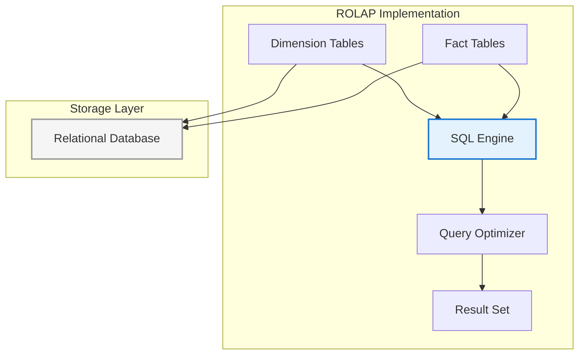

**Characteristics:**
- **Storage:** Standard relational database
- **Query Processing:** SQL with extensions (GROUP BY CUBE, ROLLUP)
- **Performance:** Variable, dependent on indexing
- **Scalability:** Excellent for large datasets
- **Flexibility:** Maximum for ad-hoc queries

#### 5.2.2 MOLAP (Multidimensional OLAP) Architecture

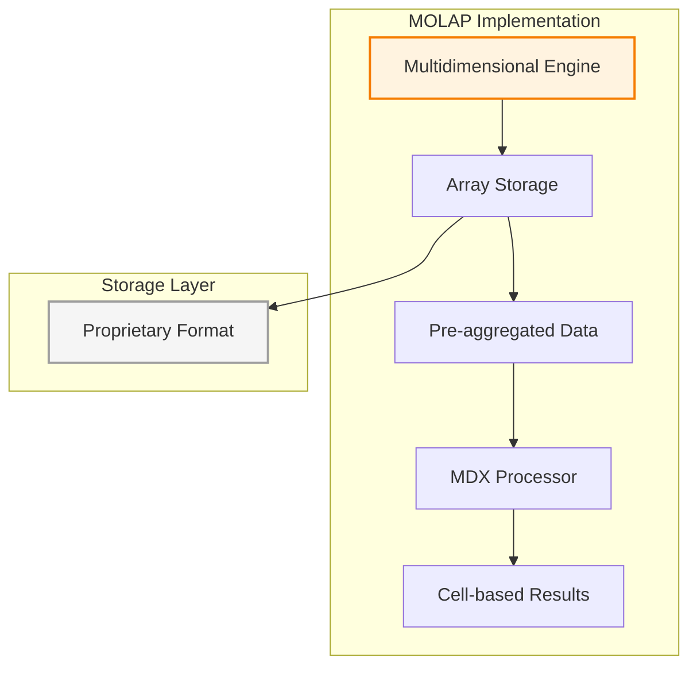

**Characteristics:**
- **Storage:** Optimized multidimensional arrays
- **Query Processing:** MDX (Multidimensional Expressions)
- **Performance:** Excellent for predefined queries
- **Scalability:** Limited by memory constraints
- **Flexibility:** Reduced for ad-hoc analysis

#### 5.2.3 HOLAP (Hybrid OLAP) Architecture

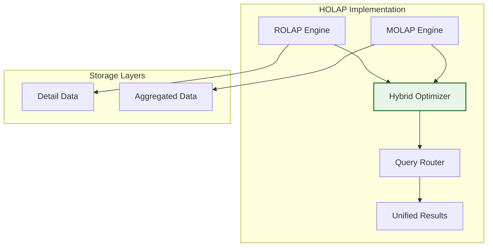

**Hybrid Strategy:**
- **Recent Data:** MOLAP for performance (last 90 days)
- **Historical Data:** ROLAP for scalability (full history)
- **Query Routing:** Automatic based on data age and query complexity

### 5.3 Advanced OLAP Operations

#### 5.3.1 Complex Aggregation Patterns

```sql
-- Multi-level Roll-up with Window Functions
SELECT 
    product_category,
    month,
    SUM(sales_amount) OVER (PARTITION BY product_category ORDER BY month) as cumulative_sales,
    SUM(sales_amount) OVER (PARTITION BY product_category) as category_total,
    sales_amount / SUM(sales_amount) OVER (PARTITION BY product_category) as category_share
FROM fact_sales
GROUP BY product_category, month, sales_amount;
```

#### 5.3.2 Time Series Analysis

```sql
-- Year-over-Year Growth with Moving Average
SELECT 
    month,
    SUM(sales_amount) as current_month,
    LAG(SUM(sales_amount), 12) OVER (ORDER BY month) as prior_year_month,
    (SUM(sales_amount) - LAG(SUM(sales_amount), 12) OVER (ORDER BY month)) / 
        LAG(SUM(sales_amount), 12) OVER (ORDER BY month) * 100 as yoy_growth_pct,
    AVG(SUM(sales_amount)) OVER (ORDER BY month ROWS BETWEEN 2 PRECEDING AND CURRENT ROW) as moving_avg_3mo
FROM fact_sales
GROUP BY month
ORDER BY month;
```

### 5.4 Performance Optimization

#### 5.4.1 Query Optimization Strategies

| Technique | Impact | Implementation Complexity |
|-----------|---------|----------------------------|
| **Bitmap Indexes** | 10-100x faster filters | Low |
| **Materialized Views** | 5-50x faster aggregations | Medium |
| **Partitioning** | 2-10x faster scans | Medium |
| **Columnar Storage** | 5-20x faster scans | High |
| **In-Memory Analytics** | 10-100x faster queries | High |

#### 5.4.2 Cache Management

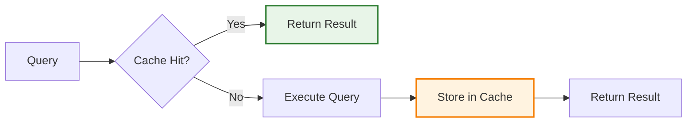

**Cache Replacement Policies:**
- **LRU (Least Recently Used):** Standard approach
- **LFU (Least Frequently Used):** For predictable patterns
- **TTL (Time To Live):** For data freshness requirements

---

## 6. Implementation Strategies & Architecture Selection

### 6.1 Decision Framework for OLAP Architecture

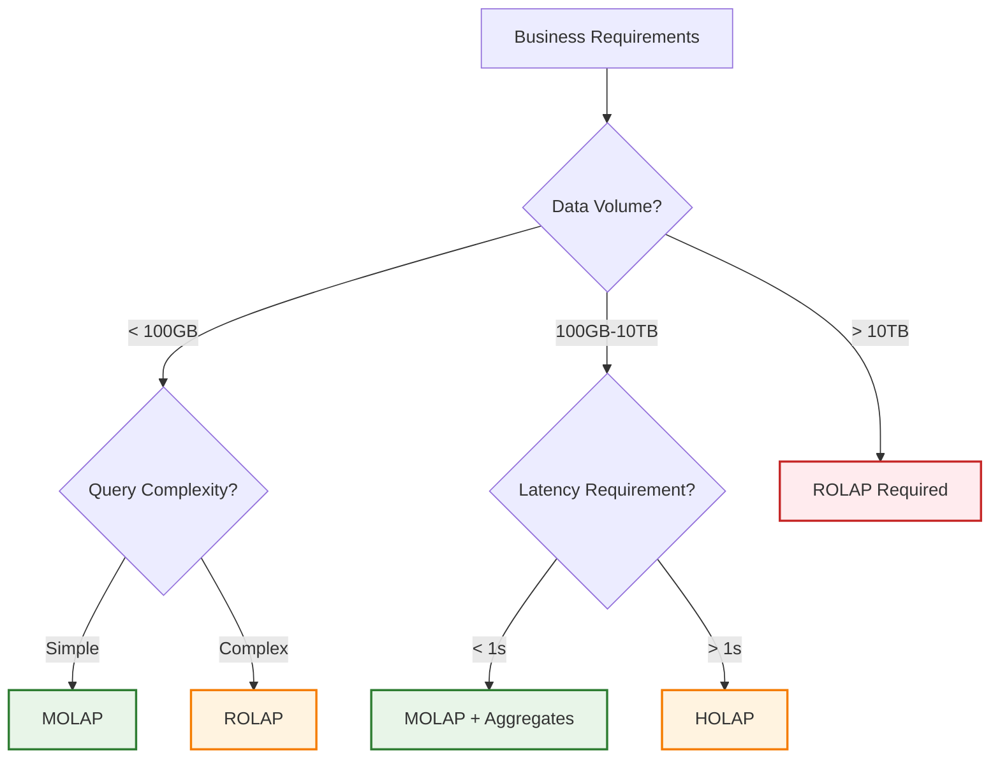

### 6.2 Cost-Benefit Analysis

| Architecture | Implementation Cost | Maintenance Cost | Performance | Scalability |
|--------------|-------------------|------------------|-------------|--------------|
| **ROLAP** | Low | Low | Variable | Excellent |
| **MOLAP** | Medium | Medium | Excellent | Limited |
| **HOLAP** | High | High | Very Good | Excellent |

### 6.3 Implementation Roadmap

#### Phase 1: Assessment (Weeks 1-2)
- Requirements gathering
- Data profiling
- Performance benchmarking
- Architecture selection

#### Phase 2: Design (Weeks 3-4)
- Dimensional modeling
- ETL design
- Security architecture
- Quality framework

#### Phase 3: Development (Weeks 5-8)
- ETL implementation
- Data warehouse build
- OLAP cube design
- Testing framework

#### Phase 4: Deployment (Weeks 9-10)
- Production deployment
- Performance tuning
- User training
- Documentation

#### Phase 5: Optimization (Weeks 11-12)
- Query optimization
- Cache tuning
- Monitoring setup
- Continuous improvement

---

## 7. Advanced Exercises & Case Studies

### 7.1 Exercise 1: Retail Chain Analytics Design

**Scenario:** Multi-national retail chain with 1,000 stores, 50M daily transactions

**Requirements:**
- Real-time inventory visibility
- Daily sales reporting
- Seasonal trend analysis
- Cross-store performance comparison

**Tasks:**
1. Design dimensional model with justification
2. Propose ETL architecture with data quality controls
3. Select OLAP architecture with performance analysis
4. Create query optimization strategy

**Evaluation Criteria:**
- Model completeness (25%)
- Architecture justification (25%)
- Performance analysis (25%)
- Implementation feasibility (25%)

### 7.2 Exercise 2: Financial Services Risk Analytics

**Scenario:** Investment bank requiring regulatory reporting and risk analysis

**Requirements:**
- Transaction-level risk scoring
- Portfolio performance attribution
- Regulatory compliance reporting
- Stress testing scenarios

**Challenges:**
- Data volume: 1B transactions daily
- Latency: < 5 minutes for risk calculations
- Accuracy: 99.99% data quality
- Security: Multi-level access controls

### 7.3 Exercise 3: Healthcare Analytics Platform

**Scenario:** Hospital network requiring patient outcome analysis

**Requirements:**
- Patient journey analytics
- Treatment effectiveness analysis
- Resource utilization optimization
- Predictive readmission modeling

**Constraints:**
- HIPAA compliance
- Data privacy requirements
- Real-time alerting
- Multi-tenant architecture

---

## 8. Comprehensive Solutions & Methodologies

### 8.1 Solution Framework

#### 8.1.1 Design Methodology

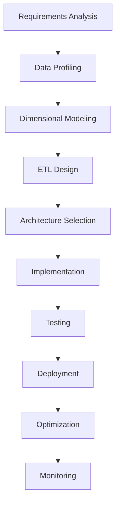

#### 8.1.2 Quality Assurance Framework

| Quality Dimension | Metrics | Thresholds |
|------------------|---------|-------------|
| **Completeness** | % records with required fields | > 99.5% |
| **Accuracy** | % matching with source system | > 99.9% |
| **Timeliness** | Data freshness | < 24 hours |
| **Consistency** | Cross-system validation | > 99.5% |
| **Uniqueness** | Duplicate rate | < 0.1% |

### 8.2 Advanced Implementation Patterns

#### 8.2.1 Real-Time ETL Architecture

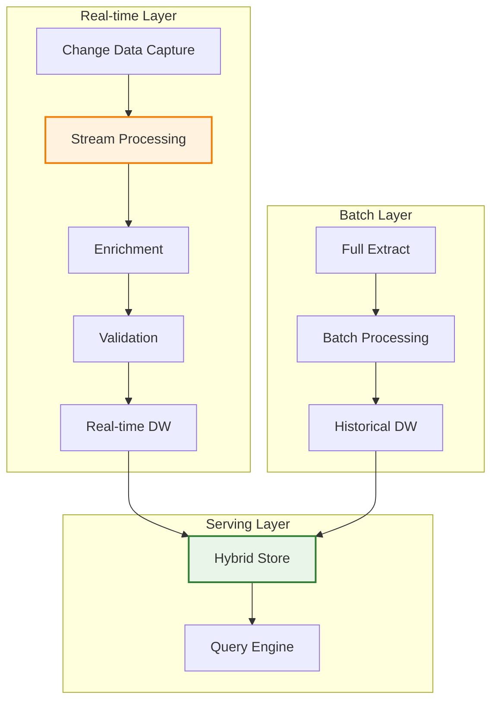

#### 8.2.2 Microservices Architecture

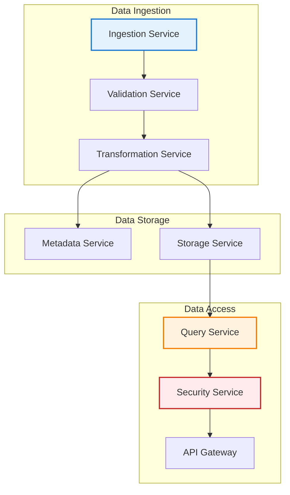

### 8.3 Performance Optimization Techniques

#### 8.3.1 Query Optimization Strategies

```sql
-- Example: Optimized Multi-dimensional Query
WITH 
monthly_sales AS (
    SELECT 
        product_category,
        DATE_TRUNC('month', order_date) as month,
        SUM(sales_amount) as monthly_total,
        COUNT(*) as transaction_count
    FROM fact_sales fs
    JOIN dim_product dp ON fs.product_key = dp.product_key
    WHERE order_date >= CURRENT_DATE - INTERVAL '12 months'
    GROUP BY product_category, DATE_TRUNC('month', order_date)
),
category_rankings AS (
    SELECT 
        product_category,
        month,
        monthly_total,
        RANK() OVER (PARTITION BY month ORDER BY monthly_total DESC) as category_rank
    FROM monthly_sales
)
SELECT 
    product_category,
    month,
    monthly_total,
    category_rank
FROM category_rankings
WHERE category_rank <= 5
ORDER BY month, category_rank;
```

#### 8.3.2 Storage Optimization

| Technique | Benefits | Implementation |
|-----------|----------|----------------|
| **Partitioning** | Faster scans, easier maintenance | Range partitioning on date |
| **Indexing Strategy** | Improved query performance | Bitmap indexes on dimensions |
| **Compression** | Reduced storage cost | Columnar compression |
| **Materialized Views** | Pre-aggregated results | Refresh strategies |

---

## 9. Mini-Project: Enterprise Analytics Platform

### 9.1 Project Overview

**Objective:** Design and implement a comprehensive BI platform for a multinational corporation

**Scope:**
- 5 business units (Sales, Finance, Operations, Marketing, HR)
- 3 years of historical data
- 10M daily transactions
- Multi-country operations

### 9.2 Project Requirements

#### 9.2.1 Functional Requirements
- Executive dashboards with KPI tracking
- Department-specific analytics
- Ad-hoc query capabilities
- Mobile accessibility
- Export functionality

#### 9.2.2 Non-Functional Requirements
- Query response time < 3 seconds
- Data freshness < 24 hours
- 99.9% availability
- Multi-level security
- GDPR compliance

### 9.3 Implementation Phases

#### Phase 1: Foundation (Weeks 1-4)
- Requirements gathering
- Data architecture design
- Technology selection
- Team formation

#### Phase 2: Core Development (Weeks 5-12)
- Data warehouse implementation
- ETL pipeline development
- Core dashboards
- Testing framework

#### Phase 3: Advanced Features (Weeks 13-16)
- Advanced analytics
- Machine learning integration
- Mobile optimization
- Performance tuning

#### Phase 4: Deployment (Weeks 17-20)
- Production deployment
- User training
- Documentation
- Go-live preparation

### 9.4 Evaluation Criteria

| Category | Weight | Criteria |
|----------|--------|----------|
| **Architecture** | 25% | Scalability, maintainability, performance |
| **Implementation** | 25% | Code quality, testing, documentation |
| **Analytics** | 25% | Dashboard effectiveness, query performance |
| **Innovation** | 15% | Advanced features, optimization techniques |
| **Presentation** | 10% | Documentation, demo, explanation |

---

## 10. Final Examination Preparation

### 10.1 Key Concepts Review

#### 10.1.1 Essential Knowledge Areas
1. **BI Architecture:** Components, data flow, integration patterns
2. **Dimensional Modeling:** Star schema, snowflake, conformed dimensions
3. **ETL Processes:** Extraction, transformation, loading strategies
4. **OLAP Operations:** Roll-up, drill-down, slice, dice, pivot
5. **Architecture Selection:** ROLAP vs MOLAP vs HOLAP decision criteria

#### 10.1.2 Advanced Topics
1. **Performance Optimization:** Indexing, partitioning, caching
2. **Data Quality:** Validation, cleansing, monitoring
3. **Real-time Analytics:** Streaming, change data capture
4. **Security:** Access control, data masking, audit trails
5. **Governance:** Metadata management, data lineage

### 10.2 Sample Examination Questions

#### 10.2.1 Theoretical Questions
1. Compare and contrast Inmon and Kimball methodologies using specific examples
2. Explain the mathematical foundations of OLAP operations with formal definitions
3. Analyze the trade-offs between ROLAP and MOLAP architectures using cost-benefit analysis

#### 10.2.2 Practical Questions
1. Design a dimensional model for a university enrollment system with justification
2. Optimize a complex analytical query with multiple joins and aggregations
3. Design an ETL pipeline for real-time fraud detection with data quality controls

#### 10.2.3 Case Study Questions
1. Recommend an architecture for a global e-commerce platform with 1B transactions/day
2. Design a migration strategy from legacy reporting systems to modern BI platform
3. Evaluate and improve an existing BI implementation using established frameworks

### 10.3 Study Resources

#### 10.3.1 Primary References
- Kimball & Ross: *The Data Warehouse Toolkit* (Chapters 1-10)
- Inmon: *Building the Data Warehouse* (Chapters 3-7)
- Kimball: *The Data Warehouse Lifecycle Toolkit* (Chapters 4-9)

#### 10.3.2 Academic Papers
- "A Survey of Data Warehouse Design Methodologies" - IEEE Transactions
- "Performance Optimization in OLAP Systems" - ACM Computing Surveys
- "Real-time Analytics: Architecture and Implementation" - VLDB Proceedings

#### 10.3.3 Industry Resources
- TDWI Best Practices
- Gartner Magic Quadrant for Analytics Platforms
- MIT Technology Review: AI in Business Intelligence

---

## 11. Course Conclusion & Future Directions

### 11.1 Industry Trends
- **AI/ML Integration:** Automated insights, predictive analytics
- **Cloud Analytics:** Scalable, pay-as-you-go analytics platforms
- **Real-time Processing:** Streaming analytics, edge computing
- **Data Governance:** Privacy, ethics, regulatory compliance

### 11.2 Career Pathways
- **Data Engineer:** ETL, data pipelines, architecture
- **BI Architect:** Solution design, technology selection
- **Analytics Consultant:** Business requirements, solution implementation
- **Data Scientist:** Advanced analytics, machine learning

### 11.3 Continuous Learning
- **Certifications:** CDMP, TDWI, cloud platform certifications
- **Communities:** TDWI, DAMA, local BI user groups
- **Research:** Academic conferences, industry publications

---

**Course Completion Requirements:**
- Complete all assignments and mini-project
- Achieve minimum 70% on final examination
- Participate in class discussions and case studies
- Submit final project with documentation and demonstration

**Office Hours:** Monday/Wednesday 2-4 PM  
**Contact:** professor@university.edu  
**Course Website:** https://bi401.university.edu

---

*This course syllabus is subject to change based on emerging industry trends and technological advancements. Students will be notified of any modifications via the course website and email communications.*
