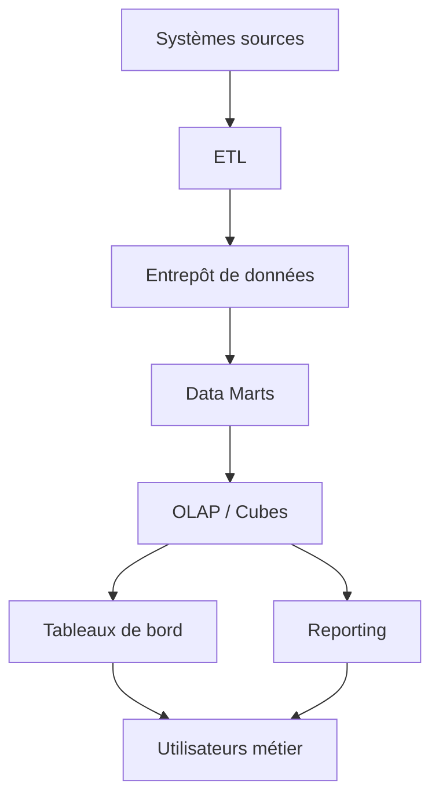
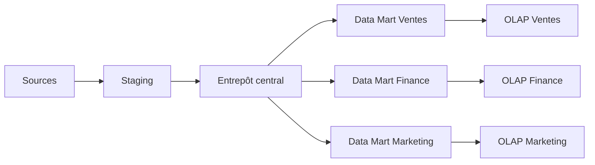
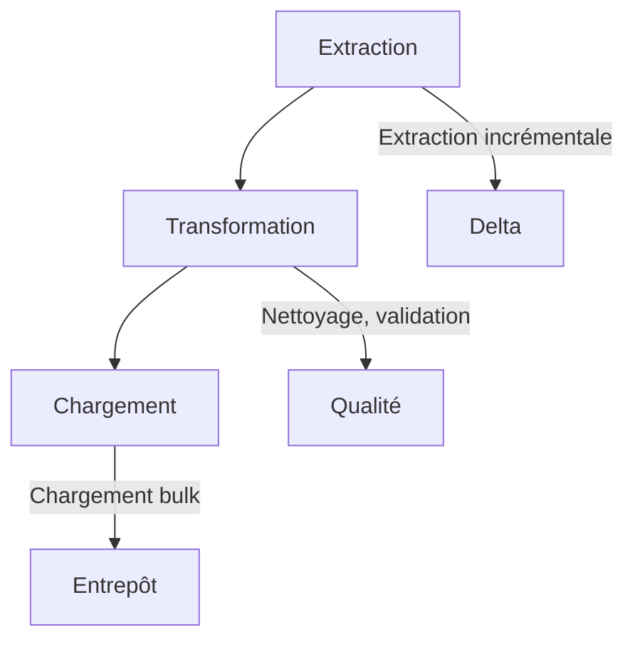
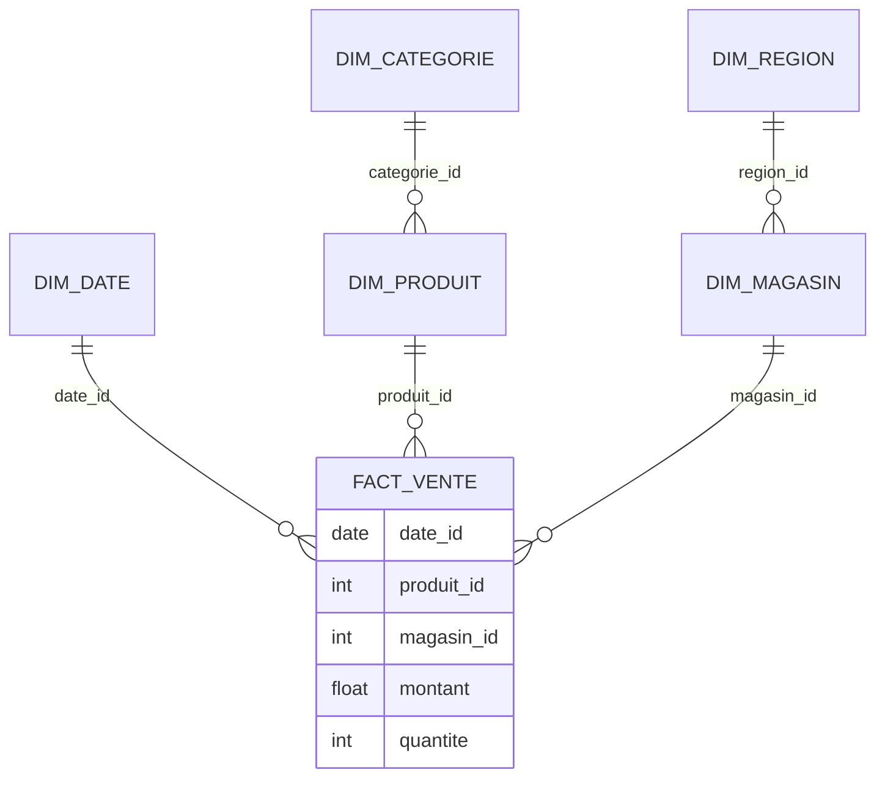
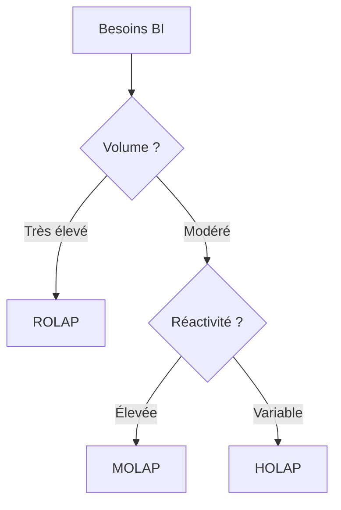
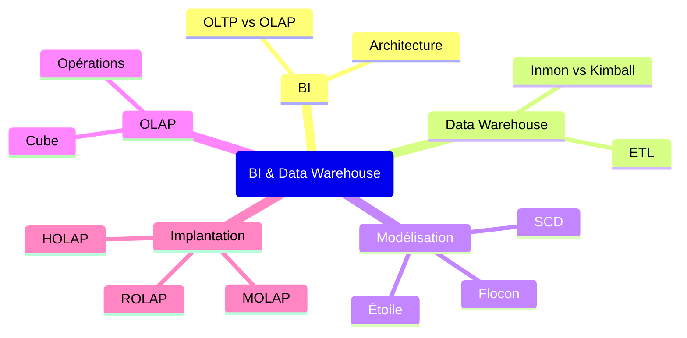

# Support de cours complet — Modélisation multidimensionnelle et entrepôts de données (L3)

> **Professeur :** Senior Business Intelligence & Data Warehousing  
> **Niveau :** Licence 3 (L2–L3) – 42h  
> **Référence principale :** Kimball & Ross, *Entrepôts de données : guide pratique de modélisation dimensionnelle*

---

## 1️⃣ Introduction générale

### Positionnement du cours
Ce cours s’inscrit dans le domaine de l’informatique décisionnelle (Business Intelligence). Il vise à donner aux étudiants les compétences pour concevoir, mettre en œuvre et exploiter des entrepôts de données à des fins d’analyse stratégique.

### Enjeux stratégiques
- **Valorisation des données :** transformer des données opérationnelles en information décisionnelle.
- **Prise de décision :** fournir des indicateurs fiables et historisés.
- **Performance organisationnelle :** aligner les systèmes d’information avec les objectifs métier.

### Learning outcomes mesurables
À la fin de ce cours, l’étudiant sera capable de :
1. Distinguer les systèmes OLTP des systèmes OLAP.
2. Concevoir un schéma en étoile ou en flocon à partir d’un cas métier.
3. Expliquer les opérations OLAP (roll-up, drill-down, slice, dice, pivot).
4. Choisir une architecture ROLAP/MOLAP/HOLAP selon les contraintes.
5. Proposer un plan d’ETL et des règles de qualité des données.

---

## 2️⃣ Chapitre 1 — Business Intelligence

### Définitions académiques
- **Business Intelligence (BI)** : ensemble des processus, technologies et outils permettant de transformer les données brutes en information pertinente pour la prise de décision.
- **OLTP (Online Transaction Processing)** : systèmes transactionnels optimisés pour les opérations courantes (insertion, mise à jour).
- **OLAP (Online Analytical Processing)** : systèmes analytiques optimisés pour les requêtes complexes et l’agrégation.

### OLTP vs OLAP (tableau comparatif)

| Critère | OLTP | OLAP |
| --- | --- | --- |
| Objectif | Opérations transactionnelles | Analyse et reporting |
| Modèle de données | Normalisé (3FN) | Dénormalisé (dimensionnel) |
| Volume | Transactionnel, temps réel | Historisé, volumineux |
| Utilisateurs | Opérationnels | Décideurs, analystes |
| Latence | Millisecondes | Secondes à minutes |

### Architecture BI (diagramme Mermaid)



**Explication pédagogique** : Les systèmes sources alimentent l’entrepôt via des processus ETL. Les data marts thématiques alimentent les cubes OLAP, qui servent de base aux tableaux de bord et aux rapports pour les décideurs.

---

## 3️⃣ Chapitre 2 — Entrepôts de Données

### Définitions Inmon vs Kimball
- **Inmon** : approche top-down, entrepôt centralisé, normalisé, data marts dépendants.
- **Kimball** : approche bottom-up, data marts indépendants, modélisation dimensionnelle rapide.

### Caractéristiques fondamentales
1. **Intégration** : données unifiées, cohérentes.
2. **Historisation** : conservation des états successifs.
3. **Orientation sujet** : organisé autour de thèmes métier.
4. **Non-volatilité** : données en lecture seule.
5. **Disponibilité** : accès performant et stable.

### Architecture Data Warehouse (Mermaid)



**Explication pédagogique** : L’architecture montre un entrepôt central qui alimente plusieurs data marts thématiques, chacun avec son propre cube OLAP.

### ETL détaillé (diagramme + explication)



**Explication** : L’ETL extrait les données, les transforme (nettoyage, validation, agrégation) puis les charge dans l’entrepôt. L’incrémental réduit les temps de traitement.

### Cas illustratif
Une entreprise retail souhaite consolider les ventes en ligne et en magasin. L’ETL unifie les données, corrige les incohérences (codes produits, dates) et charge un entrepôt pour des analyses cross-canal.

---

## 4️⃣ Chapitre 3 — Modélisation Multidimensionnelle

### Faits, dimensions, hiérarchies
- **Fait** : événement mesurable (vente, clic, commande).
- **Dimension** : axe d’analyse (produit, date, magasin).
- **Hiérarchie** : structure à plusieurs niveaux (date → mois → année).

### Schéma en étoile (Mermaid + SVG)

**Mermaid**
```mermaid
erDiagram
    DIM_DATE ||--o{ FACT_VENTE
    DIM_PRODUIT ||--o{ FACT_VENTE
    DIM_MAGASIN ||--o{ FACT_VENTE
    FACT_VENTE {
        date date_id
        int produit_id
        int magasin_id
        decimal montant_vente
        int quantite
    }
    
    DIM_DATE {
        date date_id PK
        string jour_semaine
        int mois
        int annee
        boolean est_jour_ferie
    }
    
    DIM_PRODUIT {
        int produit_id PK
        string nom_produit
        string categorie
        decimal prix_unitaire
    }
    
    DIM_MAGASIN {
        int magasin_id PK
        string nom_magasin
        string ville
        string region
        int surface
    }
```

**SVG pédagogique (représentation visuelle)**
```svg
<svg viewBox="0 0 400 300" xmlns="http://www.w3.org/2000/svg">
  <rect x="150" y="120" width="100" height="60" fill="#e3f2fd" stroke="#1976d2"/>
  <text x="200" y="155" text-anchor="middle">Fact Ventes</text>
  <rect x="50" y="30" width="80" height="40" fill="#fff3e0" stroke="#f57c00"/>
  <text x="90" y="55" text-anchor="middle">Dim Date</text>
  <rect x="270" y="30" width="80" height="40" fill="#fff3e0" stroke="#f57c00"/>
  <text x="310" y="55" text-anchor="middle">Dim Produit</text>
  <rect x="160" y="230" width="80" height="40" fill="#fff3e0" stroke="#f57c00"/>
  <text x="200" y="255" text-anchor="middle">Dim Magasin</text>
  <line x1="130" y1="70" x2="170" y2="120" stroke="#666"/>
  <line x1="270" y1="70" x2="230" y2="120" stroke="#666"/>
  <line x1="200" y1="180" x2="200" y2="230" stroke="#666"/>
</svg>
```

**Explication** : Le schéma en étoile place une table de faits au centre, reliée à des tables de dimensions. Les dimensions sont dénormalisées pour optimiser les performances des requêtes analytiques.

### Schéma en flocon (Mermaid)



**Explication** : Le flocon normalise les dimensions (ex: catégorie, région) pour réduire la redondance, au prix de joints supplémentaires.

### Constellation de faits
Une constellation combine plusieurs faits partageant des dimensions conformes (ex: ventes et stocks partagent la dimension produit).

### Granularité (illustration graphique)

```svg
<svg viewBox="0 0 500 200" xmlns="http://www.w3.org/2000/svg">
  <text x="10" y="30" font-size="14">Granularité fine (ligne de ticket)</text>
  <rect x="10" y="40" width="480" height="20" fill="#c8e6c9"/>
  <text x="10" y="80" font-size="14">Granularité agrégée (ventes journalières par magasin)</text>
  <rect x="10" y="90" width="240" height="20" fill="#ffecb3"/>
  <text x="10" y="130" font-size="14">Granularité très agrégée (ventes mensuelles)</text>
  <rect x="10" y="140" width="80" height="20" fill="#ffcdd2"/>
</svg>
```

**Explication** : Plus la granularité est fine, plus les analyses sont détaillées, mais plus le volume augmente.

### Slowly Changing Dimensions (SCD)

- **Type 1** : écrasement de l’ancienne valeur.
- **Type 2** : ajout d’une ligne avec version et dates de validité.
- **Type 3** : ajout d’une colonne pour la nouvelle valeur.

**Diagramme SCD Type 2**
```svg
<svg viewBox="0 0 400 200" xmlns="http://www.w3.org/2000/svg">
  <text x="10" y="30" font-size="14">Produit P01</text>
  <rect x="10" y="40" width="120" height="30" fill="#e3f2fd" stroke="#1976d2"/>
  <text x="15" y="60" font-size="12">Version 1: Cat A</text>
  <rect x="140" y="40" width="120" height="30" fill="#e3f2fd" stroke="#1976d2"/>
  <text x="145" y="60" font-size="12">Version 2: Cat B</text>
  <text x="10" y="100" font-size="12">Validité: 2020-01-01 → 2021-06-30</text>
  <text x="140" y="100" font-size="12">Validité: 2021-07-01 → ∞</text>
</svg>
```

---

## 5️⃣ Chapitre 4 — OLAP

### Opérations OLAP (illustrations visuelles)

- **Roll-up** : agrégation vers le haut (jour → mois).
- **Drill-down** : désagrégation (mois → jour).
- **Slice** : filtrage sur une dimension (magasin = M01).
- **Dice** : sous-cube multi-filtres (magasin M01, produit P01, mois 01).
- **Pivot** : rotation des axes (produits en lignes, magasins en colonnes).

### Cube multidimensionnel (SVG obligatoire)

```svg
<svg viewBox="0 0 300 300" xmlns="http://www.w3.org/2000/svg">
  <!-- Arêtes du cube -->
  <line x1="50" y1="250" x2="150" y2="250" stroke="#333"/>
  <line x1="150" y1="250" x2="150" y2="150" stroke="#333"/>
  <line x1="150" y1="150" x2="50" y2="150" stroke="#333"/>
  <line x1="50" y1="150" x2="50" y2="250" stroke="#333"/>
  <line x1="50" y1="150" x2="100" y2="100" stroke="#333"/>
  <line x1="150" y1="150" x2="200" y2="100" stroke="#333"/>
  <line x1="150" y1="250" x2="200" y2="200" stroke="#333"/>
  <line x1="50" y1="250" x2="100" y2="200" stroke="#333"/>
  <line x1="100" y1="100" x2="200" y2="100" stroke="#333"/>
  <line x1="200" y1="100" x2="200" y2="200" stroke="#333"/>
  <line x1="100" y1="200" x2="200" y2="200" stroke="#333"/>
  <line x1="100" y1="100" x2="100" y2="200" stroke="#333"/>
  <line x1="100" y1="200" x2="50" y2="250" stroke="#333"/>
  <!-- Labels -->
  <text x="85" y="270" font-size="12">Temps</text>
  <text x="160" y="270" font-size="12">Produit</text>
  <text x="210" y="150" font-size="12">Magasin</text>
  <text x="100" y="120" font-size="12">Ventes</text>
</svg>
```

**Explication** : Le cube OLAP représente les ventes selon trois axes (temps, produit, magasin). Chaque cellule contient une mesure (ex: montant).

### Exemples d’analyses pas à pas
1. **Roll-up** : CA mensuel par produit.
2. **Drill-down** : CA quotidien pour un produit donné.
3. **Slice** : Ventes du magasin M01.
4. **Dice** : Ventes du magasin M01 pour les produits P01 et P02 en janvier.
5. **Pivot** : Tableau croisé produits × magasins.

---

## 6️⃣ Chapitre 5 — Approches d’implantation

### ROLAP
- Stockage relationnel.
- Agrégations calculées à la volée.
- Flexibilité maximale, performances variables.

### MOLAP
- Stockage multidimensionnel.
- Agrégations pré-calculées.
- Performances élevées, volume limité.

### HOLAP
- Hybride : détails en ROLAP, agrégats en MOLAP.
- Compromis flexibilité/performance.

### Tableau comparatif

| Critère | ROLAP | MOLAP | HOLAP |
| --- | --- | --- | --- |
| Stockage | Relationnel | Multidimensionnel | Mixte |
| Performances | Moyenne | Haute | Haute/Moyenne |
| Volume | Illimité | Limité | Illimité |
| Flexibilité | Très élevée | Moyenne | Élevée |

### Diagramme décisionnel (Mermaid)



---

## 7️⃣ Travaux Dirigés Progressifs

### Exercice 1 : Modélisation en étoile
- **Énoncé** : Concevoir un schéma en étoile pour les ventes d’une chaîne de magasins.
- **Données** : ventes (date, produit, magasin, montant, quantité).
- **Travail demandé** : dimensions, faits, granularité, diagramme Mermaid.

### Exercice 2 : Opérations OLAP
- **Énoncé** : À partir d’un cube ventes, écrire les requêtes pour roll-up, drill-down, slice, dice.
- **Travail demandé** : SQL ROLAP et résultats attendus.

### Exercice 3 : Choix d’architecture
- **Énoncé** : Une entreprise a 10 ans d’historique et des dashboards quotidiens. Choisir ROLAP/MOLAP/HOLAP et justifier.

---

## 8️⃣ Corrigés Détaillés

### Exercice 1 : Corrigé
- **Dimensions** : date, produit, magasin.
- **Fait** : ventes (granularité ligne de ticket).
- **Diagramme** : voir schéma en étoile (Chapitre 3).
- **Erreurs fréquentes** : granularité incohérente, mesures non additives.

### Exercice 2 : Corrigé
- **Roll-up** : `SELECT DATE_TRUNC('month', date), produit, SUM(montant) FROM ventes GROUP BY DATE_TRUNC('month', date), produit;`
- **Drill-down** : `SELECT date, produit, SUM(montant) FROM ventes WHERE DATE_TRUNC('month', date) = '2024-01-01' GROUP BY date, produit;`
- **Slice** : `SELECT * FROM ventes WHERE magasin = 'M01';`
- **Dice** : `SELECT * FROM ventes WHERE magasin = 'M01' AND produit IN ('P01', 'P02') AND DATE_TRUNC('month', date) = '2024-01-01';`

### Exercice 3 : Corrigé
- **Recommandation** : HOLAP.
- **Justification** : détails historiques en ROLAP, agrégats récents en MOLAP.
- **Plan d’actualisation** : quotidien pour les agrégats, hebdomadaire pour l’historique.

---

## 9️⃣ Mini Projet Guidé

### Cas réaliste
Une entreprise de e-commerce souhaite analyser les ventes et les clics publicitaires.

### Cahier des charges
- Conception d’un entrepôt (schéma en étoile).
- Scripts DDL/DML.
- Requêtes OLAP (CA, top produits, taux de clics).
- Note d’architecture (ROLAP/MOLAP/HOLAP).

### Étapes de conception
1. Analyse des besoins.
2. Modélisation dimensionnelle.
3. Création des tables.
4. Alimentation (ETL simplifié).
5. Validation des requêtes.

### Critères d’évaluation détaillés
| Critère | Points |
| --- | --- |
| Schéma dimensionnel | 4 |
| Scripts SQL | 3 |
| Requêtes OLAP | 3 |
| Note d’architecture | 2 |
| Qualité globale | 2 |
| Total | 14 |

---

## 🔟 Synthèse finale

### Carte conceptuelle globale (Mermaid)



### Points clés
- La BI transforme les données en décisions.
- L’entrepôt de données intègre, historise et oriente sujet.
- La modélisation dimensionnelle optimise les requêtes analytiques.
- OLAP permet des analyses multidimensionnelles rapides.
- Le choix d’architecture dépend du volume, de la réactivité et des coûts.

### Questions type examen final
1. Comparez OLTP et OLAP (tableau).
2. Concevez un schéma en étoile pour un cas donné.
3. Expliquez les opérations OLAP avec un exemple.
4. Choisissez une architecture et justifiez.

---

**Fin du support**
