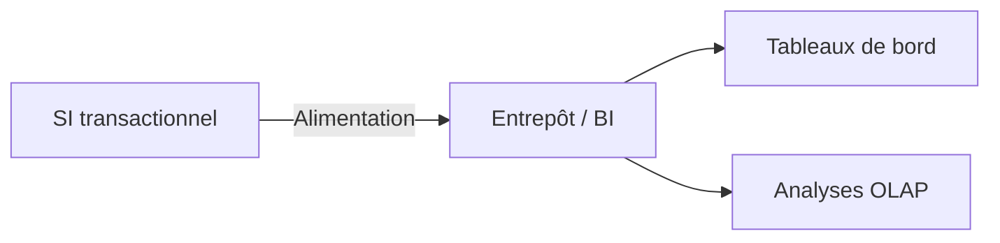
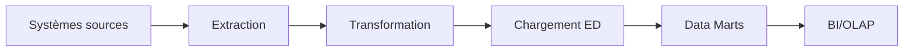
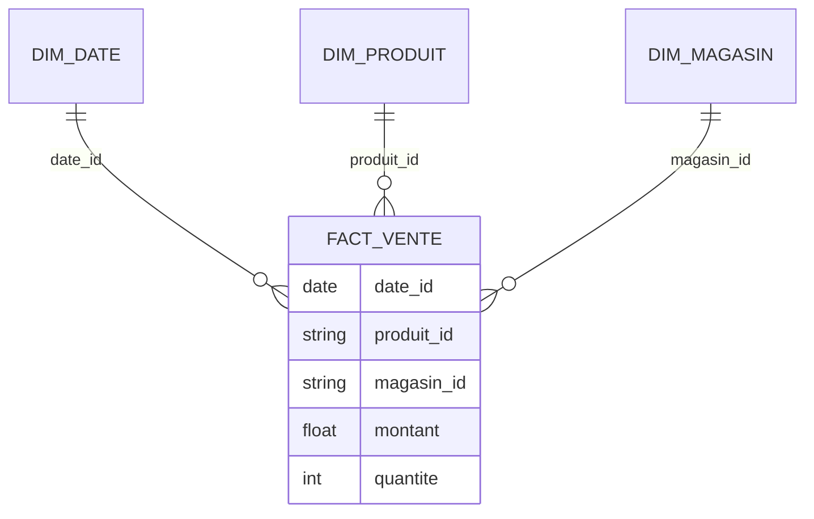
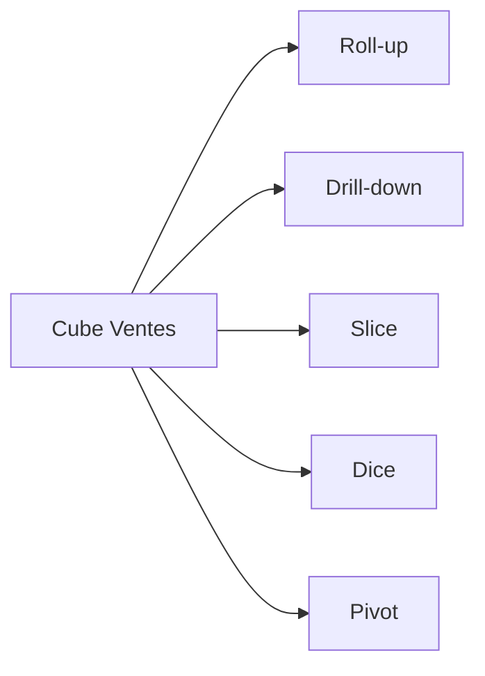
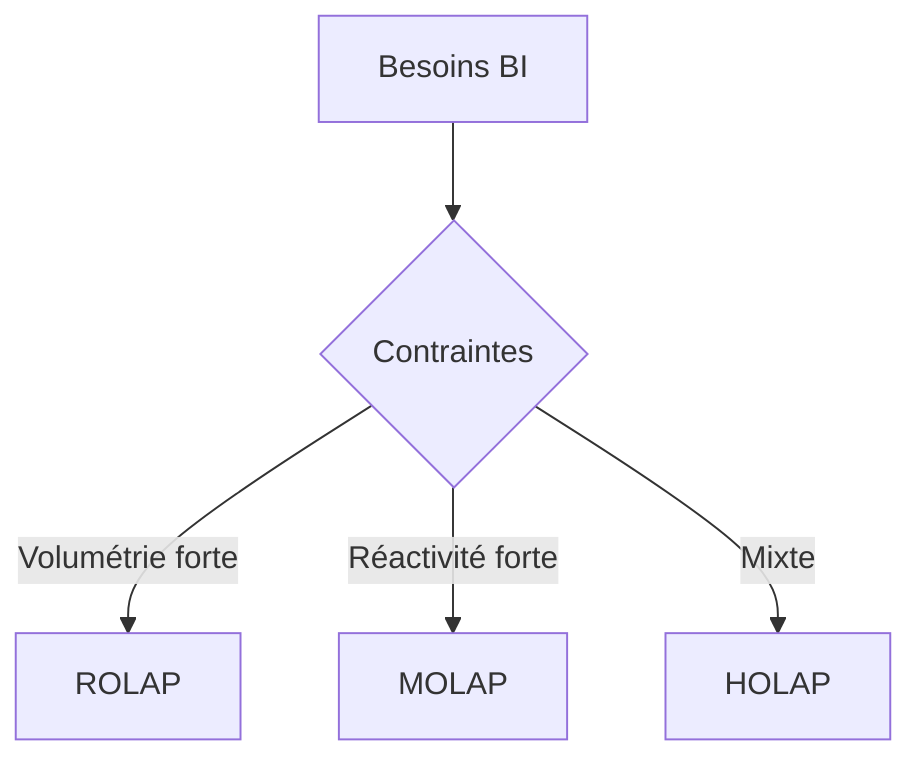

# Support de cours (auto-formation) — Modélisation multidimensionnelle et OLAP

Objectif : offrir un cours théorique complet, autoportant, avec illustrations (Mermaid), exemples concrets (SQL) et exercices corrigés.

## Chapitre A — Introduction à la BI (fondamentaux)

### Notions clés
- BI vs SI transactionnel : décisionnel (analyse, historique) vs opérationnel (transactions courantes).
- Données : qualité, intégration, historisation.

### Illustration


### Exemple concret (SQL agrégé)
```sql
CREATE VIEW v_ca_jour_magasin AS
SELECT date_vente AS jour, magasin, SUM(montant) AS ca, COUNT(*) AS nb_tickets
FROM ventes_brutes
GROUP BY date_vente, magasin;
```

### Exercice (auto-corrigé)
- Différences OLTP/OLAP (2 points) : orientation opérationnelle vs analytique ; modèle normalisé vs modèle orienté agrégation.

## Chapitre B — Entrepôt de données et ETL

### Notions clés
- Entrepôt : intégré, historisé, orienté sujet, non volatil, disponibilité élevée.
- Data mart : vue thématique ; ODS ≠ ED (latence, historisation).

### Illustration (chaîne ETL)


### Exemple concret (staging unifié)
```sql
CREATE VIEW stg_ventes_unifiees AS
SELECT date_vente, produit_id, magasin_id, montant, quantite FROM ventes_magasin
UNION ALL
SELECT date_commande, produit_id, canal AS magasin_id, montant, quantite FROM ventes_web;
```

### Exercice (auto-corrigé)
- Citer 3 propriétés d’un ED : intégration, historisation, disponibilité/qualité.
- Expliquer pourquoi un ODS n’est pas un ED : faible historique, latence faible mais peu d’agrégation.

## Chapitre C — Modélisation multidimensionnelle

### Notions clés
- Faits (additifs/semi/non), dimensions conformes, granularité, hiérarchies.
- Schéma étoile vs flocon : simplicité/performances vs normalisation accrue.

### Illustration (étoile)


### Exemple concret (DDL minimal)
```sql
CREATE TABLE fact_ventes (
  date_id DATE,
  produit_id INT,
  magasin_id INT,
  quantite INT,
  montant NUMERIC(12,2),
  PRIMARY KEY (date_id, produit_id, magasin_id)
);
```

### Exercice (auto-corrigé)
- Choisir la granularité (ligne de ticket) : permet drill-down jour/produit/magasin ; granularité mensuelle perd l’analyse fine.

## Chapitre D — OLAP et opérations

### Notions clés
- Cube, axes, cellules, mesures ; opérations : roll-up, drill-down, slice, dice, pivot.

### Illustration (opérations)


### Exemple concret (roll-up/drill-down SQL)
```sql
-- Drill-down jour
SELECT date_vente, produit, SUM(montant) AS ca_jour
FROM fact_ventes
GROUP BY date_vente, produit;

-- Roll-up mois
SELECT DATEFROMPARTS(YEAR(date_vente), MONTH(date_vente), 1) AS mois,
       produit, SUM(montant) AS ca_mensuel
FROM fact_ventes
GROUP BY DATEFROMPARTS(YEAR(date_vente), MONTH(date_vente), 1), produit;
```

### Exercice (auto-corrigé)
- Slice = filtrer 1 dimension ; Dice = sous-cube multi-filtres ; Roll-up = agrégation vers le haut ; Drill-down = inverse.

## Chapitre E — ROLAP / MOLAP / HOLAP

### Notions clés
- ROLAP (relationnel + agrégations), MOLAP (stockage multi-dim pré-agg), HOLAP (mix).
- Choix : volumétrie, réactivité, coûts, gouvernance.

### Illustration (choix)


### Exemple (pseudo-OLAP)
- ROLAP : `GROUP BY ROLLUP (date, produit, magasin)`
- MOLAP : cube pré-calculé (Date, Produit, Magasin)
- HOLAP : détails en ROLAP, agrégés fréquents en MOLAP

### Exercice (auto-corrigé)
- Historique volumineux peu consulté + sous-ensemble très consulté : HOLAP (détails ROLAP, agrégés MOLAP), ou ROLAP+MOLAP selon budget.

## Références principales
- Kimball R., Ross M. — *Entrepôts de données : guide pratique de modélisation dimensionnelle* (Vuibert).
- Berson & Smith — *Data Warehousing, Data Mining & OLAP*.
- Conférence ER 2016 — Modélisation multidimensionnelle et OLAP.

## Méthode d’auto-formation
1. Lire chaque chapitre + illustrer avec le Mermaid fourni.
2. Reproduire les exemples SQL sur un jeu d’essai minimal.
3. Faire les exercices et écrire les attendus en 3–5 lignes.
4. Vérifier la cohérence des mesures et granularités sur vos schémas.
