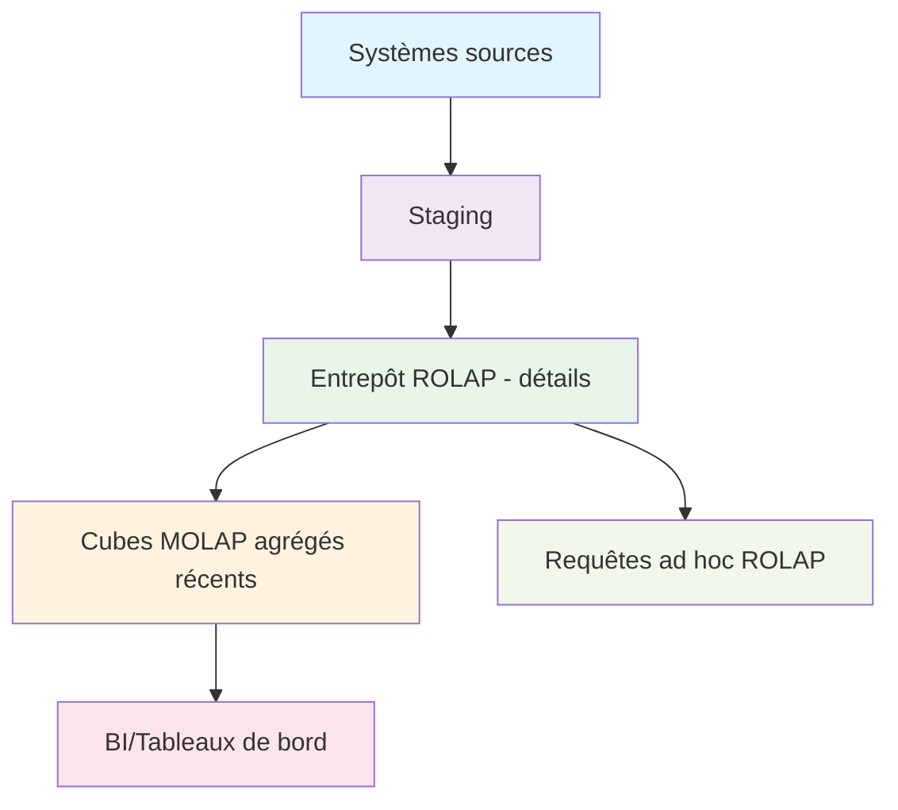
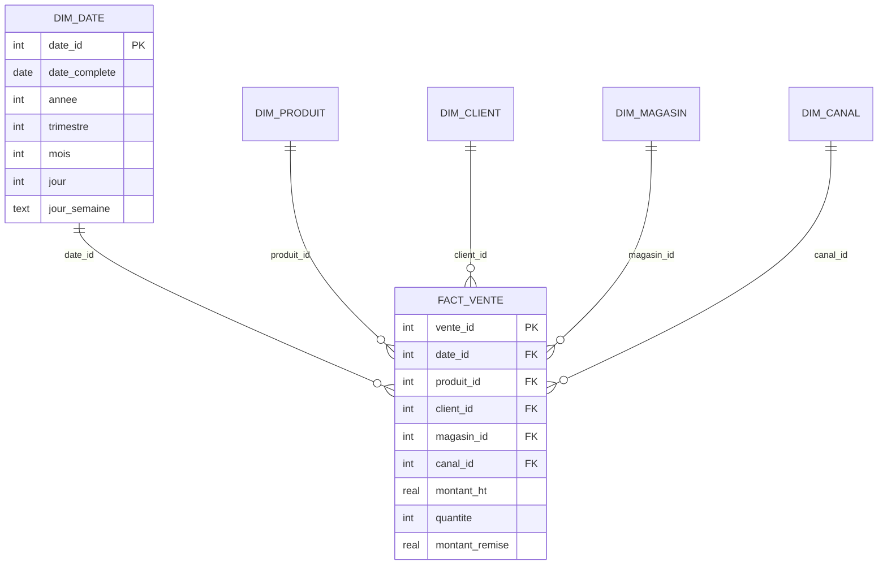

# Mini-projet — Correction Synthétique

## 🎯 Attendus Principaux

### Architecture HOLAP Recommandée
**HOLAP souvent pertinent** : détails volumineux en ROLAP, agrégés récents en MOLAP.

- **ROLAP** : Données détaillées (2-3 ans d'historique)
- **MOLAP** : Agrégats récents (60 jours) pour performance dashboard
- **HOLAP** : Combinaison optimale des deux approches

### Plan d'Actualisation
- **Daily** pour agrégés récents (60j) : Mise à jour des cubes MOLAP
- **Hebdomadaire/Mensuel** pour historique : Rechargement ROLAP complet

## 🔄 Schéma de Flux Attendu



## 📊 Barème de Correction

| Critère | Points | Évaluation |
|---|---|---|
| **Schéma** | 4 | Dimensions complètes, granularité correcte, PK/FK |
| **SQL** | 3 | DDL propre, jeu d'essai cohérent, contraintes |
| **Requêtes** | 3 | Exactitude, complexité OLAP, résultats exploitables |
| **Qualité** | 3 | 5 contrôles pertinents, scripts fonctionnels |
| **Architecture** | 2 | HOLAP justifié, plan réaliste, synthèse claire |
| **Total** | **15** | |

## 🏆 Exemples de Solutions Attendues

### Schéma en Étoile Minimal


### Requête OLAP Type
```sql
-- Roll-up : CA mensuel par catégorie et région
SELECT 
    p.categorie,
    m.region,
    SUM(f.montant_ht) as ca_mensuel,
    SUM(f.quantite) as nb_ventes
FROM FACT_VENTE f
JOIN DIM_DATE d ON f.date_id = d.date_id
JOIN DIM_PRODUIT p ON f.produit_id = p.produit_id
JOIN DIM_MAGASIN m ON f.magasin_id = m.magasin_id
WHERE d.mois = 12 AND d.annee = 2024
GROUP BY p.categorie, m.region
ORDER BY ca_mensuel DESC;
```

### Contrôle Qualité Type
```sql
-- Contrôle d'intégrité des clés étrangères
SELECT 'FK manquantes dans FACT_VENTE' as controle,
       COUNT(*) as erreurs
FROM FACT_VENTE f
LEFT JOIN DIM_DATE d ON f.date_id = d.date_id
WHERE d.date_id IS NULL

UNION ALL

SELECT 'Jours manquants dans DIM_DATE' as controle,
       COUNT(*) as erreurs
FROM (SELECT generate_series('2024-01-01'::date, '2024-12-31'::date, '1 day') as jour_complete) j
LEFT JOIN DIM_DATE d ON j.jour_complete = d.date_complete
WHERE d.date_complete IS NULL;
```

## 💡 Points Clés à Évaluer

### ✅ Ce qui doit être présent
- **5 dimensions** avec hiérarchies cohérentes
- **Grain ligne de vente** dans les faits
- **Clés étrangères** validées
- **Requêtes OLAP** avec roll-up/drill-down
- **Contrôles qualité** pertinents

### 🎯 Bonus à valoriser
- **SCD Type 2** bien implémentée
- **Bridge table** pour promotions
- **Index optimisés** pour OLAP
- **Vue matérialisée** pour agrégats fréquents

### ⚠️ Pièges à éviter
- **Granularité incorrecte** (vente vs commande)
- **Dimensions vides** ou incohérentes
- **Requêtes sans agrégation** (simple SELECT)
- **Contrôles qualité** génériques

---

**🚀 Cette correction synthétique guide l'évaluation tout en laissant flexibilité pour les approches créatives !**
