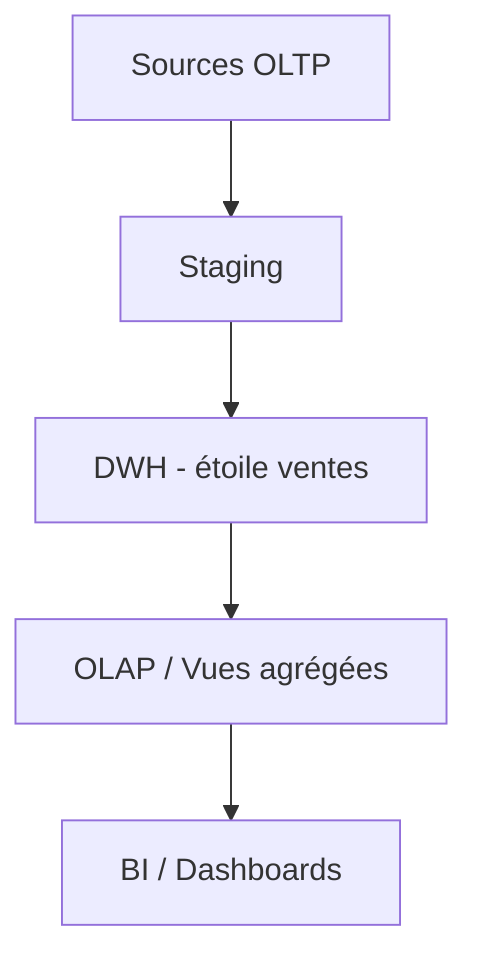

# TD0 — OLTP : comprendre les limites opérationnelles et la nécessité d’un DWH/OLAP (1h30)

## Objectifs

- Rappeler le modèle OLTP et son usage opérationnel.
- Mettre en évidence les limites d’OLTP pour l’analyse (performance, historique, agrégations).
- Motiver le passage vers un entrepôt de données (DWH) et OLAP.
- Produire un mini-diagnostic et un schéma cible simplifié.

## Prérequis rapides

- SQL de base : SELECT, INSERT, INDEX, agrégations simples.
- Notions de transactions ACID, clés primaires/étrangères.

## Jeu de données OLTP (extrait simplifié)

| id_commande | id_client | id_produit | quantite | prix_unitaire | date_commande | statut |
| --- | --- | --- | --- | --- | --- | --- |
| 101 | C01 | P10 | 2 | 45.00 | 2024-01-02 | livré |
| 102 | C02 | P11 | 1 | 120.00 | 2024-01-02 | livré |
| 103 | C01 | P12 | 1 | 60.00 | 2024-01-03 | en cours |
| 104 | C03 | P10 | 3 | 45.00 | 2024-01-04 | livré |

## Travail demandé

1. **Modèle OLTP** : dessiner le schéma relationnel actuel (tables commandes, clients, produits) avec PK/FK.
2. **Requêtes opérationnelles (OLTP)** : écrire 3 requêtes typiques (ex. statut d’une commande, stock par produit, total d’une commande).
3. **Requêtes analytiques problématiques** : écrire 3 besoins décisionnels difficiles en OLTP :
   - CA mensuel par produit et par région.
   - Top 5 produits sur 6 mois glissants.
   - Taux d’annulation par canal.
   Expliquer pourquoi ces requêtes dégradent l’OLTP (verrous, scans, index inadaptés, absence d’historisation).
4. **Diagnostic** : lister 4 limites de l’OLTP pour l’analytique (performance, schéma normalisé, absence d’historique, charge transactionnelle).
5. **Cible DWH/OLAP** : proposer en 5 bullets ce que change un DWH (schéma en étoile, historisation, agrégations, séparation des charges, gouvernance) et dessiner un schéma Mermaid simple : sources OLTP → staging → DWH (étoile ventes) → BI/OLAP.
6. **Plan minimal de passage** : étapes clés (extract, nettoyer, conformer dimensions, charger facts, publier vues/OLAP).

## Déroulé (1h30)

- 10 min : rappel OLTP, ACID, normalisation.
- 20 min : schéma OLTP + 3 requêtes opérationnelles.
- 25 min : formuler les requêtes analytiques et expliquer les freins en OLTP.
- 20 min : définir la cible DWH/OLAP et dessiner le flux Mermaid.
- 15 min : plan minimal de passage + restitution orale brève.

## Livrables

- Markdown : schéma OLTP, requêtes OLTP/analytiques, diagnostic des limites, schéma cible DWH/OLAP (Mermaid), plan de passage.
- (Optionnel) SQL : script des requêtes OLTP.

## Critères de réussite

- Problèmes OLTP clairement identifiés et reliés aux requêtes analytiques.
- Schéma cible DWH/OLAP cohérent (séparation charges, étoile simplifiée, historisation implicite).
- Plan de passage synthétique et réaliste.

## Exemple de schéma cible (Mermaid)

