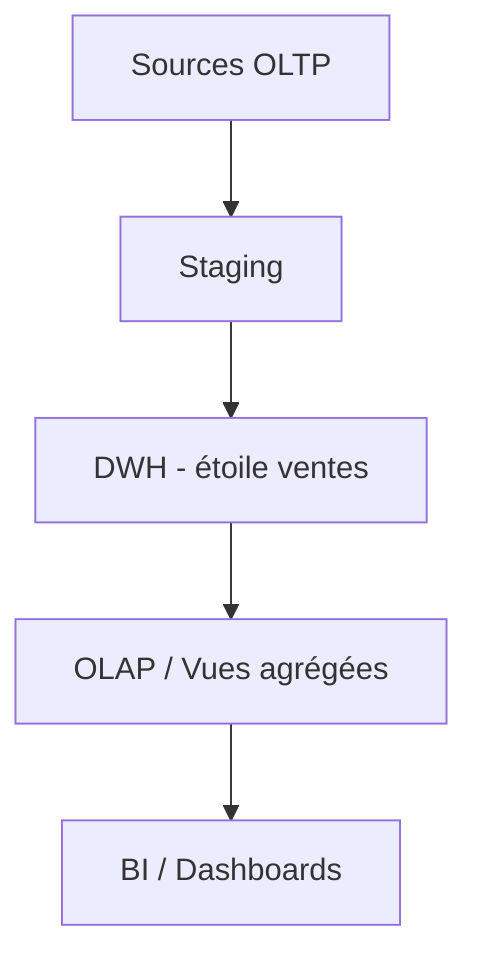

# TD0 — OLTP : comprendre les limites opérationnelles et la nécessité d’un DWH/OLAP (1h30)

## Objectifs

- Rappeler le modèle OLTP et son usage opérationnel.
- Mettre en évidence les limites d’OLTP pour l’analyse (performance, historique, agrégations).
- Motiver le passage vers un entrepôt de données (DWH) et OLAP.
- Produire un mini-diagnostic et un schéma cible simplifié.

## Prérequis rapides

- SQL de base : SELECT, INSERT, INDEX, agrégations simples.
- Notions de transactions ACID, clés primaires/étrangères.

## Jeu de données OLTP (extrait simplifié)

| id_commande | id_client | id_produit | quantite | prix_unitaire | date_commande | statut |
| --- | --- | --- | --- | --- | --- | --- |
| 101 | C01 | P10 | 2 | 45.00 | 2024-01-02 | livré |
| 102 | C02 | P11 | 1 | 120.00 | 2024-01-02 | livré |
| 103 | C01 | P12 | 1 | 60.00 | 2024-01-03 | en cours |
| 104 | C03 | P10 | 3 | 45.00 | 2024-01-04 | livré |

## Travail demandé

1. **Modèle OLTP** : dessiner le schéma relationnel actuel (tables commandes, clients, produits) avec PK/FK.
2. **Requêtes opérationnelles (OLTP)** : écrire 3 requêtes typiques (ex. statut d’une commande, stock par produit, total d’une commande).
3. **Requêtes analytiques problématiques** : écrire 3 besoins décisionnels difficiles en OLTP :
   - CA mensuel par produit et par région.
   - Top 5 produits sur 6 mois glissants.
   - Taux d’annulation par canal.
   Expliquer pourquoi ces requêtes dégradent l’OLTP (verrous, scans, index inadaptés, absence d’historisation).
4. **Diagnostic** : lister 4 limites de l’OLTP pour l’analytique (performance, schéma normalisé, absence d’historique, charge transactionnelle).
5. **Cible DWH/OLAP** : proposer en 5 bullets ce que change un DWH (schéma en étoile, historisation, agrégations, séparation des charges, gouvernance) et dessiner un schéma Mermaid simple : sources OLTP → staging → DWH (étoile ventes) → BI/OLAP.

## Exemples SQL OLTP (scénarios concrets)

- **Statut de commande** (opérationnel) :

  ```sql
  SELECT statut
  FROM commandes
  WHERE commande_id = 101;
  ```

- **Stock par produit** (jointure stock + produits) :

  ```sql
  SELECT p.produit_id, p.nom, s.quantite_dispo
  FROM stock s
  JOIN produits p ON p.produit_id = s.produit_id
  WHERE p.produit_id = 'P10';
  ```

- **Total d’une commande** (somme lignes) :

  ```sql
  SELECT c.commande_id,
         SUM(lc.quantite * lc.prix_unitaire) AS total_ht
  FROM commandes c
  JOIN lignes_commande lc ON lc.commande_id = c.commande_id
  WHERE c.commande_id = 101
  GROUP BY c.commande_id;
  ```

- **Requête analytique problématique (3 jointures + agrégat)** :

  ```sql
  SELECT strftime('%Y-%m', c.date_commande) AS mois,
         p.categorie,
         cl.ville,
         SUM(lc.quantite * lc.prix_unitaire) AS ca
  FROM commandes c
  JOIN lignes_commande lc ON lc.commande_id = c.commande_id
  JOIN produits p ON p.produit_id = lc.produit_id
  JOIN clients cl ON cl.client_id = c.client_id
  GROUP BY strftime('%Y-%m', c.date_commande), p.categorie, cl.ville
  ORDER BY mois, ca DESC;
  ```

  > À reproduire puis comparer avec la version matérialisée `fact_ventes` (voir notebook) pour mettre en évidence la différence OLTP vs pré-OLAP.

## Mini-cas à rejouer (aligné avec le notebook)

1. **Requête OLTP complexe** : écrire et commenter la requête CA mensuel par catégorie/ville sur les tables `commandes`, `lignes_commande`, `produits`, `clients` (3 jointures + agrégation).
2. **Matérialisation (pré-OLAP)** : dériver une table de faits `fact_ventes(mois, categorie, ville, montant)` et montrer la même requête avec un `GROUP BY` direct.
3. **Comparer** : lister en 3 bullets pourquoi la version matérialisée est plus adaptée à l’analytique (moins de jointures, index ciblés, séparation charge).
4. **Optionnel** : exécuter la démo SQLite du notebook et coller les résultats pour illustrer la différence.
5. **Plan minimal de passage** : étapes clés (extract, nettoyer, conformer dimensions, charger facts, publier vues/OLAP).

## Déroulé (1h30)

- 10 min : rappel OLTP, ACID, normalisation.
- 20 min : schéma OLTP + 3 requêtes opérationnelles.
- 25 min : formuler les requêtes analytiques et expliquer les freins en OLTP.
- 20 min : définir la cible DWH/OLAP et dessiner le flux Mermaid.
- 15 min : plan minimal de passage + restitution orale brève.

## Livrables

- Markdown : schéma OLTP, requêtes OLTP/analytiques, diagnostic des limites, schéma cible DWH/OLAP (Mermaid), plan de passage.
- (Optionnel) SQL : script des requêtes OLTP.

## Critères de réussite

- Problèmes OLTP clairement identifiés et reliés aux requêtes analytiques.
- Schéma cible DWH/OLAP cohérent (séparation charges, étoile simplifiée, historisation implicite).
- Plan de passage synthétique et réaliste.

## Questions de qualité (scénarios)

1. **Qualité des transactions** : citer 2 raisons pour lesquelles l’OLTP doit privilégier des opérations courtes et atomiques (ACID) et pourquoi les agrégations longues posent problème.
2. **Qualité du schéma** : comment la normalisation aide l’OLTP mais complique l’analytique ? Donner un exemple de jointures supplémentaires.
3. **Qualité des requêtes** : sur la requête CA mensuel, indiquer quelles colonnes pourraient être indexées et pourquoi cela reste insuffisant si l’on garde l’OLTP pour l’analyse.
4. **Qualité des données/historique** : que manque-t-il souvent en OLTP pour faire des analyses temporelles fiables (SCD, historique de prix, statut) ?
5. **Séparation OLTP/OLAP** : donner 3 bénéfices concrets de séparer les workloads (perf, gouvernance, disponibilité) et 1 risque (décalage de fraîcheur).

## Exemple de schéma cible (Mermaid)


