# TD0 — OLTP : comprendre les limites opérationnelles et la nécessité d’un DWH/OLAP (1h30)

## Objectifs

- Rappeler le modèle OLTP et son usage opérationnel.
- Mettre en évidence les limites d’OLTP pour l’analyse (performance, historique, agrégations).
- Motiver le passage vers un entrepôt de données (DWH) et OLAP.
- Produire un mini-diagnostic et un schéma cible simplifié.

## Prérequis rapides

- SQL de base : SELECT, INSERT, INDEX, agrégations simples.
- Notions de transactions ACID, clés primaires/étrangères.

## Jeu de données OLTP (extrait simplifié)

| client_id | nom | ville | segment |
| --- | --- | --- | --- |
| 1 | Alice Dupont | Paris | VIP |
| 2 | Bob Martin | Lyon | Standard |
| 3 | Charlie Durand | Paris | Standard |

| produit_id | nom | categorie | prix_standard |
| --- | --- | --- | --- |
| 10 | Laptop Pro | Électronique | 1200.0 |
| 11 | Smartphone X | Électronique | 800.0 |
| 12 | Chaise Bureau | Mobilier | 150.0 |

| commande_id | client_id | date_commande | statut |
| --- | --- | --- | --- |
| 1001 | 1 | 2024-01-15 | LIVRE |
| 1002 | 2 | 2024-01-16 | LIVRE |
| 1003 | 1 | 2024-02-01 | EN_COURS |

| commande_id | produit_id | quantite | prix_reel |
| --- | --- | --- | --- |
| 1001 | 10 | 1 | 1200.0 |
| 1001 | 12 | 2 | 140.0 |
| 1002 | 11 | 1 | 800.0 |
| 1003 | 12 | 1 | 150.0 |

## Travail demandé

1. **Modèle OLTP** : dessiner le schéma relationnel actuel (tables commandes, clients, produits) avec PK/FK.
2. **Requêtes opérationnelles (OLTP)** : écrire 3 requêtes typiques (ex. statut d’une commande, stock par produit, total d’une commande).
3. **Requêtes analytiques problématiques** : écrire 3 besoins décisionnels difficiles en OLTP :
   - CA mensuel par produit et par région.
   - Top 5 produits sur 6 mois glissants.
   - Taux d’annulation par canal.
   Expliquer pourquoi ces requêtes dégradent l’OLTP (verrous, scans, index inadaptés, absence d’historisation).
4. **Diagnostic** : lister 4 limites de l’OLTP pour l’analytique (performance, schéma normalisé, absence d’historique, charge transactionnelle).
5. **Cible DWH/OLAP** : proposer en 5 bullets ce que change un DWH (schéma en étoile, historisation, agrégations, séparation des charges, gouvernance) et dessiner un schéma Mermaid simple : sources OLTP → staging → DWH (étoile ventes) → BI/OLAP.

## Exemples SQL OLTP (scénarios concrets)

- **Statut de commande** (opérationnel) :

  ```sql
  SELECT statut
  FROM commandes
  WHERE commande_id = 1001;
  ```

- **Détail client** :

  ```sql
  SELECT nom, ville, segment
  FROM clients
  WHERE client_id = 1;
  ```

- **Total d'une commande** (somme lignes) :

  ```sql
  SELECT c.commande_id,
         SUM(lc.quantite * lc.prix_reel) AS total_ht
  FROM commandes c
  JOIN lignes_commande lc ON lc.commande_id = c.commande_id
  WHERE c.commande_id = 1001
  GROUP BY c.commande_id;
  ```

- **Requête analytique problématique (3 jointures + agrégat)** :

  ```sql
  SELECT strftime('%Y-%m', c.date_commande) AS mois,
         p.categorie,
         cl.ville,
         SUM(lc.quantite * lc.prix_reel) AS ca
  FROM commandes c
  JOIN lignes_commande lc ON lc.commande_id = c.commande_id
  JOIN produits p ON lc.produit_id = p.produit_id
  JOIN clients cl ON c.client_id = cl.client_id
  GROUP BY strftime('%Y-%m', c.date_commande), p.categorie, cl.ville
  ORDER BY mois, ca DESC;
  ```

  > À reproduire puis comparer avec la version optimisée `resume_ventes_mensuelles` (voir notebook) pour mettre en évidence la différence entre requête directe et table pré-calculée.

## Mini-cas à rejouer (aligné avec le notebook)

### 🎯 Objectif de l'exercice

Vous êtes développeur/analyste chez un e-commerçant. Le service commercial se plaint que le dashboard met plus de 30 secondes à charger. Votre mission : analyser le problème et proposer une solution en utilisant vos connaissances SQL actuelles.

---

### 📋 Exercice 1 : Diagnostic des performances

**Contexte** : Le dashboard "CA mensuel par catégorie et ville" est très lent.

**Votre mission** :
1. **Analyser** la requête problématique ci-dessous
2. **Identifier** pourquoi elle est lente
3. **Expliquer** l'impact sur le système

**Requête à analyser** :
```sql
-- Requête actuelle (problématique)
SELECT 
    strftime('%Y-%m', c.date_commande) AS mois,
    p.categorie,
    cl.ville,
    SUM(lc.quantite * lc.prix_reel) AS ca_mensuel,
    COUNT(DISTINCT c.commande_id) AS nb_commandes
FROM commandes c
JOIN lignes_commande lc ON lc.commande_id = c.commande_id
JOIN produits p ON lc.produit_id = p.produit_id
JOIN clients cl ON c.client_id = cl.client_id
WHERE c.statut = 'LIVRE'
GROUP BY strftime('%Y-%m', c.date_commande), p.categorie, cl.ville
ORDER BY mois, ca_mensuel DESC;
```

**Questions guides** :
- Combien de tables sont jointes ? Est-ce normal ?
- Pourquoi l'agrégation `SUM()` est-elle coûteuse ?
- Que se passe-t-il quand plusieurs utilisateurs lancent cette requête ?
- Pourquoi les index actuels sont-ils insuffisants ?

---

### 📋 Exercice 2 : Optimisation par pré-calcul

**Contexte** : Vous voulez créer une table résumée pour accélérer le dashboard.

**Votre mission** :
1. **Créer** une table qui stocke les résultats pré-calculés
2. **Écrire** le script pour la remplir
3. **Écrire** la requête simplifiée qui utilise cette table

**Table résumée à concevoir** :
```sql
-- Table à créer pour stocker les agrégats mensuels
CREATE TABLE resume_ventes_mensuelles (
    mois TEXT,           -- '2024-01'
    categorie TEXT,      -- 'Électronique', 'Mobilier'...
    ville TEXT,          -- 'Paris', 'Lyon'...
    ca_mensuel REAL,     -- Chiffre d'affaires mensuel
    nb_commandes INTEGER -- Nombre de commandes
);
```

**Étapes à réaliser** :
- **Étape 2.1** : Compléter le CREATE TABLE avec PRIMARY KEY appropriée
- **Étape 2.2** : Écrire l'INSERT INTO...SELECT qui calcule et stocke les agrégats
- **Étape 2.3** : Écrire la nouvelle requête du dashboard (simple, sans jointure)
- **Étape 2.4** : Expliquer pourquoi cette approche est plus rapide

---

### 📋 Exercice 3 : Comparaison des approches

**Contexte** : Vous devez justifier votre solution technique.

**Votre mission** : Expliquer en 3 points pourquoi la table résumée est meilleure :

1. **Performance des requêtes** : Pourquoi la nouvelle requête est plus rapide ?
2. **Impact sur le système** : Comment cela protège les opérations quotidiennes ?
3. **Maintenance** : Quels sont les avantages pour l'équipe technique ?

**Format attendu** : 3 paragraphs explicatifs avec exemples concrets.

---

### 📋 Exercice 4 : Validation pratique (optionnel)

**Contexte** : Prouver que votre solution fonctionne.

**Votre mission** :
1. **Exécuter** les deux requêtes dans le notebook
2. **Comparer** les temps d'exécution
3. **Documenter** les résultats observés

**Résultats à noter** :
- Temps d'exécution de chaque requête
- Complexité (nombre de lignes SQL)
- Facilité de compréhension du code

---

### 📋 Exercice 5 : Plan de mise à jour

**Contexte** : Comment maintenir la table résumée à jour ?

**Votre mission** : Proposer un plan pratique en 3 étapes :

1. **Initialisation** : Comment créer et peupler la table la première fois ?
2. **Mise à jour** : Comment ajouter les nouvelles données chaque jour ?
3. **Automatisation** : Comment rendre ce processus automatique ?

**Livrable attendu** : Plan d'action avec fréquence et responsabilité.

---

### 🎯 Critères de réussite

- **Analyse** : Vous identifiez correctement les problèmes de performance
- **Solution** : Vous proposez une table résumée cohérente
- **Justification** : Vous expliquez les bénéfices techniques
- **Pratique** : Vous validez avec le notebook
- **Vision** : Vous proposez un plan de maintenance réaliste

## Déroulé (1h30)

- 10 min : rappel OLTP, ACID, normalisation.
- 20 min : schéma OLTP + 3 requêtes opérationnelles.
- 25 min : formuler les requêtes analytiques et expliquer les freins en OLTP.
- 20 min : définir la cible DWH/OLAP et dessiner le flux Mermaid.
- 15 min : plan minimal de passage + restitution orale brève.

## Livrables

- Markdown : schéma OLTP, requêtes OLTP/analytiques, diagnostic des limites, schéma cible DWH/OLAP (Mermaid), plan de passage.
- (Optionnel) SQL : script des requêtes OLTP.

## Critères de réussite

- Problèmes OLTP clairement identifiés et reliés aux requêtes analytiques.
- Schéma cible DWH/OLAP cohérent (séparation charges, étoile simplifiée, historisation implicite).
- Plan de passage synthétique et réaliste.

## Questions de qualité (scénarios)

1. **Qualité des transactions** : citer 2 raisons pour lesquelles l’OLTP doit privilégier des opérations courtes et atomiques (ACID) et pourquoi les agrégations longues posent problème.
2. **Qualité du schéma** : comment la normalisation aide l’OLTP mais complique l’analytique ? Donner un exemple de jointures supplémentaires.
3. **Qualité des requêtes** : sur la requête CA mensuel, indiquer quelles colonnes pourraient être indexées et pourquoi cela reste insuffisant si l’on garde l’OLTP pour l’analyse.
4. **Qualité des données/historique** : que manque-t-il souvent en OLTP pour faire des analyses temporelles fiables (SCD, historique de prix, statut) ?
5. **Séparation OLTP/OLAP** : donner 3 bénéfices concrets de séparer les workloads (perf, gouvernance, disponibilité) et 1 risque (décalage de fraîcheur).

## Exemple de schéma cible (Mermaid)

```mermaid
graph TD
  A[Sources OLTP] --> B[Staging]
  B --> C[DWH - étoile ventes]
  C --> D[OLAP / Vues agrégées]
  D --> E[BI / Dashboards]
```


