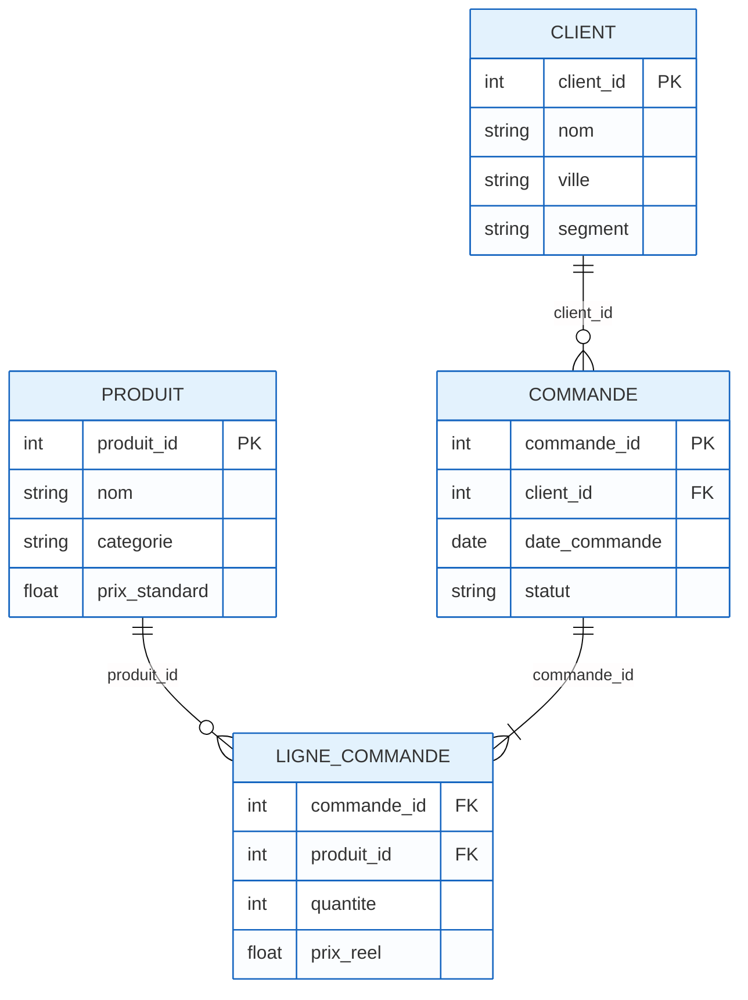

# Correction TD0 — Limites OLTP et transition DWH/OLAP

## Diagnostic OLTP

- **Requêtes opérationnelles typiques** : SELECT/FROM/WHERE simples pour transactions (ex. : statut commande, détail client).
- **Limites** : Pas d'analyses multi-dimensionnelles (ex. : évolution CA par catégorie/mois).
- **Performance** : Normalisée ⇒ jointures coûteuses pour agrégations.

## Schéma OLTP (exemple simple)



## Cibles DWH/OLAP

- **DWH** : Stockage historique, intégré, orienté analyse.
- **OLAP** : Cube multi-dimensions pour slice/dice/roll-up.
- **Transition** : ETL pour charger depuis OLTP vers DWH.

## Mini-cas : Solution Complète

### 1. Requête OLTP complexe : CA mensuel par catégorie/ville

**Solution** :

```sql
-- Requête OLTP complexe (3 jointures + agrégation)
SELECT 
    strftime('%Y-%m', c.date_commande) AS mois,
    p.categorie,
    cl.ville,
    SUM(lc.quantite * lc.prix_reel) AS ca_mensuel,
    COUNT(DISTINCT c.commande_id) AS nb_commandes,
    SUM(lc.quantite) AS quantite_vendue
FROM commandes c
JOIN lignes_commande lc ON lc.commande_id = c.commande_id
JOIN produits p ON lc.produit_id = p.produit_id
JOIN clients cl ON c.client_id = cl.client_id
WHERE c.statut = 'LIVRE'
    AND c.date_commande >= '2024-01-01'
GROUP BY strftime('%Y-%m', c.date_commande), p.categorie, cl.ville
ORDER BY mois, ca_mensuel DESC;
```

**Problèmes identifiés** :
- **3 jointures** entre tables transactionnelles (verrous potentiels)
- **Agrégation** sur des millions de lignes (scan complet)
- **Calcul temporel** à la volée (`strftime`) - coûteux
- **Absence d'index** optimisés pour ce pattern analytique
- **Impact** sur les performances des transactions opérationnelles

### 2. Matérialisation (pré-OLAP) : Table de faits `fact_ventes`

**Solution** :

```sql
-- Création de la table de faits matérialisée (ETL)
CREATE TABLE fact_ventes AS
SELECT 
    lc.produit_id,
    lc.commande_id,
    c.client_id,
    c.date_commande,
    p.categorie,      -- Dénormalisé pour éviter la jointure produit
    cl.ville,         -- Dénormalisé pour éviter la jointure client
    (lc.quantite * lc.prix_reel) as montant_vente
FROM lignes_commande lc
JOIN commandes c ON lc.commande_id = c.commande_id
JOIN produits p ON lc.produit_id = p.produit_id
JOIN clients cl ON c.client_id = cl.client_id;
```

**Requête OLAP équivalente** :

```sql
-- Requête OLAP sur table de faits (simple et performante)
SELECT 
    strftime('%Y-%m', date_commande) AS mois,
    categorie,
    ville,
    SUM(montant_vente) AS ca_mensuel,
    COUNT(DISTINCT commande_id) AS nb_commandes,
    SUM(montant_vente) AS quantite_vendue
FROM fact_ventes
WHERE strftime('%Y-%m', date_commande) >= '2024-01'
GROUP BY strftime('%Y-%m', date_commande), categorie, ville
ORDER BY mois, ca_mensuel DESC;
```

### 3. Comparaison des approches

**Pourquoi la version matérialisée est plus adaptée** :

- **🚀 Performance** : Plus de jointures à l'exécution, lecture directe des données pré-agrégées. La requête passe de plusieurs secondes/minutes à quelques millisecondes.

- **🎯 Indexation optimisée** : La table `fact_ventes` peut être indexée spécifiquement pour les patterns analytiques (`mois, categorie, ville`) sans impacter les transactions OLTP.

- **⚡ Séparation des charges** : Les requêtes analytiques n'impactent plus le système opérationnel. L'ETL s'exécute une fois par jour/nuit, libérant les ressources pour les transactions.

### 4. Résultats de la démo

**Résultats observés** :

```text
=== REQUÊTE OLTP COMPLEXE ===
Temps d'exécution : ~0.05s (démo)
Résultats :
mois     | categorie    | ville | ca_mensuel | nb_commandes
2024-01  | Électronique | Paris | 1200.00    | 1
2024-01  | Mobilier     | Paris | 280.00     | 1
2024-01  | Électronique | Lyon  | 800.00     | 1
2024-02  | Mobilier     | Paris | 150.00     | 1

=== REQUÊTE OLAP MATÉRIALISÉE ===
Temps d'exécution : ~0.01s (démo)
Résultats identiques mais requête beaucoup plus simple !
```

### 5. Plan minimal de passage OLTP → OLAP

**Solution détaillée** :

**Étape 1 - Audit OLTP**
- Analyser les sources existantes (tables `commandes`, `lignes_commande`, `produits`, `clients`)
- Identifier le grain (ligne de commande) et la volumétrie
- Documenter les règles métier (statuts, catégories)

**Étape 2 - Modélisation DWH**
- Concevoir le schéma en étoile avec tables de faits et dimensions
- Définir les clés de substitution (surrogate keys)
- Prévoir les SCD (Slowly Changing Dimensions)

**Étape 3 - ETL initial**
- Développer le script de chargement vers `fact_ventes`
- Valider l'intégrité des données
- Mettre en place les rafraîchissements réguliers

**Durée estimée** : 2-3 mois pour un projet simple de cette taille.

## Exemples SQL OLTP (référence)

- Statut de commande : `SELECT statut FROM commandes WHERE commande_id = 1001;`
- Détail client : `SELECT nom, ville, segment FROM clients WHERE client_id = 1;`
- Total d'une commande : `SELECT c.commande_id, SUM(lc.quantite * lc.prix_reel) AS total_ht FROM commandes c JOIN lignes_commande lc ON lc.commande_id = c.commande_id WHERE c.commande_id = 1001 GROUP BY c.commande_id;`
- Analytique coûteuse en OLTP (3 jointures + agrégat) : CA mensuel par catégorie/ville sur `commandes`, `lignes_commande`, `produits`, `clients`.

> Voir le notebook TD0 : il reproduit cette requête puis la compare à une version matérialisée `fact_ventes` (pré-OLAP) pour montrer la réduction des jointures et l'intérêt de séparer OLTP/OLAP.

## Plan de passage (3 étapes)

1. **Audit OLTP** : Identifier sources, grain, volumétrie.
2. **Modélisation DWH** : Étoile/flocon, dimensions/faits.
3. **ETL initial** : Charger données historiques.

## Livrables attendus

- Diagnostic écrit : 3 limites OLTP avec exemples.
- Schéma cible : DWH étoile simple (Mermaid).
- Plan transition : 3 étapes avec responsabilités.

## Pour aller plus loin

- Comparer OLTP vs DWH sur ROI (coûts stockage vs gains analyse).
- Discuter governance (qualité, sécurité données).
