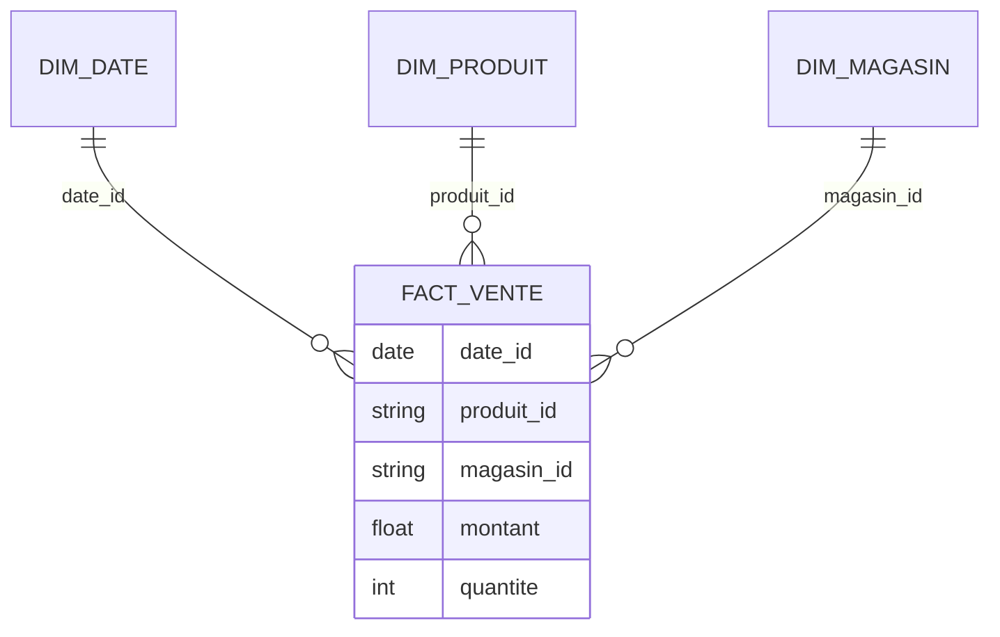

# TD1 — Modèle en étoile (niveau débutant)

## Objectifs

- Construire un schéma en étoile simple à partir d’un mini-jeu de données retail.
- Identifier faits, dimensions, clés et granularité.

## Jeu de données (extrait)

| date_vente | produit_id | magasin_id | montant | quantite |
| --- | --- | --- | --- | --- |
| 2024-01-02 | P01 | M01 | 120.0 | 2 |
| 2024-01-02 | P02 | M01 | 75.0 | 1 |
| 2024-01-03 | P01 | M02 | 60.0 | 1 |

## Travail demandé

1. Proposer les tables de dimensions (au minimum : date, produit, magasin) et la table de faits `fact_ventes`.
2. Indiquer la granularité de `fact_ventes`.
3. Dessiner le schéma en étoile (Mermaid ER).
4. Lister 3 erreurs fréquentes à éviter sur ce modèle.

## Attendus (correction synthétique)

- Dimensions avec clé surrogate et attributs métier ; fact avec clés étrangères + mesures `montant`, `quantite`.
- Granularité : ligne de transaction (par produit, par magasin, par date).
- Schéma en étoile (exemple) :

- Erreurs fréquentes : granularité incohérente, mesures non additives, dimensions dupliquées non conformes.

## Pour aller plus loin

- Ajouter une dimension « canal » (web/magasin) et discuter l’impact sur la granularité.
- Ajouter une hiérarchie produit (catégorie → sous-catégorie → produit) et décider étoile vs flocon.
