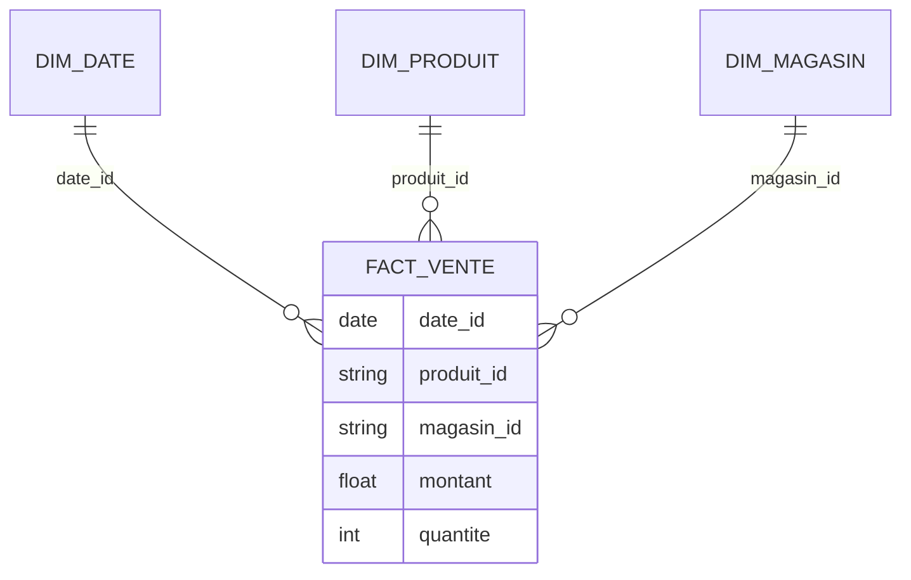

# TD1 — Modèle en étoile (niveau débutant, 1h30)

## Objectifs

- Construire un schéma en étoile simple à partir d’un mini-jeu de données retail.
- Identifier faits, dimensions, clés et granularité.
- Rédiger le DDL des dimensions et de la table de faits, puis charger un échantillon.
- Vérifier la cohérence du modèle via des requêtes de contrôle.

## Prérequis rapides

- Rappels : table de faits vs dimensions, grain, clés substitutives.
- SQL : `CREATE TABLE`, clés primaires/étrangères, `INSERT`, agrégations simples.

## Jeu de données (extrait)

| date_vente | produit_id | produit_nom | categorie | magasin_id | ville | montant | quantite |
| --- | --- | --- | --- | --- | --- | --- | --- |
| 2024-01-02 | P01 | Chemise Oxford | Textile | M01 | Paris | 120.0 | 2 |
| 2024-01-02 | P02 | Sneakers Run | Chaussure | M01 | Paris | 75.0 | 1 |
| 2024-01-03 | P01 | Chemise Oxford | Textile | M02 | Lyon | 60.0 | 1 |
| 2024-01-04 | P03 | Jeans Slim | Textile | M01 | Paris | 90.0 | 1 |

## Travail demandé

1. Proposer les tables de dimensions (min : date, produit, magasin) et la table de faits `fact_ventes`.
2. Indiquer la granularité de `fact_ventes` (transaction par produit, magasin, date).
3. Écrire le DDL complet (clés substitutives `INT AUTO_INCREMENT`, PK/FK).
4. Insérer 5 à 10 lignes d’exemple (dont celles du tableau ci-dessus).
5. Dessiner le schéma en étoile (Mermaid ER).
6. Rédiger 3 requêtes de validation :
   - volume lignes dans `fact_ventes` ;
   - top 3 produits par CA ;
   - CA par ville et par mois.
7. Lister 3 erreurs fréquentes à éviter sur ce modèle.

### Déroulé (1h30)

- 10 min : rappel grain, faits/dimensions, clés substitutives.
- 20 min : définir dimensions/fait + grain ; écrire le DDL (PK/FK, types).
- 15 min : insérer l’échantillon (5-10 lignes) et vérifier les FK.
- 20 min : dessiner le schéma Mermaid et vérifier cohérence (1 FK = 1 dimension).
- 20 min : requêtes de validation (volume, top 3 produits, CA ville/mois).
- 5 min : lister erreurs fréquentes + amélioration (canal, hiérarchie produit).

### Critères de réussite

- DDL complet, clés substitutives et intégrité référentielle fonctionnelle.
- Grain clairement formulé et cohérent avec les données insérées.
- Schéma étoile lisible (Mermaid) aligné avec le DDL.
- Requêtes de validation exécutables et résultats cohérents.

## Attendus (correction synthétique)

- Dimensions avec clé surrogate et attributs métier ; fact avec clés étrangères + mesures `montant`, `quantite`.
- Granularité : ligne de transaction (par produit, par magasin, par date).
- Schéma en étoile (exemple) :

- Erreurs fréquentes : granularité incohérente, mesures non additives, dimensions dupliquées non conformes.

## Livrables

- Fichier Markdown : schéma Mermaid + explications.
- Fichier SQL : DDL + inserts + 3 requêtes de validation commentées.
- Justification du grain et des choix d’attributs.

## Pour aller plus loin

- Ajouter une dimension « canal » (web/magasin) et discuter l’impact sur la granularité.
- Ajouter une hiérarchie produit (catégorie → sous-catégorie → produit) et décider étoile vs flocon.
