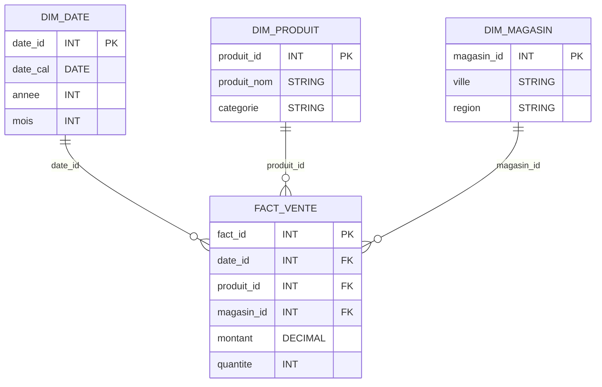

#  Modélisation Modélisation multidémentionnelle et Entrepôt de Données
## TD1 — Modèle en étoile (Semaine 2)

## Objectifs

- Concevoir un schéma en étoile réaliste avec plusieurs niveaux de complexité.
- Maîtriser les concepts avancés : SCD Type 2, attributs dégénérés, mesures semi-additives.
- Implémenter un DDL complet avec contraintes et validation qualité.
- Réaliser des analyses multi-dimensions avec des jointures complexes.

## Prérequis

- Concepts de base : faits/dimensions, grain, clés substitutives.
- SQL avancé : contraintes CHECK, jointures multiples, agrégations complexes.
- Notions de performance : indexation, partitionnement.

## Contexte métier

Vous travaillez pour une enseigne retail multi-canaux (magasins physiques, e-commerce, mobile) avec :
- Ventes de produits avec promotions et remises
- Suivi des stocks et des retours clients  
- Segmentation client RFM
- Analyse géographique multi-niveaux

## Travail demandé

1. **Concevoir** un schéma en étoile complet avec 6 dimensions minimum :
   - Date (avec attributs calendaires et fiscaux)
   - Produit (avec SCD Type 2 pour historisation)
   - Magasin (géolocalisation, caractéristiques)
   - Client (segmentation RFM, démographie)
   - Promotion (types de remises, règles)
   - Canal (physique/en ligne/mobile)

2. **Implémenter** le DDL complet avec :
   - Clés de substitution (surrogate keys)
   - Contraintes CHECK pour validation qualité
   - Clés étrangères et intégrité référentielle
   - Types de données appropriés

3. **Gérer les concepts avancés** :
   - Attributs dégénérés (ticket_id, transaction_time)
   - Mesures additives (quantité, montant) et semi-additives (stock_eod)
   - SCD Type 2 pour les changements de prix/catégorie

4. **Charger** un jeu de données réalistes (10-15 transactions) avec :
   - Calculs automatiques des montants (HT, TVA, remises)
   - Validation des contraintes métier
   - Gestion des relations plusieurs-à-plusieurs (promotions)

5. **Valider** le modèle avec 5 requêtes d'analyse avancées :
   - Volumétrie et contrôles qualité
   - CA par segment client avec panier moyen
   - Performance par canal avec taux de remise
   - Analyse temporelle (jours fériés vs weekend)
   - Impact des promotions et contrôle des stocks

6. **Optimiser** la performance :
   - Index stratégique sur clés étrangères
   - Index composites pour requêtes fréquentes
   - Partitionnement mensuel suggéré

7. **Documenter** les bonnes pratiques et pièges à éviter.

### Déroulé (1h30)

- 10 min : rappel grain, faits/dimensions, clés substitutives.
- 20 min : définir dimensions/fait + grain ; écrire le DDL (PK/FK, types).
- 15 min : insérer l’échantillon (10-15 lignes) et vérifier les FK.
- 20 min : dessiner le schéma Mermaid et vérifier cohérence (1 FK = 1 dimension).
- 20 min : requêtes de validation (volume, top 3 produits, CA ville/mois).
- 5 min : lister erreurs fréquentes + amélioration (canal, hiérarchie produit).

### Critères de réussite

- DDL complet, clés substitutives et intégrité référentielle fonctionnelle.
- Grain clairement formulé et cohérent avec les données insérées.
- Schéma étoile lisible (Mermaid) aligné avec le DDL.
- Requêtes de validation exécutables et résultats cohérents.

## Questions de qualité (scénarios)

1. **Qualité du grain** : si une ligne de `fact_ventes` correspond tantôt à un ticket complet et tantôt à une ligne produit, quel impact sur `SUM(montant)` ?
2. **Qualité des clés** : pourquoi utiliser des clés substitutives (SK) dans les dimensions ? Citer un cas où la clé naturelle change.
3. **Qualité des mesures** : donner un exemple de mesure non additive qui ne doit pas être stockée telle quelle dans `fact_ventes`.
4. **Qualité référentielle** : proposer une requête de contrôle pour détecter des lignes de faits sans dimension correspondante.
5. **Qualité performance** : citer 2 index utiles et expliquer sur quelles requêtes de validation ils ont un impact.

## Attendus (correction synthétique)

- Dimensions avec clé surrogate et attributs métier ; fact avec clés étrangères + mesures `montant`, `quantite`.
- Granularité : ligne de transaction (par produit, par magasin, par date).
- Schéma en étoile (exemple) :

- Erreurs fréquentes : granularité incohérente, mesures non additives, dimensions dupliquées non conformes.

## Livrables

- Fichier Markdown : schéma Mermaid + explications.
- Fichier SQL : DDL + inserts + 3 requêtes de validation commentées.
- Justification du grain et des choix d’attributs.

## Pour aller plus loin

- Ajouter une dimension « canal » (web/magasin) et discuter l’impact sur la granularité.
- Ajouter une hiérarchie produit (catégorie → sous-catégorie → produit) et décider étoile vs flocon.
