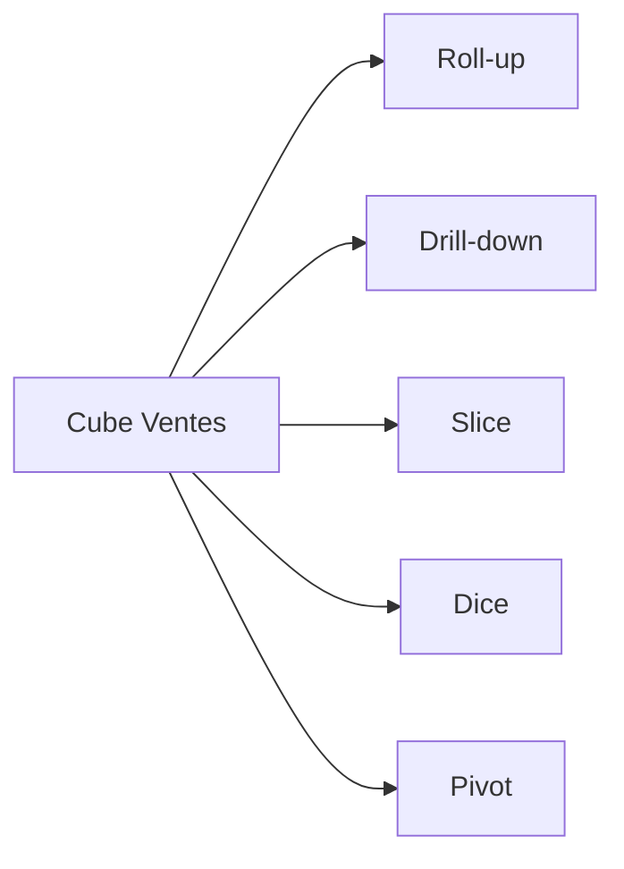

# TD2 — OLAP : opérations (niveau intermédiaire)

## Objectifs

- Manipuler les opérations OLAP : roll-up, drill-down, slice, dice, pivot.
- Vérifier la cohérence des agrégations sur un cube simple.

## Cube de départ (conceptuel)

Dimensions : Date (jour → mois → année), Produit (prod → catégorie), Magasin.
Mesures : `montant`, `quantite`.

## Travail demandé

1. Écrire une requête (SQL ROLAP) pour :
   - CA mensuel par produit et par magasin (roll-up jour → mois).
2. Décrire :
   - Un slice sur Magasin = M01.
   - Un dice sur Catégorie ∈ {C1, C2} et Mois ∈ {01,02}.
3. Expliquer la différence entre roll-up et drill-down sur la dimension Date.
4. Pivot : proposer une vue croisée Produits en lignes, Magasins en colonnes, CA en valeur.

## Attendus (correction synthétique)

- Requête type :

```sql
SELECT
  DATEFROMPARTS(YEAR(date_vente), MONTH(date_vente), 1) AS mois,
  produit_id,
  magasin_id,
  SUM(montant) AS ca_mensuel
FROM fact_ventes
GROUP BY DATEFROMPARTS(YEAR(date_vente), MONTH(date_vente), 1), produit_id, magasin_id;
```

- Slice : filtrage 1 dimension ⇒ sous-cube 2D ; Dice : sous-cube multi-filtres.
- Roll-up = agrégation vers le haut (jour→mois→année) ; Drill-down = inverse.
- Pivot : tableau croisé produit x magasin avec CA, via PIVOT ou agrégation + pivot côté outil BI.

## Diagramme des opérations



## Pour aller plus loin

- Calculer top 5 produits par mois et par magasin (SQL window ou TOP-N par partition).
- Discuter l’impact des agrégations pré-calculées (MOLAP) vs calculs à la volée (ROLAP).
