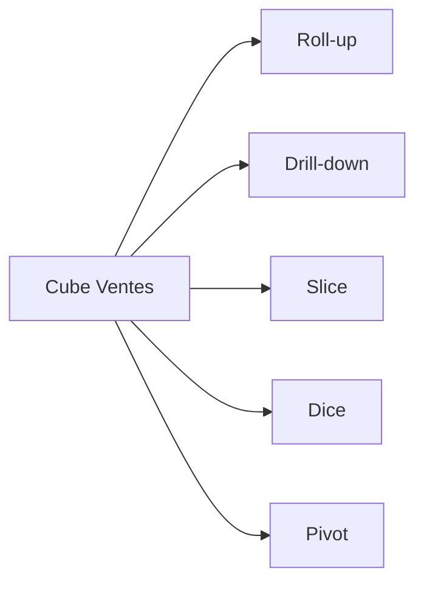

# TD2 — OLAP : opérations (niveau intermédiaire)

## Objectifs

- Manipuler les opérations OLAP : roll-up, drill-down, slice, dice, pivot.
- Vérifier la cohérence des agrégations sur un cube simple.
- Pratiquer les fonctions fenêtrées et GROUP BY ROLLUP.

## Prérequis rapides

- SQL : `GROUP BY`, `ROLLUP`, fonctions fenêtre (`LAG`, `RANK`, `PERCENT_RANK`).
- Compréhension : hiérarchies Date et Produit, mesure additive `montant`.

## Cube de départ (conceptuel)

Dimensions : Date (jour → mois → année), Produit (prod → catégorie), Magasin.  
Mesures : `montant`, `quantite`.

Dataset fourni (échantillon) : `fact_ventes`, `dim_date`, `dim_produit`, `dim_magasin` (via DDL/CSV dans le dossier du TD).

## Travail demandé

1. Requêtes SQL (à exécuter sur le dataset fourni) :
   - CA mensuel par produit et magasin (ROLLUP jour→mois), classé par CA décroissant.
   - Top 5 produits par région et par mois (`DENSE_RANK` ou `ROW_NUMBER`).
   - Variation MoM et YoY du CA par catégorie (`LAG` sur mois/année).
   - Pivot Produits en lignes, Magasins en colonnes, CA en valeur (PIVOT ou agrégation + CASE).
2. Opérations conceptuelles :
   - Slice sur Magasin = M01 ; Dice sur Catégorie ∈ {C1, C2} et Mois ∈ {01,02}.
   - Expliquer roll-up vs drill-down sur la dimension Date.
3. Contrôles de cohérence :
   - Vérifier que CA total (niveau année) = somme des CA mensuels.
   - Vérifier que CA magasin = somme des CA produits (même niveau).

## Attendus (correction synthétique)

- Requêtes incluant ROLLUP/CTE + fonctions fenêtre (`LAG`, `DENSE_RANK`).
- Slice/dice correctement définis ; pivot produit x magasin.
- Contrôles d’égalité des totaux par niveau.

## Diagramme des opérations

## Pour aller plus loin

- Calculer top 5 produits par mois et par magasin (SQL window ou TOP-N par partition).  
- Discuter l’impact des agrégations pré-calculées (MOLAP) vs calculs à la volée (ROLAP).
