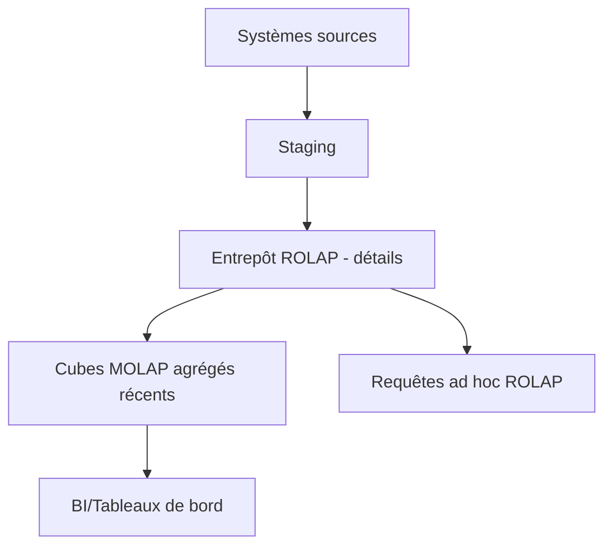

# TD3 — Choix d’architecture (ROLAP / MOLAP / HOLAP) — niveau avancé (1h30)

## Objectifs

- Choisir une architecture OLAP adaptée à un contexte métier et à des contraintes (volume, réactivité, coût).
- Argumenter et proposer un plan d’actualisation.
- Formaliser un SLA simple (latence requêtes, fenêtre d’actualisation).

## Contexte

Entreprise retail avec :

- Historique 5 ans de transactions (fort volume, peu requêté).
- Tableau de bord quotidien sur les 60 derniers jours (fortement consulté).
- Budget limité pour le stockage MOLAP massif.
- Volumétrie indicative : 50M lignes fact_ventes/an ; 500 magasins ; 5 000 produits.
- SLA cible : requêtes tableau de bord < 5s ; ad hoc < 20s ; rafraîchissement agrégés quotidiens < 2h.

## Travail demandé

1. Proposer une architecture (ROLAP / MOLAP / HOLAP) et la justifier en 5 bullet points.
2. Proposer un plan d’actualisation (fréquence des agrégés/cubes, latence acceptée).
3. Schématiser le flux (Mermaid) : sources → stockage détaillé → agrégés → BI.
4. Lister 3 risques (coût, cohérence des agrégés, performance) et les parades.
5. Définir un mini-SLA : temps de réponse attendu par type de requête et fenêtre de rafraîchissement.

## Déroulé (1h30)

- 10 min : rappel ROLAP/MOLAP/HOLAP, notions de SLA.
- 25 min : analyse du contexte (volume, utilisateurs, types de requêtes) et choix d’architecture.
- 25 min : plan d’actualisation (fenêtres, fréquence, périmètre des agrégés) + schéma Mermaid.
- 20 min : risques/parades et mini-SLA chiffré.
- 10 min : restitution et discussion.

## Questions de qualité (scénarios)

1. **Qualité du choix** : quels critères manquent si on choisit uniquement sur la performance ?
2. **Qualité du SLA** : comment vérifier qu’un SLA <5s est réaliste (périmètre, agrégats, index, cache) ?
3. **Qualité de l’actualisation** : quelle différence entre fraîcheur des données et latence de requête ?
4. **Qualité/cohérence** : comment garantir que les agrégés MOLAP = détail ROLAP (même règle métier) ?
5. **Qualité coût** : citer 2 leviers pour réduire le coût sans dégrader fortement l’usage (périmètre MOLAP, archivage froid, partitions).

## Attendus (correction synthétique)

- HOLAP souvent pertinent : détails volumineux en ROLAP, agrégés récents en MOLAP.
- Plan d’actualisation : daily pour agrégés récents (60j), hebdo/mensuel pour historique.
- Schéma de flux attendu :

- Risques : stockage MOLAP explosif (limiter plage), décalage d’actualisation (planifier/monitorer), incohérence (process ETL + rebuild cube).

## Grille d’aide au choix (mémo)

- **ROLAP** : + détaillé, + flexible, - rapide ; coût stockage moindre ; convient à requêtes ad hoc/historique.
- **MOLAP** : + rapide sur agrégés, - volumétrie ; coût stockage élevé ; idéal tableaux de bord récents.
- **HOLAP** : mix : détaillé en ROLAP, agrégés récents en MOLAP ; bon compromis coût/latence.

## Livrables

- Note synthétique (1 page) : choix, justification, SLA.
- Schéma Mermaid du flux.
- Tableau comparatif ROLAP/MOLAP/HOLAP pour ce cas (latence, coût, gouvernance).

## Pour aller plus loin

- Ajouter une stratégie d’archivage froid pour >3 ans.
- Définir des SLA de latence pour les tableaux de bord vs requêtes ad hoc.
